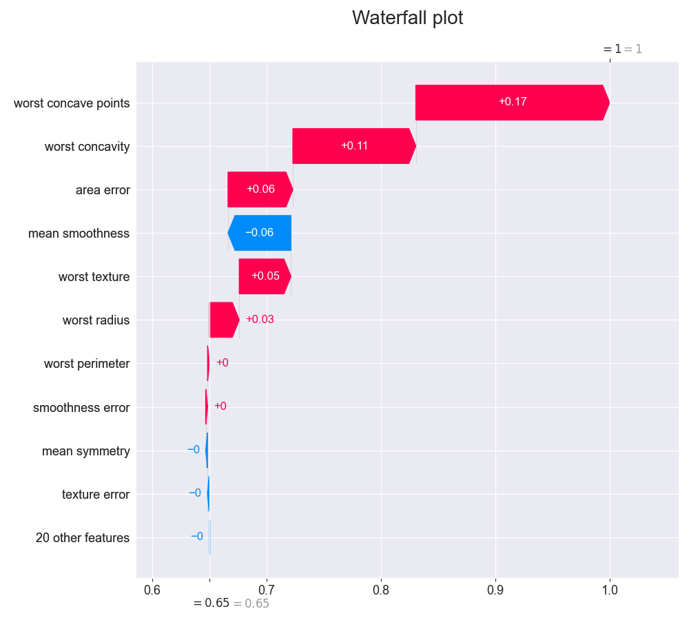

# plot_shap_waterfall
---------------------

<div style="font-size:20px">
<em>method</em> <strong style="color:#008AB8">waterfall_plot</strong>(models=None,
index=None, show=None, target=1, title=None, figsize=None, filename=None,
display=True, **kwargs)
<span style="float:right">
<a href="https://github.com/tvdboom/ATOM/blob/master/atom/plots.py#L3745">[source]</a>
</span>
</div>

Plot SHAP's waterfall plot for a single prediction. The SHAP value
of a feature represents the impact of the evidence provided by that
feature on the model’s output. The waterfall plot is designed to
visually display how the SHAP values (evidence) of each feature move
the model output from our prior expectation under the background
data distribution, to the final model prediction given the evidence
of all the features. Features are sorted by the magnitude of their
SHAP values with the smallest magnitude features grouped together
at the bottom of the plot when the number of features in the models
exceeds the `show` parameter. Read more about SHAP plots in the
[user guide](../../../user_guide/plots/#shap).

<table style="font-size:16px">
<tr>
<td width="20%" class="td_title" style="vertical-align:top"><strong>Parameters:</strong></td>
<td width="80%" class="td_params">
<p>
<strong>models: int, str, slice, sequence or None, default=None</strong><br>
Name of the model to plot. If None, all models are selected.
Note that leaving the default option could raise an exception
if there are multiple models. To avoid this, call the plot from a
model, e.g. <code>atom.xgb.waterfall_plot()</code>.
</p>
<p>
<strong>index: int, str or None, default=None</strong><br>
Index or position of the row in the dataset to plot. If None, it
selects the first row in the test set. The waterfall plot does
not support plotting multiple samples.
</p>
<p>
<strong>show: int or None, default=None</strong><br>
Number of features to show in the plot. None to show all.
</p>
<p>
<strong>target: int or str, default=1</strong><br>
Index or name of the class in the target column to look at. Only for
multi-class classification tasks.
</p>
<p>
<strong>title: str or None, default=None</strong><br>
Plot's title. If None, the title is left empty.
</p>
<p>
<strong>figsize: tuple or None, default=None</strong><br>
Figure's size, format as (x, y). If None, it adapts the size to the
number of features shown.
</p>
<p>
<strong>filename: str or None, default=None</strong><br>
Name of the file. Use "auto" for automatic naming.
If None, the figure is not saved.
</p>
<p>
<strong>display: bool or None, default=True</strong><br>
Whether to render the plot. If None, it returns the matplotlib figure.
</p>
</td>
</tr>
<tr>
<td width="20%" class="td_title" style="vertical-align:top"><strong>Returns:</strong></td>
<td width="80%" class="td_params">
<strong>matplotlib.figure.Figure</strong><br>
Plot object. Only returned if <code>display=None</code>.
</td>
</tr>
</table>
<br />


## Example

```python
from atom import ATOMClassifier

atom = ATOMClassifier(X, y)
atom.run("Tree")
atom.tree.waterfall_plot(index=120)
```

<div align="center">
    
</div>

