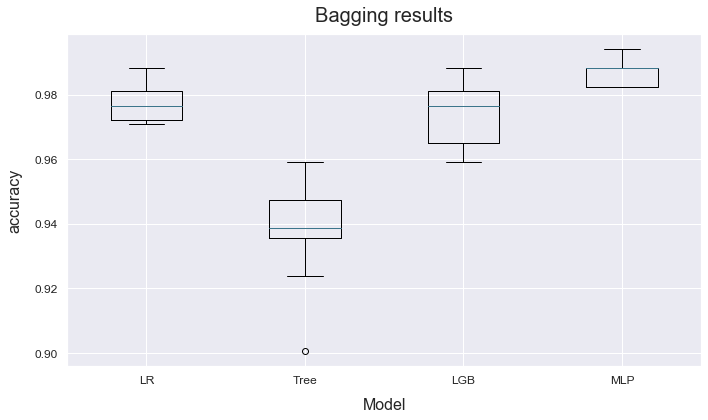

# plot_bagging
--------------

<a name="atom"></a>
<pre><em>method</em> <strong style="color:#008AB8">plot_bagging</strong>(models=None, metric=0, title=None, figsize=None, filename=None, display=True)
<div align="right"><a href="https://github.com/tvdboom/ATOM/blob/master/atom/plots.py#L542">[source]</a></div></pre>
<div style="padding-left:3%">
Plot a boxplot of the bagging's results. Only available for models fitted using
 [bagging](../../../user_guide/#bagging).
<br /><br />
<table width="100%">
<tr>
<td width="15%" style="vertical-align:top; background:#F5F5F5;"><strong>Parameters:</strong></td>
<td width="75%" style="background:white;">
<strong>models: str, sequence or None, optional (default=None)</strong>
<blockquote>
Name of the models to plot. If None, all models in the pipeline that used bagging are selected.
</blockquote>
<strong>metric: int or str, optional (default=0)</strong>
<blockquote>
Index or name of the metric to plot. Only for [multi-metric](../../../user_guide/#metric) runs.
</blockquote>
<strong>title: str or None, optional (default=None)</strong>
<blockquote>
Plot's title. If None, the default option is used.
</blockquote>
<strong>figsize: tuple, optional (default=None)</strong>
<blockquote>
Figure's size, format as (x, y). If None, adapts size the to number of models.
</blockquote>
<strong>filename: str or None, optional (default=None)</strong>
<blockquote>
Name of the file (to save). If None, the figure is not saved.
</blockquote>
<strong>display: bool, optional (default=True)</strong>
<blockquote>
Whether to render the plot.
</blockquote>
</tr>
</table>
</div>
<br />


## Example
----------

```python
from atom import ATOMClassifier

atom = ATOMClassifier(X, y)
atom.run(['LR', 'Tree', 'LGB', 'MLP'], metric='accuracy', bagging=5)
atom.plot_bagging()
```
<div align="center">
    
</div>
