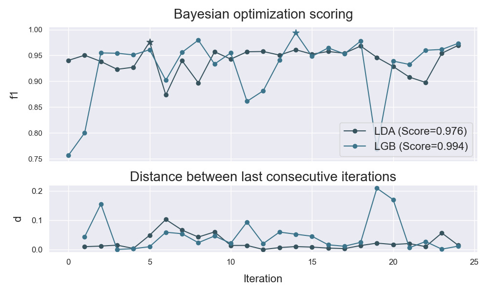

# plot_bo
---------

<pre><em>function</em> atom.plots.<strong style="color:#008AB8">plot_bo</strong>(models=None, metric=0, title=None, figsize=(10, 6), filename=None, display=True)
<div align="right"><a href="https://github.com/tvdboom/ATOM/blob/master/atom/plots.py#L336">[source]</a></div></pre>
<div style="padding-left:3%">
Plot the bayesian optimization scoring. Only for models that ran the hyperparameter
 optimization. This is the same plot as the one produced by `bo_params{'plot_bo': True}` while
 running the BO. Creates a canvas with two plots: the first plot shows the score of
 every trial and the second shows the distance between the last consecutive steps.
 <br /><br />
<table width="100%">
<tr>
<td width="15%" style="vertical-align:top; background:#F5F5F5;"><strong>Parameters:</strong></td>
<td width="75%" style="background:white;">
<strong>models: str, sequence or None, optional (default=None)</strong>
<blockquote>
Name of the models to plot. If None, all models in the pipeline that used bayesian
 optimization are selected.
</blockquote>
<strong>metric: int or str, optional (default=0)</strong>
<blockquote>
Index or name of the metric to plot. Only for multi-metric runs.
</blockquote>
<strong>title: str or None, optional (default=None)</strong>
<blockquote>
Plot's title. If None, the default option is used.
</blockquote>
<strong>figsize: tuple, optional (default=None)</strong>
<blockquote>
Figure's size, format as (x, y). If None, adapts size the to number of models.
</blockquote>
<strong>filename: str or None, optional (default=None)</strong>
<blockquote>
Name of the file (to save). If None, the figure is not saved.
</blockquote>
<strong>display: bool, optional (default=True)</strong>
<blockquote>
Whether to render the plot.
</blockquote>
</tr>
</table>
</div>
<br />


## Example
----------
```python
from atom import ATOMClassifier

atom = ATOMClassifier(X, y)
atom.run(['LDA', 'LGB'], metric='f1', n_calls=24, n_random_starts=10)
atom.plot_bo()
```

