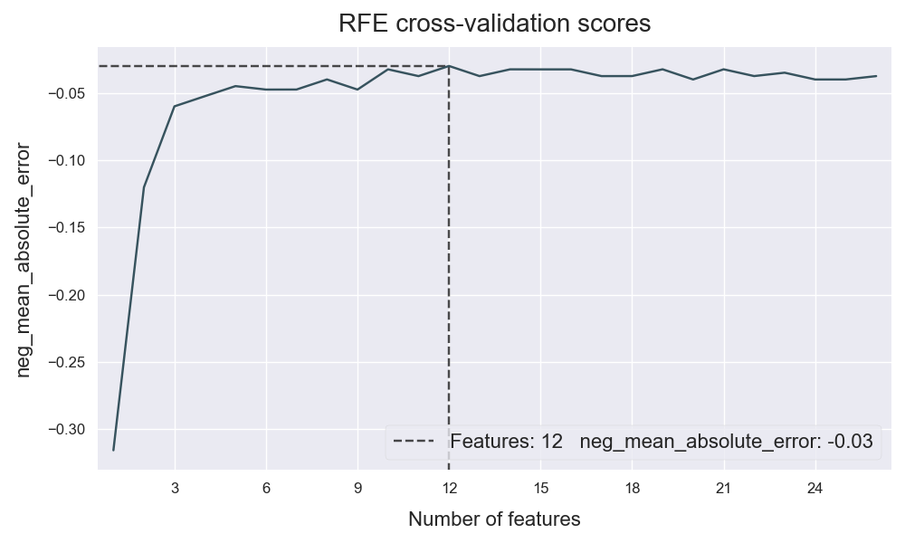

# plot_rfecv
------------

<pre><em>function</em> atom.plots.<strong style="color:#008AB8">plot_rfecv</strong>(title=None, figsize=(10, 6), filename=None, display=True)
<div align="right"><a href="https://github.com/tvdboom/ATOM/blob/master/atom/plots.py#L213">[source]</a></div></pre>
<div style="padding-left:3%">
Plot the scores obtained by the estimator fitted on every subset of
 the data. Can only be
 called from an <a href="../../ATOM/atomclassifier">ATOMClassifier</a>/
 <a href="../../ATOM/atomregressor">ATOMRegressor</a> or 
 <a href="../../feature_engineering/feature_selector">FeatureSelector</a> instance
 that applied RFECV on the dataset. Can't be called from the model subclasses.
<br /><br />
<table width="100%">
<tr>
<td width="15%" style="vertical-align:top; background:#F5F5F5;"><strong>Parameters:</strong></td>
<td width="75%" style="background:white;">
<strong>title: str or None, optional (default=None)</strong>
<blockquote>
Plot's title. If None, the default option is used.
</blockquote>
<strong>figsize: tuple, optional (default=(10, 6))</strong>
<blockquote>
Figure's size, format as (x, y).
</blockquote>
<strong>filename: str or None, optional (default=None)</strong>
<blockquote>
Name of the file (to save). If None, the figure is not saved.
</blockquote>
<strong>display: bool, optional (default=True)</strong>
<blockquote>
Whether to render the plot.
</blockquote>
</tr>
</table>
</div>
<br />


## Example
----------
```python
from atom import ATOMRegressor

atom = ATOMRegressor(X, y)
atom.feature_selection(strategy='RFECV', solver='LGB_reg', n_features=23)
atom.plot_rfecv()
```

