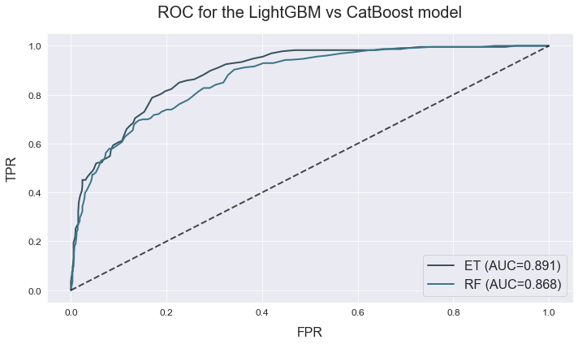
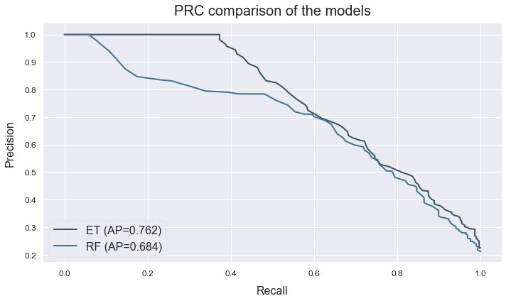

# Binary classification
---------------------------------

This example shows how we can use ATOM to perform a variety of data cleaning steps in order to prepare the data for modelling. Then, we compare the prediction performance of an Extra-Trees and a Random Forest.

The data used is a variation on the Australian weather dataset from [https://www.kaggle.com/jsphyg/weather-dataset-rattle-package](https://www.kaggle.com/jsphyg/weather-dataset-rattle-package). The goal of this dataset is to predict whether or not it will rain tomorrow training a binay classifier on target `RainTomorrow`.

## Load the data


```python
# Import packages
import pandas as pd
from sklearn.metrics import fbeta_score
from atom import ATOMClassifier
```


```python
# Load data
X = pd.read_csv('./datasets/weatherAUS.csv')

# Let's have a look at a subset of the data
X.sample(frac=1).iloc[:5, :8]
```


<div>
<style scoped>
    .dataframe tbody tr th:only-of-type {
        vertical-align: middle;
    }

    .dataframe tbody tr th {
        vertical-align: top;
    }

    .dataframe thead th {
        text-align: right;
    }
</style>
<table border="1" class="dataframe">
  <thead>
    <tr style="text-align: right;">
      <th></th>
      <th>Location</th>
      <th>MinTemp</th>
      <th>MaxTemp</th>
      <th>Rainfall</th>
      <th>Evaporation</th>
      <th>Sunshine</th>
      <th>WindGustDir</th>
      <th>WindGustSpeed</th>
    </tr>
  </thead>
  <tbody>
    <tr>
      <th>135379</th>
      <td>AliceSprings</td>
      <td>22.4</td>
      <td>35.4</td>
      <td>0.0</td>
      <td>4.8</td>
      <td>11.2</td>
      <td>ESE</td>
      <td>33.0</td>
    </tr>
    <tr>
      <th>55572</th>
      <td>Ballarat</td>
      <td>11.7</td>
      <td>19.8</td>
      <td>0.0</td>
      <td>NaN</td>
      <td>NaN</td>
      <td>NNE</td>
      <td>48.0</td>
    </tr>
    <tr>
      <th>111664</th>
      <td>Witchcliffe</td>
      <td>3.9</td>
      <td>15.4</td>
      <td>5.6</td>
      <td>NaN</td>
      <td>NaN</td>
      <td>NW</td>
      <td>43.0</td>
    </tr>
    <tr>
      <th>6661</th>
      <td>Cobar</td>
      <td>21.6</td>
      <td>34.9</td>
      <td>0.0</td>
      <td>11.2</td>
      <td>NaN</td>
      <td>NNE</td>
      <td>41.0</td>
    </tr>
    <tr>
      <th>78634</th>
      <td>Watsonia</td>
      <td>13.6</td>
      <td>33.3</td>
      <td>0.0</td>
      <td>8.0</td>
      <td>12.3</td>
      <td>N</td>
      <td>37.0</td>
    </tr>
  </tbody>
</table>
</div>


## Run the pipeline


```python
# Call ATOM using only 5% of the complete dataset (for explanatory purposes)
atom = ATOMClassifier(X, y='RainTomorrow', n_rows=0.05, n_jobs=8, warnings=False, verbose=2, random_state=1)
```

    << ================== ATOM ================== >>
    Algorithm task: binary classification.
    Parallel processing with 8 cores.
    Applying data cleaning...
    
    Dataset stats ================= >>
    Shape: (7110, 22)
    Missing values: 15896
    Categorical columns: 5
    Scaled: False
    ----------------------------------
    Train set size: 5688
    Test set size: 1422
    ----------------------------------
    Train set balance: No:Yes <==> 3.7:1.0
    Test set balance: No:Yes <==> 4.1:1.0
    ----------------------------------
    Instances in RainTomorrow per class:
    |        |    total |    train_set |    test_set |
    |:-------|---------:|-------------:|------------:|
    | 0: No  |     5615 |         4473 |        1142 |
    | 1: Yes |     1495 |         1215 |         280 |
    
    


```python
# We can change the data attributes in between the pipeline
# Note that we can only replace it with a new dataframe!
atom.X = atom.X.assign(AvgTemp=(atom.X['MaxTemp'] + atom.X['MinTemp'])/2)

# This will automatically update all other data attributes
assert 'AvgTemp' in atom.dataset
```


```python
# Impute missing values
atom.impute(strat_num='knn', strat_cat='drop', min_frac_rows=0.8)
```

    Fitting Imputer...
    Imputing missing values...
     --> Dropping 778 rows for containing less than 80% non-missing values.
     --> Imputing 5 missing values using the KNN imputer in feature MinTemp.
     --> Imputing 3 missing values using the KNN imputer in feature MaxTemp.
     --> Imputing 31 missing values using the KNN imputer in feature Rainfall.
     --> Imputing 2314 missing values using the KNN imputer in feature Evaporation.
     --> Imputing 2645 missing values using the KNN imputer in feature Sunshine.
     --> Dropping 201 rows due to missing values in feature WindGustDir.
     --> Dropping 358 rows due to missing values in feature WindDir9am.
     --> Dropping 15 rows due to missing values in feature WindDir3pm.
     --> Imputing 17 missing values using the KNN imputer in feature Humidity9am.
     --> Imputing 52 missing values using the KNN imputer in feature Humidity3pm.
     --> Imputing 37 missing values using the KNN imputer in feature Pressure9am.
     --> Imputing 34 missing values using the KNN imputer in feature Pressure3pm.
     --> Imputing 1891 missing values using the KNN imputer in feature Cloud9am.
     --> Imputing 1977 missing values using the KNN imputer in feature Cloud3pm.
     --> Imputing 4 missing values using the KNN imputer in feature Temp9am.
     --> Imputing 31 missing values using the KNN imputer in feature Temp3pm.
     --> Dropping 30 rows due to missing values in feature RainToday.
     --> Imputing 4 missing values using the KNN imputer in feature AvgTemp.
    


```python
# Encode the categorical features
atom.encode(strategy='CatBoost', max_onehot=10, frac_to_other=0.04)
```

    Fitting Encoder...
    Encoding categorical columns...
     --> CatBoost-encoding feature Location. Contains 1 unique categories.
     --> CatBoost-encoding feature WindGustDir. Contains 16 unique categories.
     --> CatBoost-encoding feature WindDir9am. Contains 16 unique categories.
     --> CatBoost-encoding feature WindDir3pm. Contains 16 unique categories.
     --> Label-encoding feature RainToday. Contains 2 unique categories.
    


```python
# Perform undersampling of the majority class
atom.balance(strategy='smote', sampling_strategy=0.9)
atom.stats()  # Note the balanced training set
```

    Oversampling with SMOTE...
     --> Adding 2302 rows to category: Yes.
    
    Dataset stats ================= >>
    Shape: (8030, 23)
    Scaled: False
    ----------------------------------
    Train set size: 6885
    Test set size: 1145
    ----------------------------------
    Train set balance: No:Yes <==> 1.1:1.0
    Test set balance: No:Yes <==> 4.1:1.0
    ----------------------------------
    Instances in RainTomorrow per class:
    |        |    total |    train_set |    test_set |
    |:-------|---------:|-------------:|------------:|
    | 0: No  |     4543 |         3624 |         919 |
    | 1: Yes |     3487 |         3261 |         226 |
    
    


```python
# Define a custom metric
def f2_score(y_true, y_pred):
    return fbeta_score(y_true, y_pred, beta=2)

# Fit the EXtra-Trees and Random Forest to the data
atom.run(models=['et', 'rf'],
         metric=f2_score,
         n_calls=0,
         bagging=5,
         verbose=1)
```

    
    Running pipeline ============================= >>
    Models in pipeline: ET, RF
    Metric: f2_score
    
    
    Results for Extra-Trees:         
    Fitting -----------------------------------------
    Score on the train set --> f2_score: 1.0000
    Score on the test set  --> f2_score: 0.5474
    Time elapsed: 0.191s
    Bagging -----------------------------------------
    Score --> f2_score: 0.6027 ± 0.0190
    Time elapsed: 0.843s
    -------------------------------------------------
    Total time: 1.038s
    
    
    Results for Random Forest:         
    Fitting -----------------------------------------
    Score on the train set --> f2_score: 1.0000
    Score on the test set  --> f2_score: 0.5959
    Time elapsed: 0.295s
    Bagging -----------------------------------------
    Score --> f2_score: 0.6087 ± 0.0113
    Time elapsed: 1.291s
    -------------------------------------------------
    Total time: 1.589s
    
    
    Final results ========================= >>
    Duration: 2.627s
    ------------------------------------------
    Extra-Trees   --> f2_score: 0.603 ± 0.019 ~
    Random Forest --> f2_score: 0.609 ± 0.011 ~ !
    

## Analyze the results


```python
# Let's have a look at the final scoring
atom.scoring()

# The winning model is indicated with a ! and can be accessed through the winner attribute
# The ~ indicates that the model is probably overfitting. If we look at the train and test
# score we see a difference of more than 20%
print(f'\n\nAnd the winner is the {atom.winner.longname} model!!')
print('Score on the training set: ', atom.winner.metric_train)
print('Score on the test set: ', atom.winner.metric_test)
```

    Results ===================== >>
    Extra-Trees   --> f2_score: 0.603 ± 0.019 ~
    Random Forest --> f2_score: 0.609 ± 0.011 ~
    
    
    And the winner is the Random Forest model!!
    Score on the training set:  1.0
    Score on the test set:  0.5958781362007168
    

**We can make many plots to check the performance of the models**


```python
# The probabilties plot shows the distribution of predicted
# probabilities for the positive class
atom.winner.plot_probabilities()
```


```python
# The threshold plot let us compare how different metrics
# perform for different thresholds
atom.winner.plot_threshold(metric=['f1', 'accuracy', 'average_precision'], steps=50, filename='thresholds.png')
```


```python
# The ROC and PRC curve are also typical ways of measuring performance 
atom.plot_roc(title="ROC for the LightGBM vs CatBoost model")
atom.plot_prc(title="PRC comparison of the models")
```







