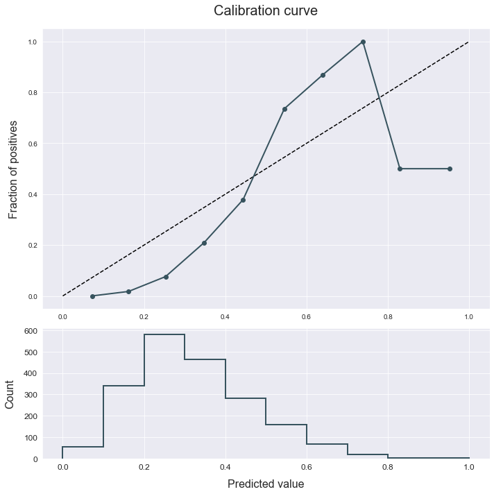
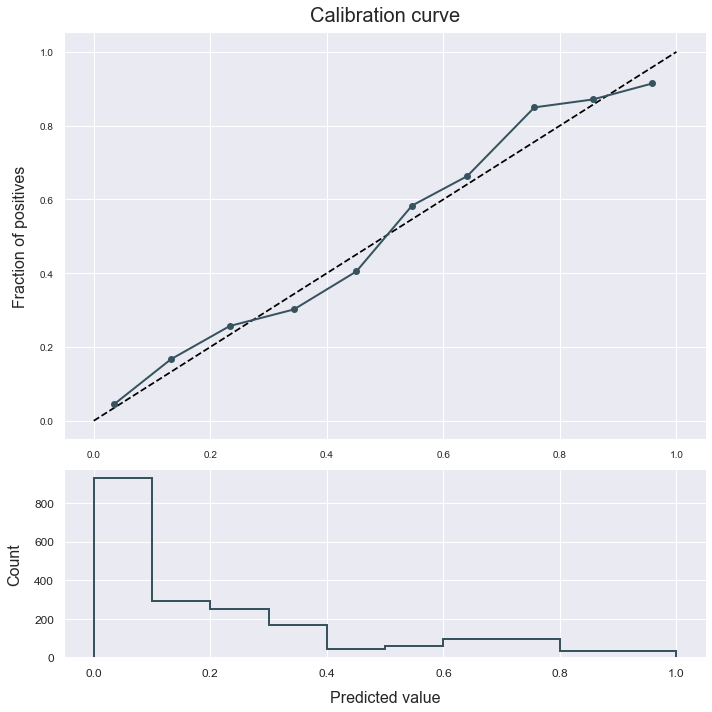

# Calibration
---------------------------------

This example shows us how to use the calibration method to calibrate a classifier.

The data used is a variation on the Australian weather dataset from [https://www.kaggle.com/jsphyg/weather-dataset-rattle-package](https://www.kaggle.com/jsphyg/weather-dataset-rattle-package). The goal of this dataset is to predict whether or not it will rain tomorrow training a binay classifier on target `RainTomorrow`.

## Load the data


```python
# Import packages
import pandas as pd
from atom import ATOMClassifier
```


```python
# Get the dataset's features and targets
X = pd.read_csv('./datasets/weatherAUS.csv')

# Let's have a look at a subset of the data
X.sample(frac=1).iloc[:5, :8]
```


<div>
<style scoped>
    .dataframe tbody tr th:only-of-type {
        vertical-align: middle;
    }

    .dataframe tbody tr th {
        vertical-align: top;
    }

    .dataframe thead th {
        text-align: right;
    }
</style>
<table border="1" class="dataframe">
  <thead>
    <tr style="text-align: right;">
      <th></th>
      <th>Location</th>
      <th>MinTemp</th>
      <th>MaxTemp</th>
      <th>Rainfall</th>
      <th>Evaporation</th>
      <th>Sunshine</th>
      <th>WindGustDir</th>
      <th>WindGustSpeed</th>
    </tr>
  </thead>
  <tbody>
    <tr>
      <th>83031</th>
      <td>Brisbane</td>
      <td>15.1</td>
      <td>24.4</td>
      <td>0.0</td>
      <td>7.8</td>
      <td>8.7</td>
      <td>ESE</td>
      <td>31.0</td>
    </tr>
    <tr>
      <th>129973</th>
      <td>Launceston</td>
      <td>14.3</td>
      <td>27.2</td>
      <td>0.0</td>
      <td>NaN</td>
      <td>NaN</td>
      <td>SSE</td>
      <td>28.0</td>
    </tr>
    <tr>
      <th>94080</th>
      <td>Adelaide</td>
      <td>14.4</td>
      <td>29.5</td>
      <td>0.0</td>
      <td>7.6</td>
      <td>11.9</td>
      <td>SSE</td>
      <td>31.0</td>
    </tr>
    <tr>
      <th>105091</th>
      <td>Woomera</td>
      <td>15.6</td>
      <td>30.7</td>
      <td>0.0</td>
      <td>15.4</td>
      <td>12.5</td>
      <td>SSW</td>
      <td>54.0</td>
    </tr>
    <tr>
      <th>83682</th>
      <td>Brisbane</td>
      <td>20.1</td>
      <td>28.8</td>
      <td>0.0</td>
      <td>5.2</td>
      <td>5.2</td>
      <td>NNE</td>
      <td>24.0</td>
    </tr>
  </tbody>
</table>
</div>


## Run the pipeline


```python
# Initialize the ATOM class
atom = ATOMClassifier(X, 'RainTomorrow', n_rows=1e4, verbose=1, warnings='ignore', random_state=1)
atom.clean()

# Handle missing values and categorical columns in the dataset
atom.impute(strat_num='median', strat_cat='most_frequent')
atom.encode(strategy='target', max_onehot=5, frac_to_other=0.05)

# Fit a linear SVM to the data
atom.run('lsvm')
```

    << ================== ATOM ================== >>
    Algorithm task: binary classification.
    
    Dataset stats ================== >>
    Shape: (10000, 22)
    Missing values: 22613
    Categorical columns: 5
    Scaled: False
    -----------------------------------
    Train set size: 8000
    Test set size: 2000
    
    Applying data cleaning...
    Fitting Imputer...
    Imputing missing values...
    Fitting Encoder...
    Encoding categorical columns...
    
    Training ===================================== >>
    Models: lSVM
    Metric: f1
    
    
    Results for Linear-SVM:         
    Fit ---------------------------------------------
    Train evaluation --> f1: 0.5634
    Test evaluation --> f1: 0.5898
    Time elapsed: 0.495s
    -------------------------------------------------
    Total time: 0.500s
    
    
    Final results ========================= >>
    Duration: 0.502s
    ------------------------------------------
    Linear-SVM --> f1: 0.590
    

## Analyze the results


```python
# Check our model's calibration
atom.plot_calibration()
```





```python
# Let's try to improve it using the calibrate method
atom.calibrate(method='isotonic', cv=5)
atom.plot_calibration()
```




