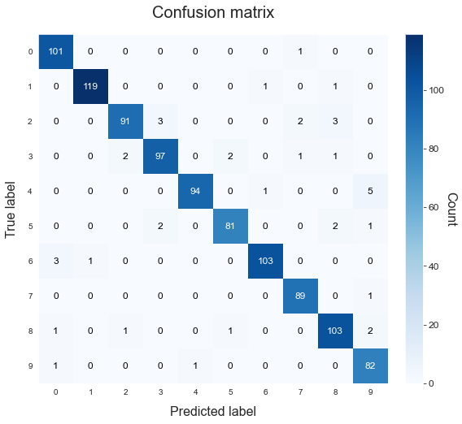

# Deep learning
---------------------------

This example shows how we can use ATOM to train and validate a Convolutional Neural Network implemented using [Keras](https://keras.io/).

Import the MNIST dataset from [keras.datasets](https://keras.io/api/datasets/mnist/). This is a well known image dataset with handwritten digits.

## Load the data


```python
# Disable annoying tf warnings
import logging
import tensorflow as tf
tf.get_logger().setLevel(logging.ERROR)

# Import standard packages
from atom import ATOMClassifier, ATOMModel
from skopt.space.space import Integer, Categorical

# Keras
from keras.datasets import mnist
from keras.models import Sequential
from keras.layers import Dense, Flatten, Conv2D
from keras.wrappers.scikit_learn import KerasClassifier
```


```python
# Create the convolutional neural network
def neural_network():
    model = Sequential()
    model.add(Conv2D(64, kernel_size=3, activation="relu", input_shape=(28, 28, 1)))
    model.add(Conv2D(64, kernel_size=3, activation="relu"))
    model.add(Flatten())
    model.add(Dense(10, activation="softmax"))
    model.compile(optimizer='adam', loss='categorical_crossentropy', metrics=['accuracy'])

    return model


# Since ATOM uses sklearn's API, use Keras' wrapper
model = KerasClassifier(neural_network, epochs=1, batch_size=512, verbose=0)

# Convert the model to an ATOM model
model = ATOMModel(model, acronym='NN', fullname='Neural network')
```


```python
# Download the MNIST dataset
(X_train, y_train), (X_test, y_test) = mnist.load_data()
```


```python
# Reshape data to fit model
X_train = X_train.reshape(60000,28,28,1)
X_test = X_test.reshape(10000,28,28,1)
```

## Run the pipeline


```python
atom = ATOMClassifier((X_train, y_train), (X_test, y_test), n_rows=0.1, n_jobs=4, warnings=False, verbose=2)
```

    << ================== ATOM ================== >>
    Algorithm task: multiclass classification.
    Parallel processing with 4 cores.
    
    Dataset stats ================== >>
    Shape: (7000, 2)
    Categorical columns: 1
    Scaled: False
    -----------------------------------
    Train set size: 6000
    Test set size: 1000
    -----------------------------------
    Train set balance: 0:1:2:3:4:5:6:7:8:9 <==> 1.1:1.2:1.1:1.1:1.0:1.0:1.2:1.1:1.1:1.1
    Test set balance: 0:1:2:3:4:5:6:7:8:9 <==> 1.2:1.4:1.2:1.2:1.2:1.0:1.3:1.1:1.3:1.0
    -----------------------------------
    Distribution of classes:
    |    |   dataset |   train |   test |
    |---:|----------:|--------:|-------:|
    |  0 |       696 |     594 |    102 |
    |  1 |       787 |     666 |    121 |
    |  2 |       680 |     581 |     99 |
    |  3 |       713 |     610 |    103 |
    |  4 |       669 |     569 |    100 |
    |  5 |       629 |     543 |     86 |
    |  6 |       737 |     630 |    107 |
    |  7 |       704 |     614 |     90 |
    |  8 |       730 |     622 |    108 |
    |  9 |       655 |     571 |     84 |
    
    


```python
# When the input data has more than 2 dimensions, ATOM creates a 
# dataset with just one column of shape (n_samples, shape_sample)
print(atom.dataset.head())
print(f"\nEvery row in the column contains the data of one image, with shape: {atom.dataset.iloc[0, 0].shape}")
```

                                                Features  target
    0  [[[0], [0], [0], [0], [0], [0], [0], [0], [0],...       6
    1  [[[0], [0], [0], [0], [0], [0], [0], [0], [0],...       0
    2  [[[0], [0], [0], [0], [0], [0], [0], [0], [0],...       8
    3  [[[0], [0], [0], [0], [0], [0], [0], [0], [0],...       9
    4  [[[0], [0], [0], [0], [0], [0], [0], [0], [0],...       3
    
    Every row in the column contains the data of one image, with shape: (28, 28, 1)
    


```python
# Like any other model, we can define custom dimensions for the bayesian optimization
dim = [Integer(1, 3, name="epochs"), Categorical([32, 64, 128, 256], name="batch_size")]

atom.run(model, metric="f1_weighted", n_calls=5, bo_params={"dimensions": dim, "cv": 1, "max_time": 120})
```

    
    Training ===================================== >>
    Models: NN
    Metric: f1_weighted
    
    
    Running BO for Neural network...
    Initial point 1 ---------------------------------
    Parameters --> {'epochs': 3, 'batch_size': 128}
    Evaluation --> f1_weighted: 0.9539  Best f1_weighted: 0.9539
    Time iteration: 13.195s   Total time: 13.199s
    Initial point 2 ---------------------------------
    Parameters --> {'epochs': 2, 'batch_size': 32}
    Evaluation --> f1_weighted: 0.9535  Best f1_weighted: 0.9539
    Time iteration: 11.150s   Total time: 24.353s
    Initial point 3 ---------------------------------
    Parameters --> {'epochs': 2, 'batch_size': 128}
    Evaluation --> f1_weighted: 0.9590  Best f1_weighted: 0.9590
    Time iteration: 8.982s   Total time: 33.339s
    Initial point 4 ---------------------------------
    Parameters --> {'epochs': 2, 'batch_size': 64}
    Evaluation --> f1_weighted: 0.9473  Best f1_weighted: 0.9590
    Time iteration: 10.401s   Total time: 43.744s
    Initial point 5 ---------------------------------
    Parameters --> {'epochs': 2, 'batch_size': 64}
    Evaluation --> f1_weighted: 0.9432  Best f1_weighted: 0.9590
    Time iteration: 9.920s   Total time: 53.668s
    
    Results for Neural network:         
    Bayesian Optimization ---------------------------
    Best parameters --> {'epochs': 2, 'batch_size': 128}
    Best evaluation --> f1_weighted: 0.9590
    Time elapsed: 54.993s
    Fit ---------------------------------------------
    Train evaluation --> f1_weighted: 0.9940
    Test evaluation --> f1_weighted: 0.9600
    Time elapsed: 12.060s
    -------------------------------------------------
    Total time: 1m:07s
    
    
    Final results ========================= >>
    Duration: 1m:07s
    ------------------------------------------
    Neural network --> f1_weighted: 0.960
    

## Analyze the results


```python
# We can use the prediction methods like any other model
atom.nn.predict_proba(X_train)
```


    array([[9.90808928e-08, 4.25013741e-06, 5.95212612e-07, ...,
            2.84667622e-05, 5.82498506e-05, 1.52232733e-05],
           [9.99999523e-01, 2.81265500e-09, 2.03615670e-07, ...,
            2.53215382e-09, 1.18079399e-07, 5.39132330e-08],
           [4.16290891e-11, 1.55575783e-08, 8.88847353e-07, ...,
            5.54162568e-07, 2.57078545e-06, 1.62668046e-04],
           ...,
           [3.20704130e-10, 1.14542015e-10, 2.37003861e-10, ...,
            9.98417460e-10, 1.32247393e-07, 2.14337160e-05],
           [3.62430466e-03, 5.39849998e-10, 3.39473763e-06, ...,
            3.78650185e-07, 5.38889992e-07, 1.00487103e-08],
           [1.49063184e-03, 6.88490618e-05, 2.90933414e-03, ...,
            1.33688780e-04, 8.61726165e-01, 1.15221173e-01]], dtype=float32)


```python
# Or make plots...
atom.nn.plot_confusion_matrix()
```




