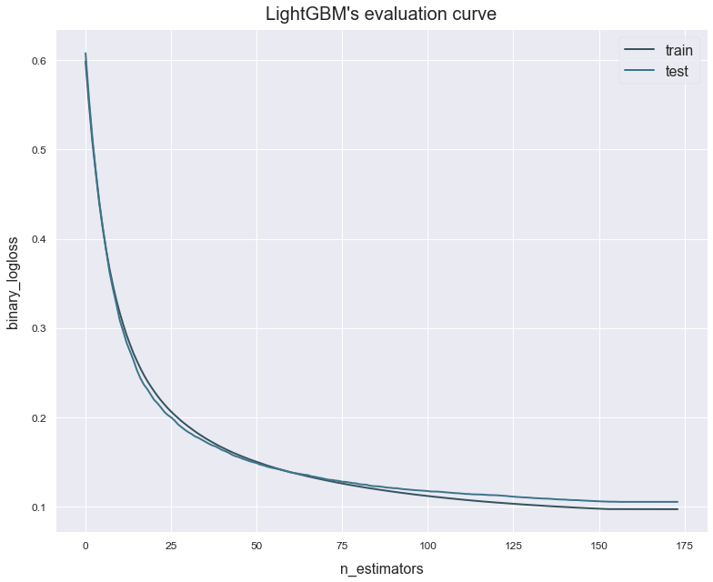

# Early stopping
---------------------------------

This example shows how we can use early stopping to reduce the time it takes to run the pipeline. This option is only available for models that allow in-training evaluation (XGBoost, LightGBM and CatBoost).

Import the breast cancer dataset from [sklearn.datasets](https://scikit-learn.org/stable/datasets/index.html#wine-dataset). This is a small and easy to train dataset whose goal is to predict whether a patient has breast cancer or not.

## Load the data


```python
# Import packages
from sklearn.datasets import load_breast_cancer
from atom import ATOMClassifier
```


```python
# Get the dataset's features and targets
X, y = load_breast_cancer(return_X_y=True)
```

## Run the pipeline


```python
# Start ATOM and fit the models using early stopping
# An early stopping of 0.1 means that the model will stop if it
# didn't improve in the last 10% of it's iterations.
atom = ATOMClassifier(X, y, n_jobs=2, verbose=2, warnings=False, random_state=1)
atom.run('LGB', metric='ap', n_calls=7, n_initial_points=3, bo_params={'early_stopping': 0.1, 'cv': 1})
```

    << ================== ATOM ================== >>
    Algorithm task: binary classification.
    Parallel processing with 2 cores.
    Applying data cleaning...
    
    Dataset stats ================= >>
    Shape: (569, 31)
    Scaled: False
    ----------------------------------
    Size of training set: 456
    Size of test set: 113
    ----------------------------------
    Class balance: 0:1 <==> 0.6:1.0
    Instances in target per class:
    |    |    total |    train_set |    test_set |
    |---:|---------:|-------------:|------------:|
    |  0 |      212 |          167 |          45 |
    |  1 |      357 |          289 |          68 |
    
    
    Running pipeline ============================= >>
    Models in pipeline: LGB
    Metric: average_precision
    
    
    Running BO for LightGBM...
    Random start 1 ----------------------------------
    Parameters --> {'n_estimators': 499, 'learning_rate': 0.73, 'max_depth': 2, 'num_leaves': 40, 'min_child_weight': 5, 'min_child_samples': 18, 'subsample': 0.7, 'colsample_bytree': 0.8, 'reg_alpha': 100, 'reg_lambda': 100}
    Early stop at iteration 50 of 499.
    Evaluation --> average_precision: 0.6304  Best average_precision: 0.6304
    Time iteration: 0.025s   Total time: 0.038s
    Random start 2 ----------------------------------
    Parameters --> {'n_estimators': 170, 'learning_rate': 0.11, 'max_depth': 5, 'num_leaves': 25, 'min_child_weight': 11, 'min_child_samples': 28, 'subsample': 0.7, 'colsample_bytree': 0.6, 'reg_alpha': 100, 'reg_lambda': 10}
    Early stop at iteration 18 of 170.
    Evaluation --> average_precision: 0.6304  Best average_precision: 0.6304
    Time iteration: 0.020s   Total time: 0.062s
    Random start 3 ----------------------------------
    Parameters --> {'n_estimators': 364, 'learning_rate': 0.4, 'max_depth': 2, 'num_leaves': 30, 'min_child_weight': 17, 'min_child_samples': 27, 'subsample': 0.9, 'colsample_bytree': 0.5, 'reg_alpha': 0, 'reg_lambda': 10}
    Early stop at iteration 45 of 364.
    Evaluation --> average_precision: 0.9785  Best average_precision: 0.9785
    Time iteration: 0.022s   Total time: 0.088s
    Iteration 4 -------------------------------------
    Parameters --> {'n_estimators': 496, 'learning_rate': 0.5, 'max_depth': 5, 'num_leaves': 37, 'min_child_weight': 15, 'min_child_samples': 15, 'subsample': 0.9, 'colsample_bytree': 0.5, 'reg_alpha': 0, 'reg_lambda': 100}
    Early stop at iteration 88 of 496.
    Evaluation --> average_precision: 0.9916  Best average_precision: 0.9916
    Time iteration: 0.027s   Total time: 0.936s
    Iteration 5 -------------------------------------
    Parameters --> {'n_estimators': 500, 'learning_rate': 1.0, 'max_depth': 10, 'num_leaves': 40, 'min_child_weight': 1, 'min_child_samples': 10, 'subsample': 0.9, 'colsample_bytree': 0.5, 'reg_alpha': 0, 'reg_lambda': 0.01}
    Early stop at iteration 57 of 500.
    Evaluation --> average_precision: 0.9947  Best average_precision: 0.9947
    Time iteration: 0.027s   Total time: 1.195s
    Iteration 6 -------------------------------------
    Parameters --> {'n_estimators': 500, 'learning_rate': 0.05, 'max_depth': 10, 'num_leaves': 40, 'min_child_weight': 20, 'min_child_samples': 10, 'subsample': 0.9, 'colsample_bytree': 0.5, 'reg_alpha': 0, 'reg_lambda': 100}
    Early stop at iteration 271 of 500.
    Evaluation --> average_precision: 0.9980  Best average_precision: 0.9980
    Time iteration: 0.048s   Total time: 1.478s
    Iteration 7 -------------------------------------
    Parameters --> {'n_estimators': 178, 'learning_rate': 0.28, 'max_depth': 1, 'num_leaves': 21, 'min_child_weight': 12, 'min_child_samples': 15, 'subsample': 0.9, 'colsample_bytree': 0.5, 'reg_alpha': 0, 'reg_lambda': 100}
    Early stop at iteration 130 of 178.
    Evaluation --> average_precision: 0.9983  Best average_precision: 0.9983
    Time iteration: 0.030s   Total time: 1.843s
    
    Results for LightGBM:         
    Bayesian Optimization ---------------------------
    Best parameters --> {'n_estimators': 178, 'learning_rate': 0.28, 'max_depth': 1, 'num_leaves': 21, 'min_child_weight': 12, 'min_child_samples': 15, 'subsample': 0.9, 'colsample_bytree': 0.5, 'reg_alpha': 0, 'reg_lambda': 100}
    Best evaluation --> average_precision: 0.9983
    Time elapsed: 2.103s
    Fitting -----------------------------------------
    Early stop at iteration 174 of 178.
    Score on the train set --> average_precision: 0.9971
    Score on the test set  --> average_precision: 0.9847
    Time elapsed: 0.040s
    -------------------------------------------------
    Total time: 2.151s
    
    
    Final results ========================= >>
    Duration: 2.153s
    ------------------------------------------
    LightGBM --> average_precision: 0.985
    

## Analyze the results


```python
# For these models, we can plot the evaluation on the train and test set during training
# Note that the metric_ is provided by the model's library, not ATOM!
atom.lgb.plot_evals(title="LightGBM's evaluation curve", figsize=(11, 9))
```




