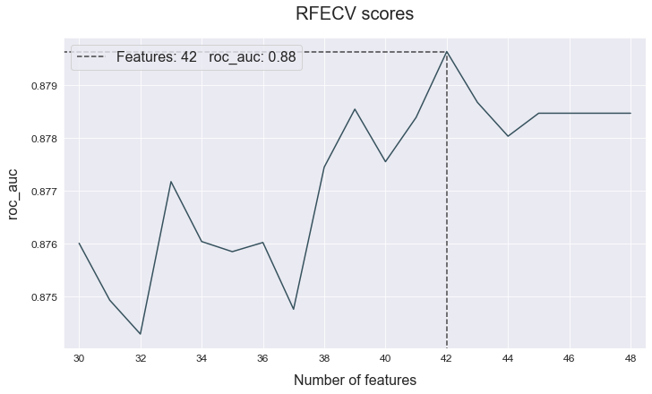
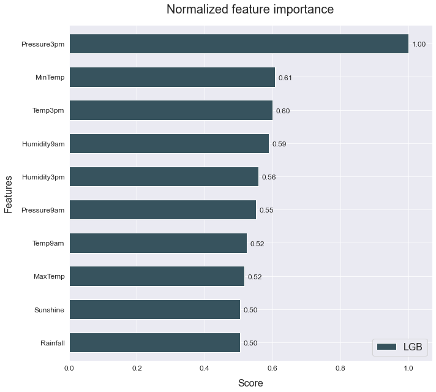
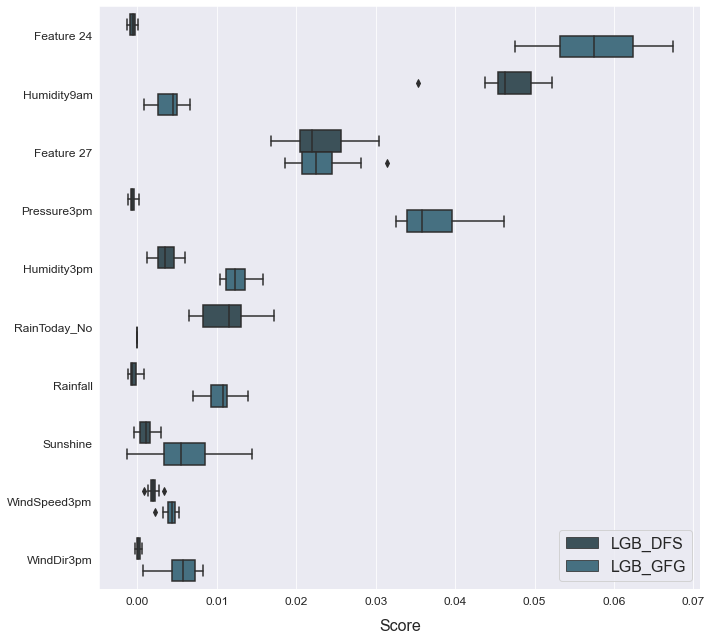

# Feature engineering
------------------------------

This example shows how to use automated feature generation to improve your model's performance.

The data used is a variation on the Australian weather dataset from [https://www.kaggle.com/jsphyg/weather-dataset-rattle-package](https://www.kaggle.com/jsphyg/weather-dataset-rattle-package). The goal of this dataset is to predict whether or not it will rain tomorrow training a binay classifier on target `RainTomorrow`.

## Load the data


```python
# Import packages
import pandas as pd
from atom import ATOMClassifier
```


    <Figure size 432x288 with 0 Axes>


```python
# Load data
X = pd.read_csv('./datasets/weatherAUS.csv')

# Let's have a look at a subset of the data
X.sample(frac=1).iloc[:5, :8]
```


<div>
<style scoped>
    .dataframe tbody tr th:only-of-type {
        vertical-align: middle;
    }

    .dataframe tbody tr th {
        vertical-align: top;
    }

    .dataframe thead th {
        text-align: right;
    }
</style>
<table border="1" class="dataframe">
  <thead>
    <tr style="text-align: right;">
      <th></th>
      <th>Location</th>
      <th>MinTemp</th>
      <th>MaxTemp</th>
      <th>Rainfall</th>
      <th>Evaporation</th>
      <th>Sunshine</th>
      <th>WindGustDir</th>
      <th>WindGustSpeed</th>
    </tr>
  </thead>
  <tbody>
    <tr>
      <th>43813</th>
      <td>Wollongong</td>
      <td>19.6</td>
      <td>24.0</td>
      <td>0.0</td>
      <td>NaN</td>
      <td>NaN</td>
      <td>SSW</td>
      <td>67.0</td>
    </tr>
    <tr>
      <th>66825</th>
      <td>Melbourne</td>
      <td>7.0</td>
      <td>12.6</td>
      <td>0.2</td>
      <td>1.4</td>
      <td>0.2</td>
      <td>N</td>
      <td>30.0</td>
    </tr>
    <tr>
      <th>32707</th>
      <td>Sydney</td>
      <td>18.6</td>
      <td>26.1</td>
      <td>3.2</td>
      <td>6.4</td>
      <td>7.9</td>
      <td>S</td>
      <td>48.0</td>
    </tr>
    <tr>
      <th>40410</th>
      <td>Williamtown</td>
      <td>7.5</td>
      <td>23.1</td>
      <td>0.0</td>
      <td>NaN</td>
      <td>NaN</td>
      <td>NW</td>
      <td>22.0</td>
    </tr>
    <tr>
      <th>1172</th>
      <td>Albury</td>
      <td>10.2</td>
      <td>27.6</td>
      <td>0.0</td>
      <td>NaN</td>
      <td>NaN</td>
      <td>NE</td>
      <td>28.0</td>
    </tr>
  </tbody>
</table>
</div>


## Run the pipeline


```python
# Initiate ATOM and apply data cleaning
atom = ATOMClassifier(X, n_rows=1e4, test_size=0.2, verbose=0, random_state=1)
atom.clean()
atom.impute(strat_num='knn', strat_cat='remove', min_frac_rows=0.8)
atom.encode(max_onehot=10, frac_to_other=0.04)

# Let's see how a LightGBM model performs without adding additional features
atom.run('LGB', metric='auc')
atom.scoring()
```

    is_categorical is deprecated and will be removed in a future version.  Use is_categorical_dtype instead
    

    Results ===================== >>
    LightGBM --> roc_auc: 0.872
    

## Deep Feature Synthesis


```python
atom.verbose = 2  # Increase verbosity to see the output

# Create 50 new features using DFS
atom.branch = 'dfs'
atom.feature_generation(strategy='dfs', n_features=50, operators=['add', 'sub', 'log', 'sqrt'])
```

    New branch 'dfs' successfully created!
    Fitting FeatureGenerator...
    Creating new features...
     --> 50 new features were added to the dataset.
    

    divide by zero encountered in log
    


```python
# The warnings warn us that some operators created missing values!
# We can see the columns with missing values using the missing attribute
atom.missing
```


    ['', '?', 'NA', 'nan', 'NaN', 'None', 'inf']


```python
# And turn off warnings in the future
atom.warnings = False
```


```python
# We can use the impute method again
atom.impute(strat_num='knn', strat_cat='remove', min_frac_rows=0.8)
```

    Fitting Imputer...
    Imputing missing values...
    


```python
# 50 new features may be to much...
# Let's check for multicollinearity and use RFECV to reduce the number even further
atom.feature_selection(strategy='RFECV', solver='lgb', n_features=30, scoring='auc', max_correlation=0.98)
```

    Fitting FeatureSelector...
    Performing feature selection ...
     --> Feature Location was removed due to low variance. Value 0.20781403164822854 repeated in 100% of the rows.
     --> Feature Cloud3pm + Humidity3pm was removed due to collinearity with another feature.
     --> Feature Cloud3pm + RainToday_No was removed due to collinearity with another feature.
     --> Feature Cloud3pm - Location was removed due to collinearity with another feature.
     --> Feature Cloud3pm - RainToday_No was removed due to collinearity with another feature.
     --> Feature Evaporation + WindGustDir was removed due to collinearity with another feature.
     --> Feature Evaporation - WindDir3pm was removed due to collinearity with another feature.
     --> Feature Humidity9am - WindDir3pm was removed due to collinearity with another feature.
     --> Feature Location + MinTemp was removed due to collinearity with another feature.
     --> Feature Location + RainToday_No was removed due to collinearity with another feature.
     --> Feature Location + WindDir3pm was removed due to collinearity with another feature.
     --> Feature Location + WindGustDir was removed due to collinearity with another feature.
     --> Feature Location + WindSpeed3pm was removed due to collinearity with another feature.
     --> Feature MaxTemp + RainToday_Yes was removed due to collinearity with another feature.
     --> Feature RainToday_No - WindDir9am was removed due to collinearity with another feature.
     --> Feature RainToday_Yes + WindDir9am was removed due to collinearity with another feature.
     --> Feature RainToday_Yes + WindSpeed3pm was removed due to collinearity with another feature.
     --> Feature RainToday_other - Temp9am was removed due to collinearity with another feature.
     --> Feature SQRT(Humidity3pm) was removed due to collinearity with another feature.
     --> Feature Sunshine + WindDir9am was removed due to collinearity with another feature.
     --> Feature Temp3pm + WindGustDir was removed due to collinearity with another feature.
     --> Feature Temp9am + WindDir9am was removed due to collinearity with another feature.
     --> Feature Temp9am + WindGustDir was removed due to collinearity with another feature.
     --> Feature Temp9am - WindDir9am was removed due to collinearity with another feature.
     --> Feature WindGustDir + WindGustSpeed was removed due to collinearity with another feature.
     --> The RFECV selected 42 features from the dataset.
       >>> Dropping feature RainToday_Yes (rank 4).
       >>> Dropping feature RainToday_No (rank 6).
       >>> Dropping feature LOG(Sunshine) (rank 3).
       >>> Dropping feature LOG(WindSpeed3pm) (rank 5).
       >>> Dropping feature RainToday_other - WindSpeed9am (rank 2).
       >>> Dropping feature SQRT(Rainfall) (rank 7).
    


```python
# The collinear attribute shows what features were removed due to multicollinearity
atom.collinear
```


<div>
<style scoped>
    .dataframe tbody tr th:only-of-type {
        vertical-align: middle;
    }

    .dataframe tbody tr th {
        vertical-align: top;
    }

    .dataframe thead th {
        text-align: right;
    }
</style>
<table border="1" class="dataframe">
  <thead>
    <tr style="text-align: right;">
      <th></th>
      <th>drop_feature</th>
      <th>correlated_feature</th>
      <th>correlation_value</th>
    </tr>
  </thead>
  <tbody>
    <tr>
      <th>0</th>
      <td>Cloud3pm + Humidity3pm</td>
      <td>Humidity3pm</td>
      <td>0.99578</td>
    </tr>
    <tr>
      <th>1</th>
      <td>Cloud3pm + RainToday_No</td>
      <td>Cloud3pm</td>
      <td>0.98124</td>
    </tr>
    <tr>
      <th>2</th>
      <td>Cloud3pm - Location</td>
      <td>Cloud3pm, Cloud3pm + RainToday_No</td>
      <td>1.0, 0.98124</td>
    </tr>
    <tr>
      <th>3</th>
      <td>Cloud3pm - RainToday_No</td>
      <td>Cloud3pm, Cloud3pm - Location</td>
      <td>0.98405, 0.98405</td>
    </tr>
    <tr>
      <th>4</th>
      <td>Evaporation + WindGustDir</td>
      <td>Evaporation</td>
      <td>0.9999</td>
    </tr>
    <tr>
      <th>5</th>
      <td>Evaporation - WindDir3pm</td>
      <td>Evaporation, Evaporation + WindGustDir</td>
      <td>0.9999, 0.99969</td>
    </tr>
    <tr>
      <th>6</th>
      <td>Humidity9am - WindDir3pm</td>
      <td>Humidity9am</td>
      <td>1.0</td>
    </tr>
    <tr>
      <th>7</th>
      <td>Location + MinTemp</td>
      <td>MinTemp</td>
      <td>1.0</td>
    </tr>
    <tr>
      <th>8</th>
      <td>Location + RainToday_No</td>
      <td>RainToday_Yes, RainToday_No</td>
      <td>-0.98404, 1.0</td>
    </tr>
    <tr>
      <th>9</th>
      <td>Location + WindDir3pm</td>
      <td>WindDir3pm</td>
      <td>1.0</td>
    </tr>
    <tr>
      <th>10</th>
      <td>Location + WindGustDir</td>
      <td>WindGustDir</td>
      <td>1.0</td>
    </tr>
    <tr>
      <th>11</th>
      <td>Location + WindSpeed3pm</td>
      <td>WindSpeed3pm</td>
      <td>1.0</td>
    </tr>
    <tr>
      <th>12</th>
      <td>MaxTemp + RainToday_Yes</td>
      <td>MaxTemp</td>
      <td>0.99834</td>
    </tr>
    <tr>
      <th>13</th>
      <td>RainToday_No - WindDir9am</td>
      <td>RainToday_No, Location + RainToday_No</td>
      <td>0.99167, 0.99167</td>
    </tr>
    <tr>
      <th>14</th>
      <td>RainToday_Yes + WindDir9am</td>
      <td>RainToday_Yes, RainToday_No - WindDir9am</td>
      <td>0.99152, -0.98471</td>
    </tr>
    <tr>
      <th>15</th>
      <td>RainToday_Yes + WindSpeed3pm</td>
      <td>WindSpeed3pm, Location + WindSpeed3pm</td>
      <td>0.99887, 0.99887</td>
    </tr>
    <tr>
      <th>16</th>
      <td>RainToday_other - Temp9am</td>
      <td>Temp9am, RainToday_No - Temp9am</td>
      <td>-0.99993, 0.99775</td>
    </tr>
    <tr>
      <th>17</th>
      <td>SQRT(Humidity3pm)</td>
      <td>Humidity3pm, Cloud3pm + Humidity3pm</td>
      <td>0.98722, 0.98193</td>
    </tr>
    <tr>
      <th>18</th>
      <td>Sunshine + WindDir9am</td>
      <td>Sunshine</td>
      <td>0.99982</td>
    </tr>
    <tr>
      <th>19</th>
      <td>Temp3pm + WindGustDir</td>
      <td>Temp3pm</td>
      <td>0.99998</td>
    </tr>
    <tr>
      <th>20</th>
      <td>Temp9am + WindDir9am</td>
      <td>Temp9am, RainToday_No - Temp9am, RainToday_oth...</td>
      <td>0.99996, -0.99793, -0.9999</td>
    </tr>
    <tr>
      <th>21</th>
      <td>Temp9am + WindGustDir</td>
      <td>Temp9am, RainToday_No - Temp9am, RainToday_oth...</td>
      <td>0.99997, -0.99793, -0.99991, 0.99996</td>
    </tr>
    <tr>
      <th>22</th>
      <td>Temp9am - WindDir9am</td>
      <td>Temp9am, RainToday_No - Temp9am, RainToday_oth...</td>
      <td>0.99996, -0.99783, -0.9999, 0.99986, 0.99991</td>
    </tr>
    <tr>
      <th>23</th>
      <td>WindGustDir + WindGustSpeed</td>
      <td>WindGustSpeed</td>
      <td>0.99999</td>
    </tr>
  </tbody>
</table>
</div>


```python
# After applying RFECV, we can plot the score per number of features
atom.plot_rfecv()
```





```python
# Let's see how the model performs now
atom.run('LGB_DFS')
```

    
    Training ===================================== >>
    Models: LGB_DFS
    Metric: roc_auc
    
    
    Results for LightGBM:         
    Fit ---------------------------------------------
    Train evaluation --> roc_auc: 0.9947
    Test evaluation --> roc_auc: 0.8764
    Time elapsed: 0.444s
    -------------------------------------------------
    Total time: 0.444s
    
    
    Final results ========================= >>
    Duration: 0.445s
    ------------------------------------------
    LightGBM --> roc_auc: 0.876
    

## Genetic Feature Generation


```python
# Create another branch for the genetic features
atom.branch = 'gfg_from_main'

# Create new features using Genetic Programming
atom.feature_generation(strategy='GFG', n_features=20, generations=10, population=2000)
```

    New branch 'gfg' successfully created!
    Fitting FeatureGenerator...
        |   Population Average    |             Best Individual              |
    ---- ------------------------- ------------------------------------------ ----------
     Gen   Length          Fitness   Length          Fitness      OOB Fitness  Time Left
       0     3.17         0.127544        3         0.504266              N/A     10.24s
       1     3.10          0.33852        5         0.536639              N/A      8.96s
       2     3.50         0.443648        9         0.541754              N/A      7.93s
       3     4.48         0.476799        7         0.544984              N/A      6.80s
       4     6.25          0.51219       13         0.546135              N/A      5.80s
       5     7.45         0.508814        9         0.550855              N/A      4.70s
       6     7.66         0.501224       11          0.55326              N/A      3.55s
       7     8.05         0.498132       11         0.553417              N/A      2.29s
       8     9.52         0.497282       13         0.554988              N/A      1.16s
       9    10.82         0.492465       11         0.553417              N/A      0.00s
    Creating new features...
     --> 5 new features were added to the dataset.
    


```python
# We can see the feature's fitness and description through the genetic_features attribute
atom.genetic_features
```


<div>
<style scoped>
    .dataframe tbody tr th:only-of-type {
        vertical-align: middle;
    }

    .dataframe tbody tr th {
        vertical-align: top;
    }

    .dataframe thead th {
        text-align: right;
    }
</style>
<table border="1" class="dataframe">
  <thead>
    <tr style="text-align: right;">
      <th></th>
      <th>name</th>
      <th>description</th>
      <th>fitness</th>
    </tr>
  </thead>
  <tbody>
    <tr>
      <th>0</th>
      <td>Feature 24</td>
      <td>mul(mul(sub(sub(sub(Humidity3pm, Sunshine), Su...</td>
      <td>0.542417</td>
    </tr>
    <tr>
      <th>1</th>
      <td>Feature 25</td>
      <td>mul(sub(sub(sub(Humidity3pm, Sunshine), Sunshi...</td>
      <td>0.542417</td>
    </tr>
    <tr>
      <th>2</th>
      <td>Feature 26</td>
      <td>mul(Humidity3pm, mul(sub(sub(sub(Humidity3pm, ...</td>
      <td>0.542417</td>
    </tr>
    <tr>
      <th>3</th>
      <td>Feature 27</td>
      <td>mul(sub(sub(Humidity3pm, Sunshine), Sunshine),...</td>
      <td>0.542260</td>
    </tr>
    <tr>
      <th>4</th>
      <td>Feature 28</td>
      <td>mul(mul(sub(Humidity3pm, Sunshine), WindGustSp...</td>
      <td>0.542260</td>
    </tr>
  </tbody>
</table>
</div>


```python
# And fit the model again
atom.run('LGB_GFG', metric='auc')
```

    
    Training ===================================== >>
    Models: LGB_GFG
    Metric: roc_auc
    
    
    Results for LightGBM:         
    Fit ---------------------------------------------
    Train evaluation --> roc_auc: 0.9894
    Test evaluation --> roc_auc: 0.8771
    Time elapsed: 0.299s
    -------------------------------------------------
    Total time: 0.299s
    
    
    Final results ========================= >>
    Duration: 0.301s
    ------------------------------------------
    LightGBM --> roc_auc: 0.877
    

## Analyze results


```python
with atom.canvas(1, 3, figsize=(20, 8)):
    atom.lgb.plot_feature_importance(show=10, title="LGB")
    atom.lgb_dfs.plot_feature_importance(show=10, title="LGB + DFS")
    atom.lgb_gfg.plot_feature_importance(show=10, title="LGB + GFG")
```





```python
# We can check the feature importance with other plots as well
atom.plot_permutation_importance(models=["LGB_DFS", "LGB_GFG"], show=10)
```




