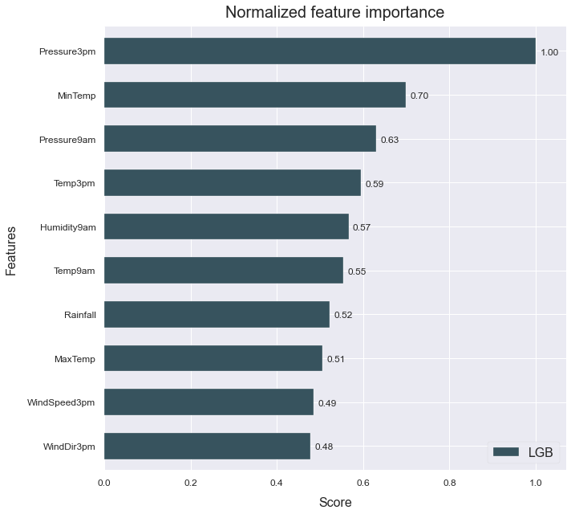

# Feature engineering
------------------------------

This example shows how to use automated feature generation to improve your model's performance.

The data used is a variation on the Australian weather dataset from [https://www.kaggle.com/jsphyg/weather-dataset-rattle-package](https://www.kaggle.com/jsphyg/weather-dataset-rattle-package). The goal of this dataset is to predict whether or not it will rain tomorrow training a binay classifier on target `RainTomorrow`.

## Load the data


```python
# Import packages
import pandas as pd
from atom import ATOMClassifier
```


```python
# Load data
X = pd.read_csv('./datasets/weatherAUS.csv')

# Let's have a look at a subset of the data
X.sample(frac=1).iloc[:5, :8]
```


<div>
<style scoped>
    .dataframe tbody tr th:only-of-type {
        vertical-align: middle;
    }

    .dataframe tbody tr th {
        vertical-align: top;
    }

    .dataframe thead th {
        text-align: right;
    }
</style>
<table border="1" class="dataframe">
  <thead>
    <tr style="text-align: right;">
      <th></th>
      <th>Location</th>
      <th>MinTemp</th>
      <th>MaxTemp</th>
      <th>Rainfall</th>
      <th>Evaporation</th>
      <th>Sunshine</th>
      <th>WindGustDir</th>
      <th>WindGustSpeed</th>
    </tr>
  </thead>
  <tbody>
    <tr>
      <th>118244</th>
      <td>Perth</td>
      <td>20.9</td>
      <td>35.5</td>
      <td>0.0</td>
      <td>11.0</td>
      <td>13.1</td>
      <td>SW</td>
      <td>31.0</td>
    </tr>
    <tr>
      <th>17985</th>
      <td>NorahHead</td>
      <td>19.1</td>
      <td>21.0</td>
      <td>0.0</td>
      <td>NaN</td>
      <td>NaN</td>
      <td>S</td>
      <td>44.0</td>
    </tr>
    <tr>
      <th>96569</th>
      <td>Adelaide</td>
      <td>7.6</td>
      <td>16.1</td>
      <td>1.8</td>
      <td>NaN</td>
      <td>NaN</td>
      <td>SW</td>
      <td>35.0</td>
    </tr>
    <tr>
      <th>63982</th>
      <td>MelbourneAirport</td>
      <td>5.8</td>
      <td>11.9</td>
      <td>3.6</td>
      <td>1.8</td>
      <td>6.6</td>
      <td>N</td>
      <td>52.0</td>
    </tr>
    <tr>
      <th>97093</th>
      <td>MountGambier</td>
      <td>6.2</td>
      <td>11.7</td>
      <td>10.8</td>
      <td>1.8</td>
      <td>0.8</td>
      <td>WNW</td>
      <td>31.0</td>
    </tr>
  </tbody>
</table>
</div>


## Run the pipeline


```python
# Initiate ATOM and apply data cleaning
atom = ATOMClassifier(X, n_rows=1e4, test_size=0.2, verbose=0, random_state=1)
atom.impute(strat_num='knn', strat_cat='remove', min_frac_rows=0.8)
atom.encode(max_onehot=10, frac_to_other=0.04)

# Let's see how a LightGBM model performs without adding additional features
atom.run('LGB', metric='auc')
atom.scoring()
```

    Results ===================== >>
    LightGBM --> roc_auc: 0.945
    


```python
# What are the most important fetaures?
atom.plot_feature_importance(show=10)
```


**Now let's create some new fetaures using Deep Feature Synthesis**


```python
atom.verbose = 2  # Increase verbosity to see the output

# Create 100 new features using DFS
atom.feature_generation(strategy='dfs', n_features=100)

# Select the best 50 features using RFECV
atom.feature_selection(strategy='RFECV', solver='lgb', n_features=30, scoring='auc')
```

    Fitting FeatureGenerator...
    Creating new features...
     --> 100 new features were added to the dataset.
    Fitting FeatureSelector...
    

    C:\Users\Mavs\AppData\Roaming\Python\Python37\site-packages\pandas\core\series.py:679: RuntimeWarning: divide by zero encountered in log
      result = getattr(ufunc, method)(*inputs, **kwargs)
    

    Performing feature selection ...
     --> Feature Location was removed due to low variance. Value 0.21025 repeated in 100.0% of rows.
     --> Feature WindDir3pm + WindSpeed9am was removed due to collinearity with another feature.
     --> Feature Pressure9am + RainToday_Yes was removed due to collinearity with another feature.
     --> Feature Cloud9am + Humidity9am was removed due to collinearity with another feature.
     --> Feature MaxTemp + WindGustDir was removed due to collinearity with another feature.
     --> Feature Location + Pressure3pm was removed due to collinearity with another feature.
     --> Feature Location + Rainfall was removed due to collinearity with another feature.
     --> Feature RainToday_Yes + Temp9am was removed due to collinearity with another feature.
     --> Feature Evaporation + Location was removed due to collinearity with another feature.
     --> Feature Location + MaxTemp was removed due to collinearity with another feature.
     --> Feature Location - RainToday_Yes was removed due to collinearity with another feature.
     --> Feature Cloud3pm - RainToday_Yes was removed due to collinearity with another feature.
     --> Feature Humidity3pm - WindDir9am was removed due to collinearity with another feature.
     --> Feature Sunshine - WindDir3pm was removed due to collinearity with another feature.
     --> Feature WindDir9am - WindSpeed3pm was removed due to collinearity with another feature.
     --> Feature Humidity9am * Pressure9am was removed due to collinearity with another feature.
     --> Feature MinTemp * Pressure9am was removed due to collinearity with another feature.
     --> Feature Location * WindGustDir was removed due to collinearity with another feature.
     --> Feature MaxTemp * Pressure3pm was removed due to collinearity with another feature.
     --> Feature Pressure9am * WindSpeed9am was removed due to collinearity with another feature.
     --> Feature Cloud3pm * Pressure3pm was removed due to collinearity with another feature.
     --> Feature Temp3pm * WindSpeed3pm was removed due to collinearity with another feature.
     --> Feature Location * Pressure3pm was removed due to collinearity with another feature.
     --> Feature Pressure9am * Temp9am was removed due to collinearity with another feature.
     --> Feature Humidity9am / Pressure3pm was removed due to collinearity with another feature.
     --> Feature RainToday_No / Location was removed due to collinearity with another feature.
     --> Feature WindSpeed9am / RainToday_No was removed due to collinearity with another feature.
     --> Feature Pressure3pm / Location was removed due to collinearity with another feature.
     --> Feature WindDir9am / Pressure9am was removed due to collinearity with another feature.
     --> Feature Evaporation / RainToday_Yes was removed due to collinearity with another feature.
     --> Feature SQRT(WindGustDir) was removed due to collinearity with another feature.
     --> Feature SQRT(Pressure9am) was removed due to collinearity with another feature.
     --> Feature WindSpeed9am was removed by the RFECV.
     --> Feature WindSpeed3pm was removed by the RFECV.
     --> Feature Cloud3pm was removed by the RFECV.
     --> Feature RainToday_Yes was removed by the RFECV.
     --> Feature RainToday_No was removed by the RFECV.
     --> Feature Rainfall * RainToday_No was removed by the RFECV.
     --> Feature Location / RainToday_Yes was removed by the RFECV.
     --> Feature LOG(Rainfall) was removed by the RFECV.
    


```python
# The collineart attribute shows what features
# were removed due to collinearity
atom.collinear
```


<div>
<style scoped>
    .dataframe tbody tr th:only-of-type {
        vertical-align: middle;
    }

    .dataframe tbody tr th {
        vertical-align: top;
    }

    .dataframe thead th {
        text-align: right;
    }
</style>
<table border="1" class="dataframe">
  <thead>
    <tr style="text-align: right;">
      <th></th>
      <th>drop_feature</th>
      <th>correlated_feature</th>
      <th>correlation_value</th>
    </tr>
  </thead>
  <tbody>
    <tr>
      <th>0</th>
      <td>WindDir3pm + WindSpeed9am</td>
      <td>WindSpeed9am</td>
      <td>0.99999</td>
    </tr>
    <tr>
      <th>1</th>
      <td>Pressure9am + RainToday_Yes</td>
      <td>Pressure9am</td>
      <td>0.99832</td>
    </tr>
    <tr>
      <th>2</th>
      <td>Cloud9am + Humidity9am</td>
      <td>Humidity9am</td>
      <td>0.99422</td>
    </tr>
    <tr>
      <th>3</th>
      <td>MaxTemp + WindGustDir</td>
      <td>MaxTemp</td>
      <td>0.99998</td>
    </tr>
    <tr>
      <th>4</th>
      <td>Location + Pressure3pm</td>
      <td>Pressure3pm</td>
      <td>1.0</td>
    </tr>
    <tr>
      <th>5</th>
      <td>Location + Rainfall</td>
      <td>Rainfall</td>
      <td>1.0</td>
    </tr>
    <tr>
      <th>6</th>
      <td>RainToday_Yes + Temp9am</td>
      <td>Temp9am</td>
      <td>0.99794</td>
    </tr>
    <tr>
      <th>7</th>
      <td>Evaporation + Location</td>
      <td>Evaporation</td>
      <td>1.0</td>
    </tr>
    <tr>
      <th>8</th>
      <td>Location + MaxTemp</td>
      <td>MaxTemp, MaxTemp + WindGustDir</td>
      <td>1.0, 0.99998</td>
    </tr>
    <tr>
      <th>9</th>
      <td>Location - RainToday_Yes</td>
      <td>RainToday_Yes, RainToday_No</td>
      <td>-1.0, 0.98441</td>
    </tr>
    <tr>
      <th>10</th>
      <td>Cloud3pm - RainToday_Yes</td>
      <td>Cloud3pm</td>
      <td>0.98149</td>
    </tr>
    <tr>
      <th>11</th>
      <td>Humidity3pm - WindDir9am</td>
      <td>Humidity3pm</td>
      <td>1.0</td>
    </tr>
    <tr>
      <th>12</th>
      <td>Sunshine - WindDir3pm</td>
      <td>Sunshine</td>
      <td>0.99987</td>
    </tr>
    <tr>
      <th>13</th>
      <td>WindDir9am - WindSpeed3pm</td>
      <td>WindSpeed3pm, RainToday_No - WindSpeed3pm</td>
      <td>-0.99998, 0.99879</td>
    </tr>
    <tr>
      <th>14</th>
      <td>Humidity9am * Pressure9am</td>
      <td>Humidity9am, Cloud9am + Humidity9am</td>
      <td>0.99965, 0.99341</td>
    </tr>
    <tr>
      <th>15</th>
      <td>MinTemp * Pressure9am</td>
      <td>MinTemp</td>
      <td>0.99992</td>
    </tr>
    <tr>
      <th>16</th>
      <td>Location * WindGustDir</td>
      <td>WindGustDir</td>
      <td>1.0</td>
    </tr>
    <tr>
      <th>17</th>
      <td>MaxTemp * Pressure3pm</td>
      <td>MaxTemp, MaxTemp + WindGustDir, Location + Max...</td>
      <td>0.9998, 0.99974, 0.9998</td>
    </tr>
    <tr>
      <th>18</th>
      <td>Pressure9am * WindSpeed9am</td>
      <td>WindSpeed9am, WindDir3pm + WindSpeed9am, WindD...</td>
      <td>0.99991, 0.99989, -0.99991</td>
    </tr>
    <tr>
      <th>19</th>
      <td>Cloud3pm * Pressure3pm</td>
      <td>Cloud3pm, Cloud3pm - RainToday_Yes</td>
      <td>0.99986, 0.98165</td>
    </tr>
    <tr>
      <th>20</th>
      <td>Temp3pm * WindSpeed3pm</td>
      <td>MaxTemp * WindSpeed3pm</td>
      <td>0.99029</td>
    </tr>
    <tr>
      <th>21</th>
      <td>Location * Pressure3pm</td>
      <td>Pressure3pm, Location + Pressure3pm</td>
      <td>1.0, 1.0</td>
    </tr>
    <tr>
      <th>22</th>
      <td>Pressure9am * Temp9am</td>
      <td>Temp9am, RainToday_Yes + Temp9am</td>
      <td>0.99987, 0.9976</td>
    </tr>
    <tr>
      <th>23</th>
      <td>Humidity9am / Pressure3pm</td>
      <td>Humidity9am, Cloud9am + Humidity9am, Humidity9...</td>
      <td>0.99965, 0.99422, 0.99863</td>
    </tr>
    <tr>
      <th>24</th>
      <td>RainToday_No / Location</td>
      <td>RainToday_Yes, RainToday_No, Location - RainTo...</td>
      <td>-0.98441, 1.0, 0.98441</td>
    </tr>
    <tr>
      <th>25</th>
      <td>WindSpeed9am / RainToday_No</td>
      <td>WindSpeed9am, WindDir3pm + WindSpeed9am, WindD...</td>
      <td>1.0, 0.99999, -0.99998, 0.99993</td>
    </tr>
    <tr>
      <th>26</th>
      <td>Pressure3pm / Location</td>
      <td>Pressure3pm, Location + Pressure3pm, Location ...</td>
      <td>1.0, 1.0, 1.0</td>
    </tr>
    <tr>
      <th>27</th>
      <td>WindDir9am / Pressure9am</td>
      <td>WindDir9am, Location - WindDir9am</td>
      <td>0.99958, -0.99958</td>
    </tr>
    <tr>
      <th>28</th>
      <td>Evaporation / RainToday_Yes</td>
      <td>Evaporation, Evaporation + Location</td>
      <td>1.0, 1.0</td>
    </tr>
    <tr>
      <th>29</th>
      <td>SQRT(WindGustDir)</td>
      <td>WindGustDir, Location * WindGustDir</td>
      <td>0.9979, 0.9979</td>
    </tr>
    <tr>
      <th>30</th>
      <td>SQRT(Pressure9am)</td>
      <td>Pressure9am, Pressure9am + RainToday_Yes</td>
      <td>1.0, 0.99831</td>
    </tr>
  </tbody>
</table>
</div>


```python
# After applying RFECV, we can plot the score per number of features
atom.plot_rfecv()
```


```python
# Since the new features apply divisions, we can have inf values in the dataset
atom.impute(strat_num='knn', strat_cat='remove', min_frac_rows=0.8)
```

    Fitting Imputer...
    Imputing missing values...
     --> Imputing 4 missing values using the KNN imputer in feature Temp9am / MinTemp.
     --> Dropping feature WindSpeed3pm / Rainfall for containing 5766 (64%) missing values.
     --> Imputing 33 missing values using the KNN imputer in feature Evaporation / WindSpeed3pm.
     --> Imputing 17 missing values using the KNN imputer in feature RainToday_No / Evaporation.
     --> Imputing 4 missing values using the KNN imputer in feature Cloud9am / MinTemp.
     --> Imputing 290 missing values using the KNN imputer in feature Pressure9am / Cloud3pm.
     --> Imputing 33 missing values using the KNN imputer in feature Pressure9am / WindSpeed3pm.
     --> Imputing 17 missing values using the KNN imputer in feature MinTemp / Evaporation.
     --> Imputing 4 missing values using the KNN imputer in feature Cloud3pm / MinTemp.
     --> Imputing 4 missing values using the KNN imputer in feature Rainfall / MinTemp.
     --> Imputing 17 missing values using the KNN imputer in feature WindSpeed9am / Evaporation.
     --> Imputing 33 missing values using the KNN imputer in feature WindSpeed9am / WindSpeed3pm.
     --> Imputing 33 missing values using the KNN imputer in feature Rainfall / WindSpeed3pm.
    


```python
# Let's see how the model performs now
atom.run('LGB')
```

    
    Running pipeline ============================= >>
    Models in pipeline: LGB
    Metric: roc_auc
    
    
    Results for LightGBM:         
    Fitting -----------------------------------------
    Score on the train set --> roc_auc: 0.9955
    Score on the test set  --> roc_auc: 0.9502
    Time elapsed: 1.409s
    -------------------------------------------------
    Total time: 1.428s
    
    
    Final results ========================= >>
    Duration: 1.430s
    ------------------------------------------
    LightGBM --> roc_auc: 0.950
    


```python
# Did the feature importance change?
atom.plot_feature_importance(show=10)
```


**Lets try the same using Genetic Feature Generation**


```python
atom = ATOMClassifier(X, n_rows=1e4, test_size=0.2, verbose=0, random_state=1)
atom.impute(strat_num='knn', strat_cat='remove', min_frac_rows=0.8)
atom.encode(max_onehot=10, frac_to_other=0.04)

atom.verbose = 2  # Increase verbosity to see the steps

# Create new features using Genetic Programming
atom.feature_generation(strategy='genetic', n_features=10, generations=20, population=1000)
```

    Fitting FeatureGenerator...
        |   Population Average    |             Best Individual              |
    ---- ------------------------- ------------------------------------------ ----------
     Gen   Length          Fitness   Length          Fitness      OOB Fitness  Time Left
       0     3.13         0.135435        3         0.503097              N/A     11.11s
       1     3.18         0.348074        7         0.506413              N/A     10.95s
       2     3.23         0.437331        5         0.513643              N/A      9.99s
       3     3.44         0.457825        5         0.513643              N/A      9.33s
       4     4.50         0.449698        9         0.522278              N/A      8.81s
       5     5.65          0.45053       13         0.527538              N/A      9.66s
       6     7.76         0.472921       17         0.528579              N/A      7.96s
       7     9.36          0.49098       15         0.529782              N/A      7.43s
       8     9.83         0.488757       15         0.529782              N/A      6.76s
       9    10.63         0.488877       15         0.529782              N/A      6.18s
      10    11.03         0.485024       13         0.528901              N/A      5.61s
      11    11.31          0.48378       11         0.527328              N/A      5.04s
      12    10.61         0.482128       11         0.527328              N/A      4.35s
      13    10.99         0.486747       11         0.527328              N/A      3.78s
      14    10.81         0.487697       11         0.527328              N/A      3.11s
      15    11.03         0.487411       11         0.527328              N/A      2.49s
      16    10.89         0.490537       11         0.527328              N/A      1.86s
      17    10.98         0.484706       11         0.546642              N/A      1.24s
      18    10.90         0.481711       11         0.546642              N/A      0.62s
      19    10.96         0.486717       13         0.555663              N/A      0.00s
    Creating new features...
    -------------------------------------------------
     --> 10 new features were added to the dataset.
    


```python
# We can see the feature's fitness and description through the genetic_features attribute
atom.genetic_features
```


<div>
<style scoped>
    .dataframe tbody tr th:only-of-type {
        vertical-align: middle;
    }

    .dataframe tbody tr th {
        vertical-align: top;
    }

    .dataframe thead th {
        text-align: right;
    }
</style>
<table border="1" class="dataframe">
  <thead>
    <tr style="text-align: right;">
      <th></th>
      <th>name</th>
      <th>description</th>
      <th>fitness</th>
    </tr>
  </thead>
  <tbody>
    <tr>
      <th>0</th>
      <td>Feature 23</td>
      <td>mul(Humidity3pm, mul(add(WindGustSpeed, WindDi...</td>
      <td>0.542663</td>
    </tr>
    <tr>
      <th>1</th>
      <td>Feature 24</td>
      <td>mul(sub(add(WindGustSpeed, WindDir9am), Sunshi...</td>
      <td>0.539049</td>
    </tr>
    <tr>
      <th>2</th>
      <td>Feature 25</td>
      <td>mul(Humidity3pm, mul(sub(Humidity3pm, Sunshine...</td>
      <td>0.533669</td>
    </tr>
    <tr>
      <th>3</th>
      <td>Feature 26</td>
      <td>mul(Humidity3pm, mul(Humidity3pm, mul(Humidity...</td>
      <td>0.530592</td>
    </tr>
    <tr>
      <th>4</th>
      <td>Feature 27</td>
      <td>mul(Humidity3pm, mul(Humidity3pm, add(WindGust...</td>
      <td>0.532912</td>
    </tr>
    <tr>
      <th>5</th>
      <td>Feature 28</td>
      <td>mul(sub(sub(add(WindGustSpeed, WindDir9am), Su...</td>
      <td>0.522363</td>
    </tr>
    <tr>
      <th>6</th>
      <td>Feature 29</td>
      <td>mul(Humidity3pm, mul(Humidity3pm, sub(sub(sub(...</td>
      <td>0.518317</td>
    </tr>
    <tr>
      <th>7</th>
      <td>Feature 30</td>
      <td>mul(mul(Humidity3pm, sub(sub(add(WindGustSpeed...</td>
      <td>0.511776</td>
    </tr>
    <tr>
      <th>8</th>
      <td>Feature 31</td>
      <td>mul(Humidity3pm, mul(Humidity3pm, mul(Humidity...</td>
      <td>0.514151</td>
    </tr>
    <tr>
      <th>9</th>
      <td>Feature 32</td>
      <td>mul(Humidity3pm, mul(Humidity3pm, sub(sub(sub(...</td>
      <td>0.516328</td>
    </tr>
  </tbody>
</table>
</div>


```python
# And fit the model again
atom.run('LGB', metric='auc')
```

    
    Running pipeline ============================= >>
    Models in pipeline: LGB
    Metric: roc_auc
    
    
    Results for LightGBM:         
    Fitting -----------------------------------------
    Score on the train set --> roc_auc: 0.9879
    Score on the test set  --> roc_auc: 0.9459
    Time elapsed: 0.545s
    -------------------------------------------------
    Total time: 0.557s
    
    
    Final results ========================= >>
    Duration: 0.559s
    ------------------------------------------
    LightGBM --> roc_auc: 0.946
    


```python
# And show the feature importance
atom.plot_feature_importance(show=10)
```




