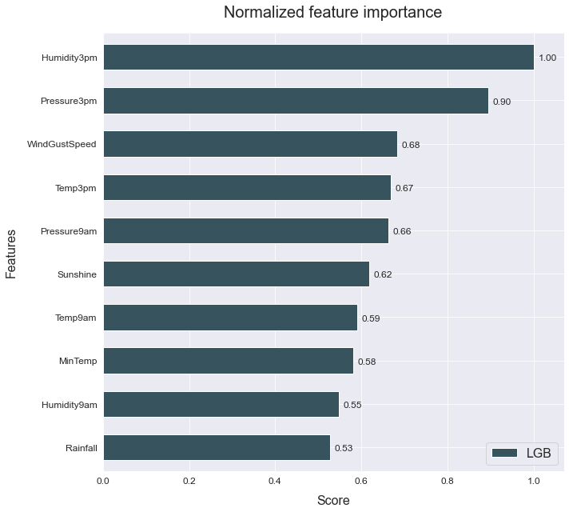
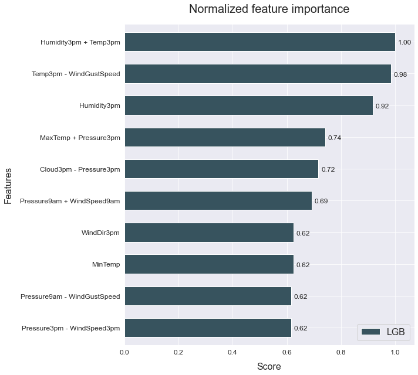

# Feature engineering
------------------------------

This example shows how to use automated feature generation to improve your model's performance.

The data used is a variation on the Australian weather dataset from [https://www.kaggle.com/jsphyg/weather-dataset-rattle-package](https://www.kaggle.com/jsphyg/weather-dataset-rattle-package). The goal of this dataset is to predict whether or not it will rain tomorrow training a binay classifier on target `RainTomorrow`.

## Load the data


```python
# Import packages
import pandas as pd
from atom import ATOMClassifier
```


```python
# Load data
X = pd.read_csv('./datasets/weatherAUS.csv')

# Let's have a look at a subset of the data
X.sample(frac=1).iloc[:5, :8]
```


<div>
<style scoped>
    .dataframe tbody tr th:only-of-type {
        vertical-align: middle;
    }

    .dataframe tbody tr th {
        vertical-align: top;
    }

    .dataframe thead th {
        text-align: right;
    }
</style>
<table border="1" class="dataframe">
  <thead>
    <tr style="text-align: right;">
      <th></th>
      <th>Location</th>
      <th>MinTemp</th>
      <th>MaxTemp</th>
      <th>Rainfall</th>
      <th>Evaporation</th>
      <th>Sunshine</th>
      <th>WindGustDir</th>
      <th>WindGustSpeed</th>
    </tr>
  </thead>
  <tbody>
    <tr>
      <th>36171</th>
      <td>WaggaWagga</td>
      <td>14.3</td>
      <td>21.4</td>
      <td>0.8</td>
      <td>10.6</td>
      <td>5.8</td>
      <td>W</td>
      <td>52.0</td>
    </tr>
    <tr>
      <th>44425</th>
      <td>Canberra</td>
      <td>16.0</td>
      <td>22.8</td>
      <td>0.0</td>
      <td>12.4</td>
      <td>6.0</td>
      <td>E</td>
      <td>50.0</td>
    </tr>
    <tr>
      <th>126238</th>
      <td>Walpole</td>
      <td>13.8</td>
      <td>20.7</td>
      <td>4.8</td>
      <td>NaN</td>
      <td>NaN</td>
      <td>NW</td>
      <td>33.0</td>
    </tr>
    <tr>
      <th>54550</th>
      <td>Ballarat</td>
      <td>3.3</td>
      <td>14.7</td>
      <td>0.0</td>
      <td>NaN</td>
      <td>NaN</td>
      <td>N</td>
      <td>46.0</td>
    </tr>
    <tr>
      <th>85638</th>
      <td>Cairns</td>
      <td>23.5</td>
      <td>31.5</td>
      <td>43.8</td>
      <td>0.8</td>
      <td>8.5</td>
      <td>SSE</td>
      <td>52.0</td>
    </tr>
  </tbody>
</table>
</div>


## Run the pipeline


```python
# Initiate ATOM and apply data cleaning
atom = ATOMClassifier(X, n_rows=1e4, test_size=0.2, verbose=0, random_state=1)
atom.impute(strat_num='knn', strat_cat='remove', min_frac_rows=0.8)
atom.encode(max_onehot=10, frac_to_other=0.04)

# Let's see how a LightGBM model performs without adding additional features
atom.run('LGB', metric='auc')
atom.scoring()
```

    is_categorical is deprecated and will be removed in a future version.  Use is_categorical_dtype instead
    

    Results ===================== >>
    LightGBM --> roc_auc: 0.878
    


```python
# What are the most important fetaures?
atom.plot_feature_importance(show=10)
```





**Now let's create some new fetaures using Deep Feature Synthesis**


```python
atom.verbose = 2  # Increase verbosity to see the output

# Create 100 new features using DFS
atom.feature_generation(strategy='dfs', n_features=100, operators=['add', 'sub', 'log', 'sqrt'])
```

    Fitting FeatureGenerator...
    Creating new features...
     --> 100 new features were added to the dataset.
    

    divide by zero encountered in log
    invalid value encountered in log
    


```python
# The warnings warn us that some operators created missing values!
# We can see the columns with missing values using the missing attribute
atom.missing

# We can easily turn off warnings in the future
atom.warnings = False
```


```python
# We can use the impute method again
atom.impute(strat_num='knn', strat_cat='remove', min_frac_rows=0.8)
```

    Fitting Imputer...
    Imputing missing values...
     --> Imputing 577 missing values using the KNN imputer in feature LOG(Cloud9am).
     --> Dropping feature LOG(RainToday_other) for containing 8873 (99%) missing values.
     --> Imputing 148 missing values using the KNN imputer in feature LOG(Sunshine).
     --> Imputing 6 missing values using the KNN imputer in feature LOG(Temp9am).
     --> Imputing 33 missing values using the KNN imputer in feature LOG(WindSpeed3pm).
    


```python
# 100 new features may be to much...
# Let's check for multicollinearity and use RFECV to reduce the number even further
atom.feature_selection(strategy='RFECV', solver='lgb', n_features=30, scoring='auc', max_correlation=0.98)
```

    Fitting FeatureSelector...
    Performing feature selection ...
     --> Feature Location was removed due to low variance. Value 0.2077375946173255 repeated in 100% of the rows.
     --> Feature Cloud3pm + Humidity3pm was removed due to collinearity with another feature.
     --> Feature Cloud3pm + RainToday_No was removed due to collinearity with another feature.
     --> Feature Cloud3pm + WindDir9am was removed due to collinearity with another feature.
     --> Feature Cloud3pm - Location was removed due to collinearity with another feature.
     --> Feature Cloud3pm - RainToday_No was removed due to collinearity with another feature.
     --> Feature Cloud9am + WindGustDir was removed due to collinearity with another feature.
     --> Feature Evaporation + Location was removed due to collinearity with another feature.
     --> Feature Evaporation + WindGustDir was removed due to collinearity with another feature.
     --> Feature Evaporation - WindDir3pm was removed due to collinearity with another feature.
     --> Feature Humidity3pm - RainToday_No was removed due to collinearity with another feature.
     --> Feature Humidity3pm - Sunshine was removed due to collinearity with another feature.
     --> Feature Humidity9am + RainToday_Yes was removed due to collinearity with another feature.
     --> Feature Humidity9am - RainToday_No was removed due to collinearity with another feature.
     --> Feature Humidity9am - Sunshine was removed due to collinearity with another feature.
     --> Feature LOG(MaxTemp) was removed due to collinearity with another feature.
     --> Feature Location + MinTemp was removed due to collinearity with another feature.
     --> Feature Location + RainToday_No was removed due to collinearity with another feature.
     --> Feature Location + WindDir3pm was removed due to collinearity with another feature.
     --> Feature Location + WindGustDir was removed due to collinearity with another feature.
     --> Feature Location + WindSpeed3pm was removed due to collinearity with another feature.
     --> Feature Location - RainToday_Yes was removed due to collinearity with another feature.
     --> Feature MaxTemp + RainToday_No was removed due to collinearity with another feature.
     --> Feature MaxTemp + RainToday_Yes was removed due to collinearity with another feature.
     --> Feature MinTemp + WindGustDir was removed due to collinearity with another feature.
     --> Feature Pressure3pm + RainToday_other was removed due to collinearity with another feature.
     --> Feature Pressure3pm + Temp3pm was removed due to collinearity with another feature.
     --> Feature Pressure3pm - WindGustDir was removed due to collinearity with another feature.
     --> Feature Pressure9am - WindGustDir was removed due to collinearity with another feature.
     --> Feature RainToday_No + Temp9am was removed due to collinearity with another feature.
     --> Feature RainToday_No + WindGustDir was removed due to collinearity with another feature.
     --> Feature RainToday_No - WindDir9am was removed due to collinearity with another feature.
     --> Feature RainToday_Yes + Temp9am was removed due to collinearity with another feature.
     --> Feature RainToday_Yes + WindDir3pm was removed due to collinearity with another feature.
     --> Feature RainToday_Yes + WindDir9am was removed due to collinearity with another feature.
     --> Feature RainToday_Yes - WindDir9am was removed due to collinearity with another feature.
     --> Feature RainToday_other - Temp9am was removed due to collinearity with another feature.
     --> Feature RainToday_other - WindGustSpeed was removed due to collinearity with another feature.
     --> Feature RainToday_other - WindSpeed9am was removed due to collinearity with another feature.
     --> Feature Rainfall + RainToday_No was removed due to collinearity with another feature.
     --> Feature Rainfall + WindDir9am was removed due to collinearity with another feature.
     --> Feature Rainfall - WindDir3pm was removed due to collinearity with another feature.
     --> Feature SQRT(Humidity3pm) was removed due to collinearity with another feature.
     --> Feature SQRT(Pressure9am) was removed due to collinearity with another feature.
     --> Feature Sunshine + WindDir9am was removed due to collinearity with another feature.
     --> Feature Temp3pm + WindDir9am was removed due to collinearity with another feature.
     --> Feature Temp3pm + WindGustDir was removed due to collinearity with another feature.
     --> Feature Temp3pm - WindDir3pm was removed due to collinearity with another feature.
     --> Feature Temp9am - WindDir9am was removed due to collinearity with another feature.
     --> Feature WindDir3pm - WindSpeed3pm was removed due to collinearity with another feature.
     --> Feature WindGustDir + WindGustSpeed was removed due to collinearity with another feature.
     --> Feature WindGustDir - WindSpeed9am was removed due to collinearity with another feature.
     --> The RFECV selected 64 features from the dataset.
       >>> Dropping feature RainToday_Yes (rank 3).
       >>> Dropping feature RainToday_No (rank 5).
       >>> Dropping feature Location - WindSpeed9am (rank 2).
       >>> Dropping feature SQRT(Cloud9am) (rank 7).
       >>> Dropping feature SQRT(Rainfall) (rank 6).
       >>> Dropping feature SQRT(WindSpeed9am) (rank 4).
    


```python
# The collinear attribute shows what features were removed due to multicollinearity
atom.collinear
```


<div>
<style scoped>
    .dataframe tbody tr th:only-of-type {
        vertical-align: middle;
    }

    .dataframe tbody tr th {
        vertical-align: top;
    }

    .dataframe thead th {
        text-align: right;
    }
</style>
<table border="1" class="dataframe">
  <thead>
    <tr style="text-align: right;">
      <th></th>
      <th>drop_feature</th>
      <th>correlated_feature</th>
      <th>correlation_value</th>
    </tr>
  </thead>
  <tbody>
    <tr>
      <th>0</th>
      <td>Cloud3pm + Humidity3pm</td>
      <td>Humidity3pm</td>
      <td>0.99578</td>
    </tr>
    <tr>
      <th>1</th>
      <td>Cloud3pm + RainToday_No</td>
      <td>Cloud3pm</td>
      <td>0.98122</td>
    </tr>
    <tr>
      <th>2</th>
      <td>Cloud3pm + WindDir9am</td>
      <td>Cloud3pm, Cloud3pm + RainToday_No</td>
      <td>0.99968, 0.98054</td>
    </tr>
    <tr>
      <th>3</th>
      <td>Cloud3pm - Location</td>
      <td>Cloud3pm, Cloud3pm + RainToday_No, Cloud3pm + ...</td>
      <td>1.0, 0.98122, 0.99968</td>
    </tr>
    <tr>
      <th>4</th>
      <td>Cloud3pm - RainToday_No</td>
      <td>Cloud3pm, Cloud3pm + WindDir9am, Cloud3pm - Lo...</td>
      <td>0.98405, 0.98408, 0.98405</td>
    </tr>
    <tr>
      <th>5</th>
      <td>Cloud9am + WindGustDir</td>
      <td>Cloud9am</td>
      <td>0.99979</td>
    </tr>
    <tr>
      <th>6</th>
      <td>Evaporation + Location</td>
      <td>Evaporation</td>
      <td>1.0</td>
    </tr>
    <tr>
      <th>7</th>
      <td>Evaporation + WindGustDir</td>
      <td>Evaporation, Evaporation + Location</td>
      <td>0.9999, 0.9999</td>
    </tr>
    <tr>
      <th>8</th>
      <td>Evaporation - WindDir3pm</td>
      <td>Evaporation, Evaporation + Location, Evaporati...</td>
      <td>0.9999, 0.9999, 0.99969</td>
    </tr>
    <tr>
      <th>9</th>
      <td>Humidity3pm - RainToday_No</td>
      <td>Humidity3pm, Cloud3pm + Humidity3pm</td>
      <td>0.99983, 0.99572</td>
    </tr>
    <tr>
      <th>10</th>
      <td>Humidity3pm - Sunshine</td>
      <td>Humidity3pm, Cloud3pm + Humidity3pm, Humidity3...</td>
      <td>0.99347, 0.99405, 0.9935</td>
    </tr>
    <tr>
      <th>11</th>
      <td>Humidity9am + RainToday_Yes</td>
      <td>Humidity9am</td>
      <td>0.9998</td>
    </tr>
    <tr>
      <th>12</th>
      <td>Humidity9am - RainToday_No</td>
      <td>Humidity9am, Humidity9am + RainToday_Yes</td>
      <td>0.9998, 0.99999</td>
    </tr>
    <tr>
      <th>13</th>
      <td>Humidity9am - Sunshine</td>
      <td>Humidity9am, Humidity9am + RainToday_Yes, Humi...</td>
      <td>0.99165, 0.99183, 0.99184</td>
    </tr>
    <tr>
      <th>14</th>
      <td>LOG(MaxTemp)</td>
      <td>MaxTemp</td>
      <td>0.98395</td>
    </tr>
    <tr>
      <th>15</th>
      <td>Location + MinTemp</td>
      <td>MinTemp</td>
      <td>1.0</td>
    </tr>
    <tr>
      <th>16</th>
      <td>Location + RainToday_No</td>
      <td>RainToday_Yes, RainToday_No</td>
      <td>-0.98403, 1.0</td>
    </tr>
    <tr>
      <th>17</th>
      <td>Location + WindDir3pm</td>
      <td>WindDir3pm</td>
      <td>1.0</td>
    </tr>
    <tr>
      <th>18</th>
      <td>Location + WindGustDir</td>
      <td>WindGustDir</td>
      <td>1.0</td>
    </tr>
    <tr>
      <th>19</th>
      <td>Location + WindSpeed3pm</td>
      <td>WindSpeed3pm</td>
      <td>1.0</td>
    </tr>
    <tr>
      <th>20</th>
      <td>Location - RainToday_Yes</td>
      <td>RainToday_Yes, RainToday_No, Location + RainTo...</td>
      <td>-1.0, 0.98403, 0.98403</td>
    </tr>
    <tr>
      <th>21</th>
      <td>MaxTemp + RainToday_No</td>
      <td>MaxTemp, LOG(MaxTemp)</td>
      <td>0.99841, 0.9831</td>
    </tr>
    <tr>
      <th>22</th>
      <td>MaxTemp + RainToday_Yes</td>
      <td>MaxTemp, LOG(MaxTemp), MaxTemp + RainToday_No</td>
      <td>0.99834, 0.98156, 0.99356</td>
    </tr>
    <tr>
      <th>23</th>
      <td>MinTemp + WindGustDir</td>
      <td>MinTemp, Location + MinTemp</td>
      <td>0.99997, 0.99997</td>
    </tr>
    <tr>
      <th>24</th>
      <td>Pressure3pm + RainToday_other</td>
      <td>Pressure3pm</td>
      <td>0.99995</td>
    </tr>
    <tr>
      <th>25</th>
      <td>Pressure3pm + Temp3pm</td>
      <td>MaxTemp + Pressure3pm</td>
      <td>0.98005</td>
    </tr>
    <tr>
      <th>26</th>
      <td>Pressure3pm - WindGustDir</td>
      <td>Pressure3pm, Pressure3pm + RainToday_other</td>
      <td>0.99998, 0.99992</td>
    </tr>
    <tr>
      <th>27</th>
      <td>Pressure9am - WindGustDir</td>
      <td>Pressure9am</td>
      <td>0.99998</td>
    </tr>
    <tr>
      <th>28</th>
      <td>RainToday_No + Temp9am</td>
      <td>Temp9am</td>
      <td>0.99797</td>
    </tr>
    <tr>
      <th>29</th>
      <td>RainToday_No + WindGustDir</td>
      <td>RainToday_No, Location + RainToday_No</td>
      <td>0.9933, 0.9933</td>
    </tr>
    <tr>
      <th>30</th>
      <td>RainToday_No - WindDir9am</td>
      <td>RainToday_No, Location + RainToday_No</td>
      <td>0.99169, 0.99169</td>
    </tr>
    <tr>
      <th>31</th>
      <td>RainToday_Yes + Temp9am</td>
      <td>Temp9am, RainToday_No + Temp9am, RainToday_No ...</td>
      <td>0.99795, 0.99191, -0.99993</td>
    </tr>
    <tr>
      <th>32</th>
      <td>RainToday_Yes + WindDir3pm</td>
      <td>RainToday_Yes, Location - RainToday_Yes</td>
      <td>0.99334, -0.99334</td>
    </tr>
    <tr>
      <th>33</th>
      <td>RainToday_Yes + WindDir9am</td>
      <td>RainToday_Yes, Location - RainToday_Yes, RainT...</td>
      <td>0.99154, -0.99154, -0.9847, 0.98993</td>
    </tr>
    <tr>
      <th>34</th>
      <td>RainToday_Yes - WindDir9am</td>
      <td>RainToday_Yes, Location - RainToday_Yes</td>
      <td>0.9911, -0.9911</td>
    </tr>
    <tr>
      <th>35</th>
      <td>RainToday_other - Temp9am</td>
      <td>Temp9am, RainToday_No + Temp9am, RainToday_No ...</td>
      <td>-0.99993, -0.998, 0.99775, -0.99792</td>
    </tr>
    <tr>
      <th>36</th>
      <td>RainToday_other - WindGustSpeed</td>
      <td>WindGustSpeed, Cloud9am - WindGustSpeed</td>
      <td>-0.99998, 0.98438</td>
    </tr>
    <tr>
      <th>37</th>
      <td>RainToday_other - WindSpeed9am</td>
      <td>WindSpeed9am, Location - WindSpeed9am</td>
      <td>-0.99997, 0.99997</td>
    </tr>
    <tr>
      <th>38</th>
      <td>Rainfall + RainToday_No</td>
      <td>Rainfall</td>
      <td>0.99907</td>
    </tr>
    <tr>
      <th>39</th>
      <td>Rainfall + WindDir9am</td>
      <td>Rainfall, Rainfall + RainToday_No</td>
      <td>0.99998, 0.99902</td>
    </tr>
    <tr>
      <th>40</th>
      <td>Rainfall - WindDir3pm</td>
      <td>Rainfall, Rainfall + RainToday_No, Rainfall + ...</td>
      <td>0.99998, 0.99907, 0.99995</td>
    </tr>
    <tr>
      <th>41</th>
      <td>SQRT(Humidity3pm)</td>
      <td>Humidity3pm, Cloud3pm + Humidity3pm, Humidity3...</td>
      <td>0.98722, 0.98193, 0.98674</td>
    </tr>
    <tr>
      <th>42</th>
      <td>SQRT(Pressure9am)</td>
      <td>Pressure9am, Pressure9am - WindGustDir</td>
      <td>1.0, 0.99998</td>
    </tr>
    <tr>
      <th>43</th>
      <td>Sunshine + WindDir9am</td>
      <td>Sunshine, RainToday_other - Sunshine</td>
      <td>0.99982, -0.99948</td>
    </tr>
    <tr>
      <th>44</th>
      <td>Temp3pm + WindDir9am</td>
      <td>Temp3pm</td>
      <td>0.99997</td>
    </tr>
    <tr>
      <th>45</th>
      <td>Temp3pm + WindGustDir</td>
      <td>Temp3pm, Temp3pm + WindDir9am</td>
      <td>0.99998, 0.99997</td>
    </tr>
    <tr>
      <th>46</th>
      <td>Temp3pm - WindDir3pm</td>
      <td>Temp3pm, Temp3pm + WindDir9am, Temp3pm + WindG...</td>
      <td>0.99998, 0.99993, 0.99993</td>
    </tr>
    <tr>
      <th>47</th>
      <td>Temp9am - WindDir9am</td>
      <td>Temp9am, RainToday_No + Temp9am, RainToday_No ...</td>
      <td>0.99996, 0.99798, -0.99783, 0.99787, -0.9999</td>
    </tr>
    <tr>
      <th>48</th>
      <td>WindDir3pm - WindSpeed3pm</td>
      <td>WindSpeed3pm, Location + WindSpeed3pm, Locatio...</td>
      <td>-0.99998, -0.99998, 0.99998</td>
    </tr>
    <tr>
      <th>49</th>
      <td>WindGustDir + WindGustSpeed</td>
      <td>WindGustSpeed, Cloud9am - WindGustSpeed, RainT...</td>
      <td>0.99999, -0.9843, -0.99998</td>
    </tr>
    <tr>
      <th>50</th>
      <td>WindGustDir - WindSpeed9am</td>
      <td>WindSpeed9am, Location - WindSpeed9am, RainTod...</td>
      <td>-0.99999, 0.99999, 0.99995</td>
    </tr>
  </tbody>
</table>
</div>


```python
# After applying RFECV, we can plot the score per number of features
atom.plot_rfecv()
```


```python
# Let's see how the model performs now
atom.run('LGB')
```

    
    Running pipeline ============================= >>
    Models in pipeline: LGB
    Metric: roc_auc
    
    
    Results for LightGBM:         
    Fitting -----------------------------------------
    Score on the train set --> roc_auc: 0.9962
    Score on the test set  --> roc_auc: 0.8787
    Time elapsed: 0.708s
    -------------------------------------------------
    Total time: 0.722s
    
    
    Final results ========================= >>
    Duration: 0.723s
    ------------------------------------------
    LightGBM --> roc_auc: 0.879
    


```python
# Did the feature importance change?
atom.plot_feature_importance(show=10)
```





**Lets try the same using Genetic Feature Generation**


```python
atom = ATOMClassifier(X, n_rows=1e4, test_size=0.2, verbose=0, warnings=False, random_state=1)
atom.impute(strat_num='knn', strat_cat='remove', min_frac_rows=0.8)
atom.encode(max_onehot=10, frac_to_other=0.04)

# Change verbosity to print extended info
atom.verbose = 2

# Create new features using Genetic Programming
atom.feature_generation(strategy='genetic', n_features=20, generations=10, population=2000)
```

    Fitting FeatureGenerator...
        |   Population Average    |             Best Individual              |
    ---- ------------------------- ------------------------------------------ ----------
     Gen   Length          Fitness   Length          Fitness      OOB Fitness  Time Left
       0     3.17         0.127531        3          0.50405              N/A      9.52s
       1     3.10         0.338627        5         0.536586              N/A      9.04s
       2     3.50         0.443734        9         0.541692              N/A      7.65s
       3     4.44          0.47684        7          0.54494              N/A      6.89s
       4     6.25         0.512037       13         0.546193              N/A      5.76s
       5     7.47         0.507736        9         0.550266              N/A      4.62s
       6     7.73         0.500405       11          0.55324              N/A      3.56s
       7     7.99         0.497944       11         0.553398              N/A      2.38s
       8     9.29         0.494223       13         0.554965              N/A      1.29s
       9    10.68         0.493684       11         0.553398              N/A      0.00s
    Creating new features...
     --> 5 new features were added to the dataset.
    


```python
# We can see the feature's fitness and description through the genetic_features attribute
atom.genetic_features
```


<div>
<style scoped>
    .dataframe tbody tr th:only-of-type {
        vertical-align: middle;
    }

    .dataframe tbody tr th {
        vertical-align: top;
    }

    .dataframe thead th {
        text-align: right;
    }
</style>
<table border="1" class="dataframe">
  <thead>
    <tr style="text-align: right;">
      <th></th>
      <th>name</th>
      <th>description</th>
      <th>fitness</th>
    </tr>
  </thead>
  <tbody>
    <tr>
      <th>0</th>
      <td>Feature 24</td>
      <td>mul(sub(sub(sub(Humidity3pm, Sunshine), Sunshi...</td>
      <td>0.542398</td>
    </tr>
    <tr>
      <th>1</th>
      <td>Feature 25</td>
      <td>mul(sub(sub(Humidity3pm, Sunshine), Sunshine),...</td>
      <td>0.542240</td>
    </tr>
    <tr>
      <th>2</th>
      <td>Feature 26</td>
      <td>mul(sub(Humidity3pm, Sunshine), mul(sub(sub(Hu...</td>
      <td>0.542240</td>
    </tr>
    <tr>
      <th>3</th>
      <td>Feature 27</td>
      <td>mul(mul(sub(Humidity3pm, Sunshine), WindGustSp...</td>
      <td>0.542240</td>
    </tr>
    <tr>
      <th>4</th>
      <td>Feature 28</td>
      <td>mul(mul(sub(sub(Humidity3pm, Sunshine), Sunshi...</td>
      <td>0.542240</td>
    </tr>
  </tbody>
</table>
</div>


```python
# And fit the model again
atom.run('LGB', metric='auc')
```

    
    Running pipeline ============================= >>
    Models in pipeline: LGB
    Metric: roc_auc
    
    
    Results for LightGBM:         
    Fitting -----------------------------------------
    Score on the train set --> roc_auc: 0.9901
    Score on the test set  --> roc_auc: 0.8793
    Time elapsed: 0.305s
    -------------------------------------------------
    Total time: 0.313s
    
    
    Final results ========================= >>
    Duration: 0.314s
    ------------------------------------------
    LightGBM --> roc_auc: 0.879
    


```python
atom.plot_feature_importance(show=10)
```


```python
# We can check the feature importance with other plots as well
atom.plot_permutation_importance(show=10)
atom.dependence_plot()
```


