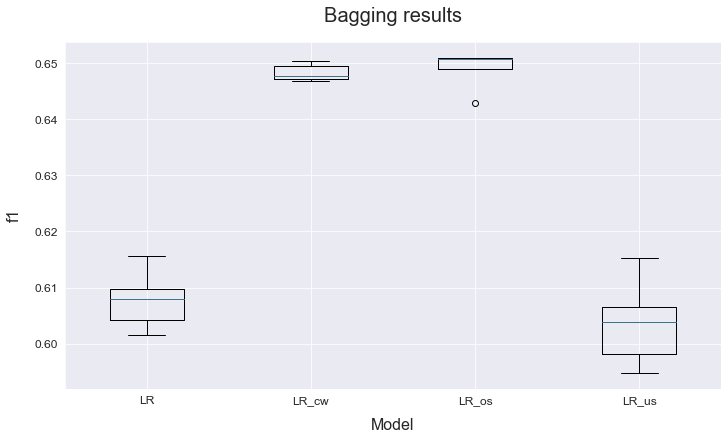

# Imbalanced datasets
------------------------------------

This example shows the different approaches we can take to handle imbalanced datasets.

The data used is a variation on the Australian weather dataset from [https://www.kaggle.com/jsphyg/weather-dataset-rattle-package](https://www.kaggle.com/jsphyg/weather-dataset-rattle-package). The goal of this dataset is to predict whether or not it will rain tomorrow training a binay classifier on target `RainTomorrow`.

## Load the data


```python
# Import packages
import pandas as pd
from atom import ATOMClassifier
```


    <Figure size 432x288 with 0 Axes>


```python
# Load data
X = pd.read_csv('./datasets/weatherAUS.csv')

# Let's have a look at a subset of the data
X.sample(frac=1).iloc[:5, :8]
```


<div>
<style scoped>
    .dataframe tbody tr th:only-of-type {
        vertical-align: middle;
    }

    .dataframe tbody tr th {
        vertical-align: top;
    }

    .dataframe thead th {
        text-align: right;
    }
</style>
<table border="1" class="dataframe">
  <thead>
    <tr style="text-align: right;">
      <th></th>
      <th>Location</th>
      <th>MinTemp</th>
      <th>MaxTemp</th>
      <th>Rainfall</th>
      <th>Evaporation</th>
      <th>Sunshine</th>
      <th>WindGustDir</th>
      <th>WindGustSpeed</th>
    </tr>
  </thead>
  <tbody>
    <tr>
      <th>56886</th>
      <td>Bendigo</td>
      <td>10.3</td>
      <td>14.0</td>
      <td>12.4</td>
      <td>1.2</td>
      <td>NaN</td>
      <td>ENE</td>
      <td>30.0</td>
    </tr>
    <tr>
      <th>132891</th>
      <td>AliceSprings</td>
      <td>21.0</td>
      <td>39.1</td>
      <td>1.2</td>
      <td>9.0</td>
      <td>12.2</td>
      <td>NNW</td>
      <td>41.0</td>
    </tr>
    <tr>
      <th>100511</th>
      <td>Nuriootpa</td>
      <td>2.6</td>
      <td>15.7</td>
      <td>1.0</td>
      <td>1.0</td>
      <td>5.3</td>
      <td>ENE</td>
      <td>15.0</td>
    </tr>
    <tr>
      <th>10385</th>
      <td>CoffsHarbour</td>
      <td>19.9</td>
      <td>27.0</td>
      <td>0.0</td>
      <td>4.8</td>
      <td>3.0</td>
      <td>NNW</td>
      <td>35.0</td>
    </tr>
    <tr>
      <th>112606</th>
      <td>PearceRAAF</td>
      <td>12.5</td>
      <td>36.1</td>
      <td>0.0</td>
      <td>NaN</td>
      <td>13.3</td>
      <td>WSW</td>
      <td>46.0</td>
    </tr>
  </tbody>
</table>
</div>


## Run the pipeline


```python
# Initialize ATOM with the created dataset
atom = ATOMClassifier(X, n_rows=0.3, test_size=0.3, verbose=2, random_state=1)
atom.clean()
atom.impute()
atom.encode()
```

    << ================== ATOM ================== >>
    Algorithm task: binary classification.
    
    Dataset stats ================== >>
    Shape: (42658, 22)
    Missing values: 95216
    Categorical columns: 5
    Scaled: False
    -----------------------------------
    Train set size: 29861
    Test set size: 12797
    -----------------------------------
    Train set balance: No:Yes <==> 3.5:1.0
    Test set balance: No:Yes <==> 3.4:1.0
    -----------------------------------
    Distribution of classes:
    |     |   dataset |   train |   test |
    |:----|----------:|--------:|-------:|
    | No  |     33139 |   23247 |   9892 |
    | Yes |      9519 |    6614 |   2905 |
    
    Applying data cleaning...
     --> Label-encoding the target column.
    Fitting Imputer...
    Imputing missing values...
     --> Dropping 352 rows for containing less than 50% non-missing values.
     --> Dropping 92 rows due to missing values in feature MinTemp.
     --> Dropping 56 rows due to missing values in feature MaxTemp.
     --> Dropping 350 rows due to missing values in feature Rainfall.
     --> Dropping 17551 rows due to missing values in feature Evaporation.
     --> Dropping 3229 rows due to missing values in feature Sunshine.
     --> Dropping 1258 rows due to missing values in feature WindGustDir.
     --> Dropping 655 rows due to missing values in feature WindDir9am.
     --> Dropping 69 rows due to missing values in feature WindDir3pm.
     --> Dropping 73 rows due to missing values in feature Humidity9am.
     --> Dropping 20 rows due to missing values in feature Humidity3pm.
     --> Dropping 18 rows due to missing values in feature Pressure9am.
     --> Dropping 5 rows due to missing values in feature Pressure3pm.
     --> Dropping 1609 rows due to missing values in feature Cloud9am.
     --> Dropping 426 rows due to missing values in feature Cloud3pm.
    Fitting Encoder...
    Encoding categorical columns...
     --> LeaveOneOut-encoding feature Location. Contains 26 unique classes.
     --> LeaveOneOut-encoding feature WindGustDir. Contains 16 unique classes.
     --> LeaveOneOut-encoding feature WindDir9am. Contains 16 unique classes.
     --> LeaveOneOut-encoding feature WindDir3pm. Contains 16 unique classes.
     --> Label-encoding feature RainToday. Contains 2 unique classes.
    


```python
# First, we fit a logistic regression model directly on the imbalanced data
atom.run("LR", metric="f1", bagging=5)
```

    
    Training ===================================== >>
    Models: LR
    Metric: f1
    
    
    Results for Logistic Regression:         
    Fit ---------------------------------------------
    Train evaluation --> f1: 0.6174
    Test evaluation --> f1: 0.6096
    Time elapsed: 0.074s
    Bagging -----------------------------------------
    Evaluation --> f1: 0.6078 ± 0.0048
    Time elapsed: 0.321s
    -------------------------------------------------
    Total time: 0.396s
    
    
    Final results ========================= >>
    Duration: 0.397s
    ------------------------------------------
    Logistic Regression --> f1: 0.608 ± 0.005
    

## Class weights


```python
# Add class weights through the est_params parameter
atom.run("LR_cw", est_params={"class_weight": atom.get_class_weight()}, bagging=5)
```

    
    Training ===================================== >>
    Models: LR_cw
    Metric: f1
    
    
    Results for Logistic Regression:         
    Fit ---------------------------------------------
    Train evaluation --> f1: 0.6449
    Test evaluation --> f1: 0.6472
    Time elapsed: 0.074s
    Bagging -----------------------------------------
    Evaluation --> f1: 0.6483 ± 0.0014
    Time elapsed: 0.306s
    -------------------------------------------------
    Total time: 0.381s
    
    
    Final results ========================= >>
    Duration: 0.382s
    ------------------------------------------
    Logistic Regression --> f1: 0.648 ± 0.001
    

## Oversampling & undersampling


```python
# Create a new branch for oversampling
atom.branch = "oversampling"
```

    New branch 'oversampling' successfully created!
    


```python
# Perform oversampling of the minority class
atom.balance(strategy='smote', sampling_strategy=0.9)
```

    Oversampling with SMOTE...
     --> Adding 5830 rows to class: Yes.
    


```python
atom.classes  # Note the balanced training set!
```


<div>
<style scoped>
    .dataframe tbody tr th:only-of-type {
        vertical-align: middle;
    }

    .dataframe tbody tr th {
        vertical-align: top;
    }

    .dataframe thead th {
        text-align: right;
    }
</style>
<table border="1" class="dataframe">
  <thead>
    <tr style="text-align: right;">
      <th></th>
      <th>dataset</th>
      <th>train</th>
      <th>test</th>
    </tr>
  </thead>
  <tbody>
    <tr>
      <th>0</th>
      <td>13189</td>
      <td>9317</td>
      <td>3872</td>
    </tr>
    <tr>
      <th>1</th>
      <td>9536</td>
      <td>8385</td>
      <td>1151</td>
    </tr>
  </tbody>
</table>
</div>


```python
atom.run("LR_os", bagging=5)
```

    
    Training ===================================== >>
    Models: LR_os
    Metric: f1
    
    
    Results for Logistic Regression:         
    Fit ---------------------------------------------
    Train evaluation --> f1: 0.7918
    Test evaluation --> f1: 0.6505
    Time elapsed: 0.097s
    Bagging -----------------------------------------
    Evaluation --> f1: 0.6489 ± 0.0031
    Time elapsed: 0.368s
    -------------------------------------------------
    Total time: 0.465s
    
    
    Final results ========================= >>
    Duration: 0.466s
    ------------------------------------------
    Logistic Regression --> f1: 0.649 ± 0.003
    


```python
# Create the undersampling branch from main
atom.branch = "undersampling_from_main"

# Note that here the data is still imbalanced!
atom.classes
```

    New branch 'undersampling' successfully created!
    


<div>
<style scoped>
    .dataframe tbody tr th:only-of-type {
        vertical-align: middle;
    }

    .dataframe tbody tr th {
        vertical-align: top;
    }

    .dataframe thead th {
        text-align: right;
    }
</style>
<table border="1" class="dataframe">
  <thead>
    <tr style="text-align: right;">
      <th></th>
      <th>dataset</th>
      <th>train</th>
      <th>test</th>
    </tr>
  </thead>
  <tbody>
    <tr>
      <th>0</th>
      <td>13189</td>
      <td>9317</td>
      <td>3872</td>
    </tr>
    <tr>
      <th>1</th>
      <td>3706</td>
      <td>2555</td>
      <td>1151</td>
    </tr>
  </tbody>
</table>
</div>


```python
# Perform undersampling of the majority class
atom.balance(strategy='NearMiss', sampling_strategy=0.9)
```

    Undersampling with NearMiss...
     --> Removing 6479 rows from class: No.
    


```python
atom.run("LR_us", bagging=5)
```

    
    Training ===================================== >>
    Models: LR_us
    Metric: f1
    
    
    Results for Logistic Regression:         
    Fit ---------------------------------------------
    Train evaluation --> f1: 0.7829
    Test evaluation --> f1: 0.6061
    Time elapsed: 0.052s
    Bagging -----------------------------------------
    Evaluation --> f1: 0.6037 ± 0.0071
    Time elapsed: 0.213s
    -------------------------------------------------
    Total time: 0.266s
    
    
    Final results ========================= >>
    Duration: 0.267s
    ------------------------------------------
    Logistic Regression --> f1: 0.604 ± 0.007 ~
    

## Analyze results


```python
atom.plot_bagging()
```




