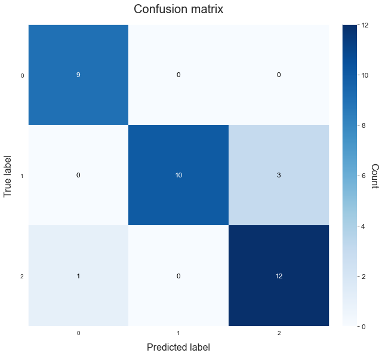

# Multiclass classification
---------------------------------

This example shows how to compare the performance of three models on a multiclass classification task.

Import the wine dataset from [sklearn.datasets](https://scikit-learn.org/stable/datasets/index.html#breast-cancer-wisconsin-diagnostic-dataset). This is a small and easy to train dataset whose goal is to predict wines into three groups (which cultivator it's from) using features based on the results of chemical analysis.

## Load the data


```python
# Import packages
from sklearn.datasets import load_wine
from atom import ATOMClassifier
```


```python
# Load the dataset's features and targets
X, y = load_wine(return_X_y=True, as_frame=True)

# Let's have a look at a subsample of the data
X.sample(frac=1).iloc[:5, :8]
```


<div>
<style scoped>
    .dataframe tbody tr th:only-of-type {
        vertical-align: middle;
    }

    .dataframe tbody tr th {
        vertical-align: top;
    }

    .dataframe thead th {
        text-align: right;
    }
</style>
<table border="1" class="dataframe">
  <thead>
    <tr style="text-align: right;">
      <th></th>
      <th>alcohol</th>
      <th>malic_acid</th>
      <th>ash</th>
      <th>alcalinity_of_ash</th>
      <th>magnesium</th>
      <th>total_phenols</th>
      <th>flavanoids</th>
      <th>nonflavanoid_phenols</th>
    </tr>
  </thead>
  <tbody>
    <tr>
      <th>62</th>
      <td>13.67</td>
      <td>1.25</td>
      <td>1.92</td>
      <td>18.0</td>
      <td>94.0</td>
      <td>2.10</td>
      <td>1.79</td>
      <td>0.32</td>
    </tr>
    <tr>
      <th>46</th>
      <td>14.38</td>
      <td>3.59</td>
      <td>2.28</td>
      <td>16.0</td>
      <td>102.0</td>
      <td>3.25</td>
      <td>3.17</td>
      <td>0.27</td>
    </tr>
    <tr>
      <th>30</th>
      <td>13.73</td>
      <td>1.50</td>
      <td>2.70</td>
      <td>22.5</td>
      <td>101.0</td>
      <td>3.00</td>
      <td>3.25</td>
      <td>0.29</td>
    </tr>
    <tr>
      <th>54</th>
      <td>13.74</td>
      <td>1.67</td>
      <td>2.25</td>
      <td>16.4</td>
      <td>118.0</td>
      <td>2.60</td>
      <td>2.90</td>
      <td>0.21</td>
    </tr>
    <tr>
      <th>146</th>
      <td>13.88</td>
      <td>5.04</td>
      <td>2.23</td>
      <td>20.0</td>
      <td>80.0</td>
      <td>0.98</td>
      <td>0.34</td>
      <td>0.40</td>
    </tr>
  </tbody>
</table>
</div>


## Run the pipeline


```python
atom = ATOMClassifier(X, y, n_jobs=-1, warnings='ignore', verbose=2, random_state=1)

# Fit the pipeline with the selected models
atom.run(models=['LR','LDA', 'RF'],
         metric='roc_auc_ovr',
         n_calls=4,
         n_random_starts=3,
         bo_params={'base_estimator': 'rf', 'max_time': 100},
         bagging=5)
```

    << ================== ATOM ================== >>
    Algorithm task: multiclass classification.
    Parallel processing with 16 cores.
    Applying data cleaning...
    
    Dataset stats ================= >>
    Shape: (178, 14)
    Scaled: False
    ----------------------------------
    Size of training set: 143
    Size of test set: 35
    ----------------------------------
    Class balance: 0:1:2 <==> 1.2:1.5:1.0
    Instances in target per class:
    |    |    total |    train_set |    test_set |
    |---:|---------:|-------------:|------------:|
    |  0 |       59 |           50 |           9 |
    |  1 |       71 |           58 |          13 |
    |  2 |       48 |           35 |          13 |
    
    
    Running pipeline ============================= >>
    Models in pipeline: LR, LDA, RF
    Metric: roc_auc_ovr
    
    
    Running BO for Logistic Regression...
    Random start 1 ----------------------------------
    Parameters --> {'max_iter': 335, 'solver': 'sag', 'class_weight': None, 'penalty': 'l2', 'C': 0.001}
    Evaluation --> roc_auc_ovr: 0.9970  Best roc_auc_ovr: 0.9970
    Time iteration: 3.490s   Total time: 3.494s
    Random start 2 ----------------------------------
    Parameters --> {'max_iter': 683, 'solver': 'lbfgs', 'class_weight': 'balanced', 'penalty': 'l2', 'C': 0.096}
    Evaluation --> roc_auc_ovr: 0.9996  Best roc_auc_ovr: 0.9996
    Time iteration: 3.023s   Total time: 6.523s
    Random start 3 ----------------------------------
    Parameters --> {'max_iter': 352, 'solver': 'saga', 'class_weight': 'balanced', 'penalty': 'l2', 'C': 0.001}
    Evaluation --> roc_auc_ovr: 0.9950  Best roc_auc_ovr: 0.9996
    Time iteration: 3.125s   Total time: 9.652s
    Iteration 4 -------------------------------------
    Parameters --> {'max_iter': 603, 'solver': 'liblinear', 'class_weight': None, 'penalty': 'l2', 'C': 0.061}
    Evaluation --> roc_auc_ovr: 1.0000  Best roc_auc_ovr: 1.0000
    Time iteration: 2.405s   Total time: 12.267s
    
    Results for Logistic Regression:         
    Bayesian Optimization ---------------------------
    Best parameters --> {'max_iter': 603, 'solver': 'liblinear', 'class_weight': None, 'penalty': 'l2', 'C': 0.061}
    Best evaluation --> roc_auc_ovr: 1.0000
    Time elapsed: 12.464s
    Fitting -----------------------------------------
    Score on the train set --> roc_auc_ovr: 1.0000
    Score on the test set  --> roc_auc_ovr: 0.9977
    Time elapsed: 0.018s
    Bagging -----------------------------------------
    Score --> roc_auc_ovr: 0.9981 ± 0.0009
    Time elapsed: 0.046s
    -------------------------------------------------
    Total time: 12.535s
    
    
    Running BO for Linear Discriminant Analysis...
    Random start 1 ----------------------------------
    Parameters --> {'solver': 'eigen', 'shrinkage': 1.0}
    Evaluation --> roc_auc_ovr: 0.8975  Best roc_auc_ovr: 0.8975
    Time iteration: 0.033s   Total time: 0.034s
    Random start 2 ----------------------------------
    Parameters --> {'solver': 'svd'}
    Evaluation --> roc_auc_ovr: 1.0000  Best roc_auc_ovr: 1.0000
    Time iteration: 0.033s   Total time: 0.070s
    Random start 3 ----------------------------------
    Parameters --> {'solver': 'svd'}
    Evaluation --> roc_auc_ovr: 1.0000  Best roc_auc_ovr: 1.0000
    Time iteration: 0.032s   Total time: 0.106s
    Iteration 4 -------------------------------------
    Parameters --> {'solver': 'lsqr', 'shrinkage': 0.7}
    Evaluation --> roc_auc_ovr: 0.8996  Best roc_auc_ovr: 1.0000
    Time iteration: 0.033s   Total time: 0.297s
    
    Results for Linear Discriminant Analysis:         
    Bayesian Optimization ---------------------------
    Best parameters --> {'solver': 'svd'}
    Best evaluation --> roc_auc_ovr: 1.0000
    Time elapsed: 0.531s
    Fitting -----------------------------------------
    Score on the train set --> roc_auc_ovr: 1.0000
    Score on the test set  --> roc_auc_ovr: 1.0000
    Time elapsed: 0.012s
    Bagging -----------------------------------------
    Score --> roc_auc_ovr: 0.9998 ± 0.0005
    Time elapsed: 0.034s
    -------------------------------------------------
    Total time: 0.583s
    
    
    Running BO for Random Forest...
    Random start 1 ----------------------------------
    Parameters --> {'n_estimators': 245, 'max_depth': 7, 'max_features': 1.0, 'criterion': 'gini', 'min_samples_split': 7, 'min_samples_leaf': 16, 'ccp_alpha': 0.008, 'bootstrap': True, 'max_samples': 0.6}
    Evaluation --> roc_auc_ovr: 0.9853  Best roc_auc_ovr: 0.9853
    Time iteration: 0.559s   Total time: 0.564s
    Random start 2 ----------------------------------
    Parameters --> {'n_estimators': 400, 'max_depth': 4, 'max_features': 0.8, 'criterion': 'gini', 'min_samples_split': 20, 'min_samples_leaf': 12, 'ccp_alpha': 0.016, 'bootstrap': True, 'max_samples': 0.7}
    Evaluation --> roc_auc_ovr: 0.9937  Best roc_auc_ovr: 0.9937
    Time iteration: 0.671s   Total time: 1.239s
    Random start 3 ----------------------------------
    Parameters --> {'n_estimators': 78, 'max_depth': 10, 'max_features': 0.7, 'criterion': 'gini', 'min_samples_split': 2, 'min_samples_leaf': 14, 'ccp_alpha': 0.025, 'bootstrap': False}
    Evaluation --> roc_auc_ovr: 0.9865  Best roc_auc_ovr: 0.9937
    Time iteration: 0.271s   Total time: 1.515s
    Iteration 4 -------------------------------------
    Parameters --> {'n_estimators': 323, 'max_depth': 7, 'max_features': 1.0, 'criterion': 'gini', 'min_samples_split': 16, 'min_samples_leaf': 1, 'ccp_alpha': 0.007, 'bootstrap': False}
    Evaluation --> roc_auc_ovr: 0.9315  Best roc_auc_ovr: 0.9937
    Time iteration: 0.545s   Total time: 2.257s
    
    Results for Random Forest:         
    Bayesian Optimization ---------------------------
    Best parameters --> {'n_estimators': 400, 'max_depth': 4, 'max_features': 0.8, 'criterion': 'gini', 'min_samples_split': 20, 'min_samples_leaf': 12, 'ccp_alpha': 0.016, 'bootstrap': True, 'max_samples': 0.7}
    Best evaluation --> roc_auc_ovr: 0.9937
    Time elapsed: 2.452s
    Fitting -----------------------------------------
    Score on the train set --> roc_auc_ovr: 0.9997
    Score on the test set  --> roc_auc_ovr: 0.9825
    Time elapsed: 0.753s
    Bagging -----------------------------------------
    Score --> roc_auc_ovr: 0.9737 ± 0.0116
    Time elapsed: 3.200s
    -------------------------------------------------
    Total time: 6.411s
    
    
    Final results ========================= >>
    Duration: 19.530s
    ------------------------------------------
    Logistic Regression          --> roc_auc_ovr: 0.998 ± 0.001
    Linear Discriminant Analysis --> roc_auc_ovr: 1.000 ± 0.000 !
    Random Forest                --> roc_auc_ovr: 0.974 ± 0.012
    

## Analyze the results


```python
# We can access the pipeline's results via the results attribute
atom.results
```


<div>
<style scoped>
    .dataframe tbody tr th:only-of-type {
        vertical-align: middle;
    }

    .dataframe tbody tr th {
        vertical-align: top;
    }

    .dataframe thead th {
        text-align: right;
    }
</style>
<table border="1" class="dataframe">
  <thead>
    <tr style="text-align: right;">
      <th></th>
      <th>name</th>
      <th>score_bo</th>
      <th>time_bo</th>
      <th>score_train</th>
      <th>score_test</th>
      <th>time_fit</th>
      <th>mean_bagging</th>
      <th>std_bagging</th>
      <th>time_bagging</th>
      <th>time</th>
    </tr>
    <tr>
      <th>model</th>
      <th></th>
      <th></th>
      <th></th>
      <th></th>
      <th></th>
      <th></th>
      <th></th>
      <th></th>
      <th></th>
      <th></th>
    </tr>
  </thead>
  <tbody>
    <tr>
      <th>LR</th>
      <td>Logistic Regression</td>
      <td>1.000000</td>
      <td>12.464s</td>
      <td>1.000000</td>
      <td>0.997669</td>
      <td>0.018s</td>
      <td>0.998135</td>
      <td>0.000932</td>
      <td>0.046s</td>
      <td>12.535s</td>
    </tr>
    <tr>
      <th>LDA</th>
      <td>Linear Discriminant Analysis</td>
      <td>1.000000</td>
      <td>0.531s</td>
      <td>1.000000</td>
      <td>1.000000</td>
      <td>0.012s</td>
      <td>0.999767</td>
      <td>0.000466</td>
      <td>0.034s</td>
      <td>0.583s</td>
    </tr>
    <tr>
      <th>RF</th>
      <td>Random Forest</td>
      <td>0.993712</td>
      <td>2.452s</td>
      <td>0.999725</td>
      <td>0.982517</td>
      <td>0.753s</td>
      <td>0.973686</td>
      <td>0.011577</td>
      <td>3.200s</td>
      <td>6.411s</td>
    </tr>
  </tbody>
</table>
</div>


```python
# Show the scoring for a different metric than the one we trained on
atom.scoring('precision_macro')
```

    Results ===================== >>
    Logistic Regression          --> precision_macro: 0.976
    Linear Discriminant Analysis --> precision_macro: 0.976
    Random Forest                --> precision_macro: 0.9
    

**Let's have a closer look at the Random Forest**


```python
# Get the results on some other metrics
print('Jaccard score:', atom.rf.scoring('jaccard_weighted'))
print('Recall score:', atom.rf.scoring('recall_macro'))
```

    Jaccard score: 0.7957142857142857
    Recall score: 0.8974358974358975
    


```python
# Plot the confusion matrix
atom.RF.plot_confusion_matrix(figsize=(9, 9))
```





```python
# Save the model as a pickle file
atom.RF.save_model('Random_Forest_model')
```

    Random Forest model saved successfully!
    
