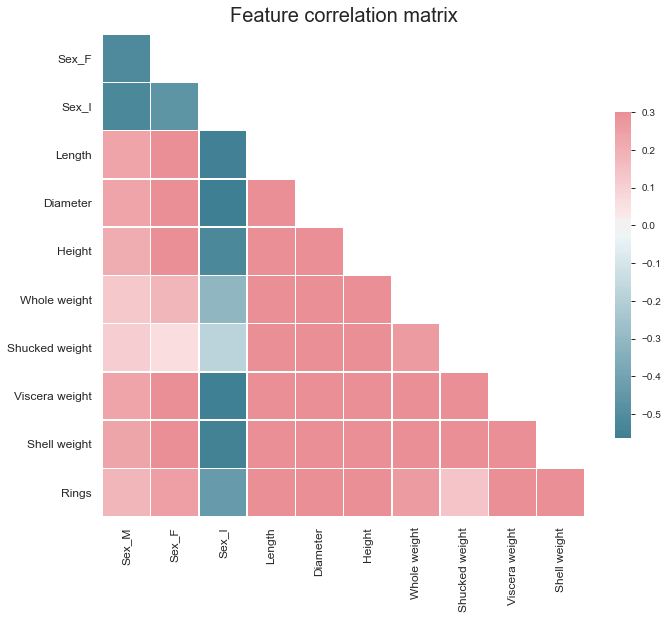
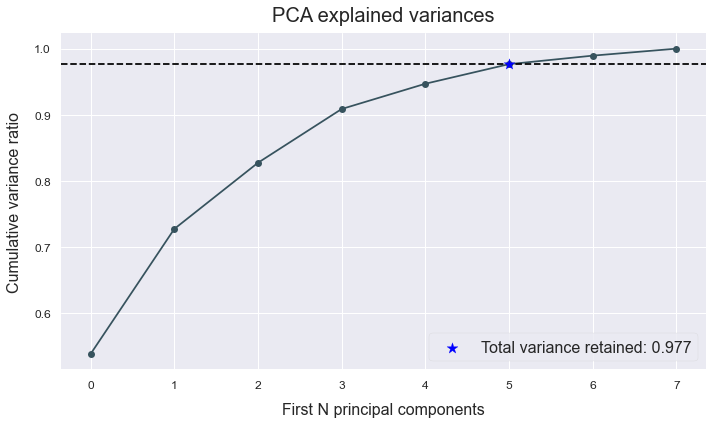
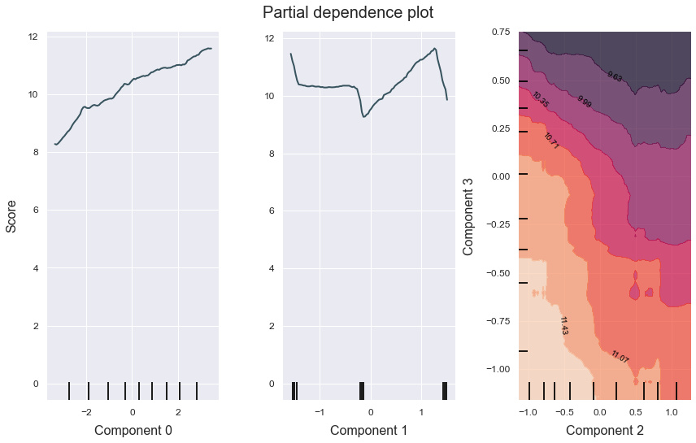

# Regression
---------------------------------

This example shows how to use ATOM to apply PCA on the data and run a regression pipeline.

Download the abalone dataset from [https://archive.ics.uci.edu/ml/datasets/Abalone](https://archive.ics.uci.edu/ml/datasets/Abalone). The goal of this dataset is to predict the rings (age) of abalone shells from physical measurements.

### Load the data


```python
# Import packages
import pandas as pd
from atom import ATOMRegressor

# Load the abalone dataset
X = pd.read_csv("./datasets/abalone.csv")
```


```python
# Let's have a look at the data
X.head()
```


<div>
<style scoped>
    .dataframe tbody tr th:only-of-type {
        vertical-align: middle;
    }

    .dataframe tbody tr th {
        vertical-align: top;
    }

    .dataframe thead th {
        text-align: right;
    }
</style>
<table border="1" class="dataframe">
  <thead>
    <tr style="text-align: right;">
      <th></th>
      <th>Sex</th>
      <th>Length</th>
      <th>Diameter</th>
      <th>Height</th>
      <th>Whole weight</th>
      <th>Shucked weight</th>
      <th>Viscera weight</th>
      <th>Shell weight</th>
      <th>Rings</th>
    </tr>
  </thead>
  <tbody>
    <tr>
      <th>0</th>
      <td>M</td>
      <td>0.455</td>
      <td>0.365</td>
      <td>0.095</td>
      <td>0.5140</td>
      <td>0.2245</td>
      <td>0.1010</td>
      <td>0.150</td>
      <td>15</td>
    </tr>
    <tr>
      <th>1</th>
      <td>M</td>
      <td>0.350</td>
      <td>0.265</td>
      <td>0.090</td>
      <td>0.2255</td>
      <td>0.0995</td>
      <td>0.0485</td>
      <td>0.070</td>
      <td>7</td>
    </tr>
    <tr>
      <th>2</th>
      <td>F</td>
      <td>0.530</td>
      <td>0.420</td>
      <td>0.135</td>
      <td>0.6770</td>
      <td>0.2565</td>
      <td>0.1415</td>
      <td>0.210</td>
      <td>9</td>
    </tr>
    <tr>
      <th>3</th>
      <td>M</td>
      <td>0.440</td>
      <td>0.365</td>
      <td>0.125</td>
      <td>0.5160</td>
      <td>0.2155</td>
      <td>0.1140</td>
      <td>0.155</td>
      <td>10</td>
    </tr>
    <tr>
      <th>4</th>
      <td>I</td>
      <td>0.330</td>
      <td>0.255</td>
      <td>0.080</td>
      <td>0.2050</td>
      <td>0.0895</td>
      <td>0.0395</td>
      <td>0.055</td>
      <td>7</td>
    </tr>
  </tbody>
</table>
</div>


```python
# Initialize ATOM for regression tasks and encode the categorical features
atom = ATOMRegressor(X, y="Rings", verbose=2, random_state=42)
atom.encode()
```

    << ================== ATOM ================== >>
    Algorithm task: regression.
    Applying data cleaning...
    
    Dataset stats ================= >>
    Shape: (4177, 9)
    Categorical columns: 1
    Scaled: False
    ----------------------------------
    Train set size: 3342
    Test set size: 835
    
    Fitting Encoder...
    Encoding categorical columns...
     --> OneHot-encoding feature Sex. Contains 3 unique classes.
    

    is_categorical is deprecated and will be removed in a future version.  Use is_categorical_dtype instead
    


```python
# Plot the dataset's correlation matrix
atom.plot_correlation()
```





```python
# Apply PCA for dimensionality reduction
atom.feature_selection(strategy="pca", n_features=6)
```

    Fitting FeatureSelector...
    Performing feature selection ...
     --> Applying Principal Component Analysis...
       >>> Scaling features...
       >>> Total explained variance: 0.976
    


```python
# Use the plotting methods to see the retained variance ratio
atom.plot_pca()
atom.plot_components(figsize=(8, 6), filename="atom_PCA_plot")
```





### Run the pipeline


```python
atom.run(
    models=["Tree", "Bag", "ET"],
    metric="MSE",
    n_calls=5,
    n_initial_points=2,
    bo_params={"base_estimator": "GBRT", "cv": 1},
    bagging=5
)
```

    
    Running pipeline ============================= >>
    Models in pipeline: Tree, Bag, ET
    Metric: neg_mean_squared_error
    
    
    Running BO for Decision Tree...
    Random start 1 ----------------------------------
    Parameters --> {"criterion": "mae", "splitter": "random", "max_depth": 5, "max_features": 0.9, "min_samples_split": 8, "min_samples_leaf": 19, "ccp_alpha": 0.003}
    Evaluation --> neg_mean_squared_error: -7.8759  Best neg_mean_squared_error: -7.8759
    Time iteration: 0.043s   Total time: 0.048s
    Random start 2 ----------------------------------
    Parameters --> {"criterion": "mae", "splitter": "best", "max_depth": 10, "max_features": 0.9, "min_samples_split": 3, "min_samples_leaf": 12, "ccp_alpha": 0.033}
    Evaluation --> neg_mean_squared_error: -9.1854  Best neg_mean_squared_error: -7.8759
    Time iteration: 0.181s   Total time: 0.233s
    Iteration 3 -------------------------------------
    Parameters --> {"criterion": "friedman_mse", "splitter": "random", "max_depth": 7, "max_features": 0.6, "min_samples_split": 17, "min_samples_leaf": 19, "ccp_alpha": 0.015}
    Evaluation --> neg_mean_squared_error: -8.2130  Best neg_mean_squared_error: -7.8759
    Time iteration: 0.007s   Total time: 0.428s
    Iteration 4 -------------------------------------
    Parameters --> {"criterion": "friedman_mse", "splitter": "best", "max_depth": 4, "max_features": 0.9, "min_samples_split": 3, "min_samples_leaf": 12, "ccp_alpha": 0.006}
    Evaluation --> neg_mean_squared_error: -6.7540  Best neg_mean_squared_error: -6.7540
    Time iteration: 0.010s   Total time: 0.533s
    Iteration 5 -------------------------------------
    Parameters --> {"criterion": "mae", "splitter": "best", "max_depth": 3, "max_features": 0.9, "min_samples_split": 7, "min_samples_leaf": 6, "ccp_alpha": 0.007}
    Evaluation --> neg_mean_squared_error: -7.2855  Best neg_mean_squared_error: -6.7540
    Time iteration: 0.132s   Total time: 0.757s
    
    Results for Decision Tree:         
    Bayesian Optimization ---------------------------
    Best parameters --> {"criterion": "friedman_mse", "splitter": "best", "max_depth": 4, "max_features": 0.9, "min_samples_split": 3, "min_samples_leaf": 12, "ccp_alpha": 0.006}
    Best evaluation --> neg_mean_squared_error: -6.7540
    Time elapsed: 0.855s
    Fitting -----------------------------------------
    Score on the train set --> neg_mean_squared_error: -6.3636
    Score on the test set  --> neg_mean_squared_error: -5.4433
    Time elapsed: 0.011s
    Bagging -----------------------------------------
    Score --> neg_mean_squared_error: -5.5541 ± 0.1150
    Time elapsed: 0.039s
    -------------------------------------------------
    Total time: 0.910s
    
    
    Running BO for Bagging Regressor...
    Random start 1 ----------------------------------
    Parameters --> {"n_estimators": 112, "max_samples": 0.9, "max_features": 0.6, "bootstrap": False, "bootstrap_features": False}
    Evaluation --> neg_mean_squared_error: -5.7680  Best neg_mean_squared_error: -5.7680
    Time iteration: 0.877s   Total time: 0.881s
    Random start 2 ----------------------------------
    Parameters --> {"n_estimators": 131, "max_samples": 0.5, "max_features": 0.5, "bootstrap": False, "bootstrap_features": False}
    Evaluation --> neg_mean_squared_error: -6.8254  Best neg_mean_squared_error: -5.7680
    Time iteration: 0.585s   Total time: 1.471s
    Iteration 3 -------------------------------------
    Parameters --> {"n_estimators": 50, "max_samples": 0.9, "max_features": 0.6, "bootstrap": False, "bootstrap_features": True}
    Evaluation --> neg_mean_squared_error: -5.4895  Best neg_mean_squared_error: -5.4895
    Time iteration: 0.389s   Total time: 1.953s
    Iteration 4 -------------------------------------
    Parameters --> {"n_estimators": 74, "max_samples": 0.5, "max_features": 0.5, "bootstrap": False, "bootstrap_features": True}
    Evaluation --> neg_mean_squared_error: -6.0363  Best neg_mean_squared_error: -5.4895
    Time iteration: 0.330s   Total time: 2.381s
    Iteration 5 -------------------------------------
    Parameters --> {"n_estimators": 36, "max_samples": 0.9, "max_features": 0.6, "bootstrap": True, "bootstrap_features": False}
    Evaluation --> neg_mean_squared_error: -6.0037  Best neg_mean_squared_error: -5.4895
    Time iteration: 0.194s   Total time: 2.668s
    
    Results for Bagging Regressor:         
    Bayesian Optimization ---------------------------
    Best parameters --> {"n_estimators": 50, "max_samples": 0.9, "max_features": 0.6, "bootstrap": False, "bootstrap_features": True}
    Best evaluation --> neg_mean_squared_error: -5.4895
    Time elapsed: 2.764s
    Fitting -----------------------------------------
    Score on the train set --> neg_mean_squared_error: -0.0867
    Score on the test set  --> neg_mean_squared_error: -4.9533
    Time elapsed: 0.571s
    Bagging -----------------------------------------
    Score --> neg_mean_squared_error: -5.2363 ± 0.1099
    Time elapsed: 2.325s
    -------------------------------------------------
    Total time: 5.662s
    
    
    Running BO for Extra-Trees...
    Random start 1 ----------------------------------
    Parameters --> {"n_estimators": 112, "max_depth": 6, "max_features": 1.0, "criterion": "mae", "min_samples_split": 8, "min_samples_leaf": 19, "ccp_alpha": 0.003, "bootstrap": True, "max_samples": 0.6}
    Evaluation --> neg_mean_squared_error: -7.1995  Best neg_mean_squared_error: -7.1995
    Time iteration: 1.034s   Total time: 1.040s
    Random start 2 ----------------------------------
    Parameters --> {"n_estimators": 369, "max_depth": 10, "max_features": 0.8, "criterion": "mse", "min_samples_split": 13, "min_samples_leaf": 6, "ccp_alpha": 0.0, "bootstrap": False}
    Evaluation --> neg_mean_squared_error: -6.9525  Best neg_mean_squared_error: -6.9525
    Time iteration: 0.495s   Total time: 1.538s
    Iteration 3 -------------------------------------
    Parameters --> {"n_estimators": 481, "max_depth": 10, "max_features": 0.8, "criterion": "mse", "min_samples_split": 7, "min_samples_leaf": 2, "ccp_alpha": 0.001, "bootstrap": False}
    Evaluation --> neg_mean_squared_error: -5.0279  Best neg_mean_squared_error: -5.0279
    Time iteration: 0.744s   Total time: 2.388s
    Iteration 4 -------------------------------------
    Parameters --> {"n_estimators": 460, "max_depth": 5, "max_features": 1.0, "criterion": "mae", "min_samples_split": 5, "min_samples_leaf": 4, "ccp_alpha": 0.034, "bootstrap": True, "max_samples": 0.6}
    Evaluation --> neg_mean_squared_error: -7.3319  Best neg_mean_squared_error: -5.0279
    Time iteration: 5.020s   Total time: 7.517s
    Iteration 5 -------------------------------------
    Parameters --> {"n_estimators": 474, "max_depth": 4, "max_features": 0.8, "criterion": "mae", "min_samples_split": 20, "min_samples_leaf": 1, "ccp_alpha": 0.018, "bootstrap": True, "max_samples": 0.6}
    Evaluation --> neg_mean_squared_error: -7.5183  Best neg_mean_squared_error: -5.0279
    Time iteration: 4.067s   Total time: 11.690s
    
    Results for Extra-Trees:         
    Bayesian Optimization ---------------------------
    Best parameters --> {"n_estimators": 481, "max_depth": 10, "max_features": 0.8, "criterion": "mse", "min_samples_split": 7, "min_samples_leaf": 2, "ccp_alpha": 0.001, "bootstrap": False}
    Best evaluation --> neg_mean_squared_error: -5.0279
    Time elapsed: 11.801s
    Fitting -----------------------------------------
    Score on the train set --> neg_mean_squared_error: -4.5366
    Score on the test set  --> neg_mean_squared_error: -4.4905
    Time elapsed: 0.968s
    Bagging -----------------------------------------
    Score --> neg_mean_squared_error: -4.5803 ± 0.0691
    Time elapsed: 4.259s
    -------------------------------------------------
    Total time: 17.032s
    
    
    Final results ========================= >>
    Duration: 23.606s
    ------------------------------------------
    Decision Tree     --> neg_mean_squared_error: -5.554 ± 0.115 ~
    Bagging Regressor --> neg_mean_squared_error: -5.236 ± 0.110 ~
    Extra-Trees       --> neg_mean_squared_error: -4.580 ± 0.069 ~ !
    

### Analyze the results


```python
# For regression tasks, use the errors or residuals plots to check the model performances
atom.plot_residuals()
```


```python
# Use the partial dependence plot to analyze the relation between the target response and the features
atom.n_jobs = 8  # The method can be slow...
atom.ET.plot_partial_dependence(features=(0, 1, (2, 3)), figsize=(12, 8))
```




