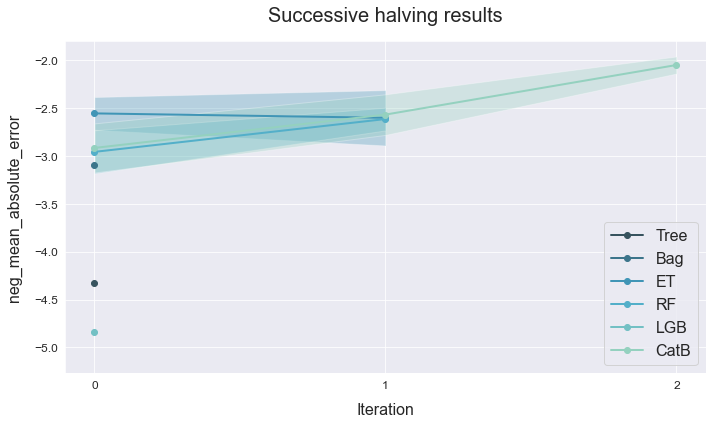

# Successive halving
---------------------------------

This example shows how to compare multiple tree-based models using successive halving.

Import the boston dataset from [sklearn.datasets](https://scikit-learn.org/stable/datasets/index.html#boston-dataset).
 This is a small and easy to train dataset whose goal is to predict house prices.

## Load the data


```python
# Import packages
import numpy as np
import pandas as pd
from sklearn.datasets import load_boston
from atom import ATOMRegressor
```


```python
# Load the dataset's features and targets
X, y = load_boston(return_X_y=True)
```

## Run the pipeline


```python
atom = ATOMRegressor(X, y, verbose=1, random_state=1)
```

    << ================== ATOM ================== >>
    Algorithm task: regression.
    Applying data cleaning...
    
    Dataset stats ================= >>
    Shape: (506, 14)
    Scaled: False
    ----------------------------------
    Size of training set: 405
    Size of test set: 101
    
    


```python
# We can compare tree-based models via successive halving
atom.successive_halving(['tree', 'bag', 'et', 'rf', 'lgb', 'catb'],
                        metric='mae',
                        bagging=5)
```

    
    Running pipeline ============================= >>
    Metric: neg_mean_absolute_error
    
    
    Run 0 (17% of set) ============================>>
    Models in pipeline: Tree, Bag, ET, RF, LGB, CatB
    Size of training set: 67
    Size of test set: 101
    
    
    Results for Decision Tree:         
    Fitting -----------------------------------------
    Score on the train set --> neg_mean_absolute_error: -0.0000
    Score on the test set  --> neg_mean_absolute_error: -3.3257
    Time elapsed: 0.007s
    Bagging -----------------------------------------
    Score --> neg_mean_absolute_error: -4.3307 ± 0.5250
    Time elapsed: 0.020s
    -------------------------------------------------
    Total time: 0.030s
    
    
    Results for Bagging Regressor:         
    Fitting -----------------------------------------
    Score on the train set --> neg_mean_absolute_error: -1.3054
    Score on the test set  --> neg_mean_absolute_error: -2.6950
    Time elapsed: 0.020s
    Bagging -----------------------------------------
    Score --> neg_mean_absolute_error: -3.0957 ± 0.2677
    Time elapsed: 0.079s
    -------------------------------------------------
    Total time: 0.103s
    
    
    Results for Extra-Trees:         
    Fitting -----------------------------------------
    Score on the train set --> neg_mean_absolute_error: -0.0000
    Score on the test set  --> neg_mean_absolute_error: -2.1541
    Time elapsed: 0.088s
    Bagging -----------------------------------------
    Score --> neg_mean_absolute_error: -2.5554 ± 0.1708
    Time elapsed: 0.364s
    -------------------------------------------------
    Total time: 0.456s
    
    
    Results for Random Forest:         
    Fitting -----------------------------------------
    Score on the train set --> neg_mean_absolute_error: -1.1509
    Score on the test set  --> neg_mean_absolute_error: -2.4143
    Time elapsed: 0.111s
    Bagging -----------------------------------------
    Score --> neg_mean_absolute_error: -2.9574 ± 0.2253
    Time elapsed: 0.509s
    -------------------------------------------------
    Total time: 0.625s
    
    
    Results for LightGBM:         
    Fitting -----------------------------------------
    Score on the train set --> neg_mean_absolute_error: -3.4205
    Score on the test set  --> neg_mean_absolute_error: -4.5600
    Time elapsed: 0.024s
    Bagging -----------------------------------------
    Score --> neg_mean_absolute_error: -4.8393 ± 0.2682
    Time elapsed: 0.068s
    -------------------------------------------------
    Total time: 0.097s
    
    
    Results for CatBoost:         
    Fitting -----------------------------------------
    Score on the train set --> neg_mean_absolute_error: -0.0806
    Score on the test set  --> neg_mean_absolute_error: -2.3984
    Time elapsed: 0.760s
    Bagging -----------------------------------------
    Score --> neg_mean_absolute_error: -2.9165 ± 0.2564
    Time elapsed: 3.112s
    -------------------------------------------------
    Total time: 3.875s
    
    
    Final results ========================= >>
    Duration: 5.188s
    ------------------------------------------
    Decision Tree     --> neg_mean_absolute_error: -4.331 ± 0.525 ~
    Bagging Regressor --> neg_mean_absolute_error: -3.096 ± 0.268 ~
    Extra-Trees       --> neg_mean_absolute_error: -2.555 ± 0.171 ~ !
    Random Forest     --> neg_mean_absolute_error: -2.957 ± 0.225 ~
    LightGBM          --> neg_mean_absolute_error: -4.839 ± 0.268 ~
    CatBoost          --> neg_mean_absolute_error: -2.916 ± 0.256 ~
    
    
    Run 1 (33% of set) ============================>>
    Models in pipeline: ET, CatB, RF
    Size of training set: 135
    Size of test set: 101
    
    
    Results for Extra-Trees:         
    Fitting -----------------------------------------
    Score on the train set --> neg_mean_absolute_error: -0.0000
    Score on the test set  --> neg_mean_absolute_error: -2.2361
    Time elapsed: 0.099s
    Bagging -----------------------------------------
    Score --> neg_mean_absolute_error: -2.6016 ± 0.2890
    Time elapsed: 0.418s
    -------------------------------------------------
    Total time: 0.520s
    
    
    Results for CatBoost:         
    Fitting -----------------------------------------
    Score on the train set --> neg_mean_absolute_error: -0.2835
    Score on the test set  --> neg_mean_absolute_error: -2.4196
    Time elapsed: 0.873s
    Bagging -----------------------------------------
    Score --> neg_mean_absolute_error: -2.5681 ± 0.2119
    Time elapsed: 3.423s
    -------------------------------------------------
    Total time: 4.300s
    
    
    Results for Random Forest:         
    Fitting -----------------------------------------
    Score on the train set --> neg_mean_absolute_error: -0.9820
    Score on the test set  --> neg_mean_absolute_error: -2.5055
    Time elapsed: 0.132s
    Bagging -----------------------------------------
    Score --> neg_mean_absolute_error: -2.6144 ± 0.1188
    Time elapsed: 0.603s
    -------------------------------------------------
    Total time: 0.739s
    
    
    Final results ========================= >>
    Duration: 5.561s
    ------------------------------------------
    Extra-Trees   --> neg_mean_absolute_error: -2.602 ± 0.289 ~
    CatBoost      --> neg_mean_absolute_error: -2.568 ± 0.212 ~ !
    Random Forest --> neg_mean_absolute_error: -2.614 ± 0.119 ~
    
    
    Run 2 (100% of set) ===========================>>
    Models in pipeline: CatB
    Size of training set: 405
    Size of test set: 101
    
    
    Results for CatBoost:         
    Fitting -----------------------------------------
    Score on the train set --> neg_mean_absolute_error: -0.3978
    Score on the test set  --> neg_mean_absolute_error: -1.8772
    Time elapsed: 1.252s
    Bagging -----------------------------------------
    Score --> neg_mean_absolute_error: -2.0501 ± 0.0892
    Time elapsed: 5.481s
    -------------------------------------------------
    Total time: 6.737s
    
    
    Final results ========================= >>
    Duration: 6.740s
    ------------------------------------------
    CatBoost --> neg_mean_absolute_error: -2.050 ± 0.089 ~
    

## Analyze results


```python
# Note that the results dataframe now is multi-index
atom.results
```


<div>
<style scoped>
    .dataframe tbody tr th:only-of-type {
        vertical-align: middle;
    }

    .dataframe tbody tr th {
        vertical-align: top;
    }

    .dataframe thead th {
        text-align: right;
    }
</style>
<table border="1" class="dataframe">
  <thead>
    <tr style="text-align: right;">
      <th></th>
      <th></th>
      <th>name</th>
      <th>score_train</th>
      <th>score_test</th>
      <th>time_fit</th>
      <th>mean_bagging</th>
      <th>std_bagging</th>
      <th>time_bagging</th>
      <th>time</th>
    </tr>
    <tr>
      <th>run</th>
      <th>model</th>
      <th></th>
      <th></th>
      <th></th>
      <th></th>
      <th></th>
      <th></th>
      <th></th>
      <th></th>
    </tr>
  </thead>
  <tbody>
    <tr>
      <th rowspan="6" valign="top">0</th>
      <th>Tree</th>
      <td>Decision Tree</td>
      <td>-0.000000e+00</td>
      <td>-3.325743</td>
      <td>0.007s</td>
      <td>-4.330693</td>
      <td>0.525026</td>
      <td>0.020s</td>
      <td>0.030s</td>
    </tr>
    <tr>
      <th>Bag</th>
      <td>Bagging Regressor</td>
      <td>-1.305373e+00</td>
      <td>-2.695050</td>
      <td>0.020s</td>
      <td>-3.095663</td>
      <td>0.267668</td>
      <td>0.079s</td>
      <td>0.103s</td>
    </tr>
    <tr>
      <th>ET</th>
      <td>Extra-Trees</td>
      <td>-2.256238e-14</td>
      <td>-2.154089</td>
      <td>0.088s</td>
      <td>-2.555434</td>
      <td>0.170823</td>
      <td>0.364s</td>
      <td>0.456s</td>
    </tr>
    <tr>
      <th>RF</th>
      <td>Random Forest</td>
      <td>-1.150866e+00</td>
      <td>-2.414297</td>
      <td>0.111s</td>
      <td>-2.957400</td>
      <td>0.225311</td>
      <td>0.509s</td>
      <td>0.625s</td>
    </tr>
    <tr>
      <th>LGB</th>
      <td>LightGBM</td>
      <td>-3.420518e+00</td>
      <td>-4.559962</td>
      <td>0.024s</td>
      <td>-4.839315</td>
      <td>0.268167</td>
      <td>0.068s</td>
      <td>0.097s</td>
    </tr>
    <tr>
      <th>CatB</th>
      <td>CatBoost</td>
      <td>-8.055503e-02</td>
      <td>-2.398431</td>
      <td>0.760s</td>
      <td>-2.916470</td>
      <td>0.256428</td>
      <td>3.112s</td>
      <td>3.875s</td>
    </tr>
    <tr>
      <th rowspan="3" valign="top">1</th>
      <th>ET</th>
      <td>Extra-Trees</td>
      <td>-2.315185e-14</td>
      <td>-2.236079</td>
      <td>0.099s</td>
      <td>-2.601648</td>
      <td>0.289034</td>
      <td>0.418s</td>
      <td>0.520s</td>
    </tr>
    <tr>
      <th>CatB</th>
      <td>CatBoost</td>
      <td>-2.835499e-01</td>
      <td>-2.419625</td>
      <td>0.873s</td>
      <td>-2.568085</td>
      <td>0.211868</td>
      <td>3.423s</td>
      <td>4.300s</td>
    </tr>
    <tr>
      <th>RF</th>
      <td>Random Forest</td>
      <td>-9.819778e-01</td>
      <td>-2.505465</td>
      <td>0.132s</td>
      <td>-2.614416</td>
      <td>0.118758</td>
      <td>0.603s</td>
      <td>0.739s</td>
    </tr>
    <tr>
      <th>2</th>
      <th>CatB</th>
      <td>CatBoost</td>
      <td>-3.977985e-01</td>
      <td>-1.877205</td>
      <td>1.252s</td>
      <td>-2.050118</td>
      <td>0.089185</td>
      <td>5.481s</td>
      <td>6.737s</td>
    </tr>
  </tbody>
</table>
</div>


```python
# Plot the successive halving's results
atom.plot_successive_halving()
```




