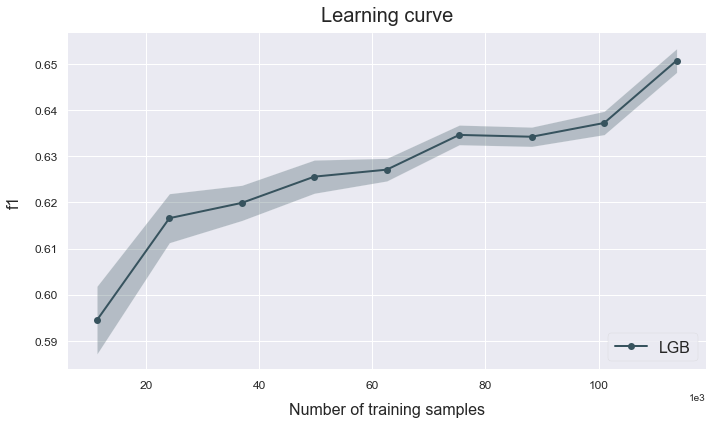

# Train sizing
---------------------------------

This example shows how to asses a model's performance based on the size of the training set.

The data used is a variation on the Australian weather dataset from https://www.kaggle.com/jsphyg/weather-dataset-rattle-package. The goal of this dataset is to predict whether or not it will rain tomorrow training a binay classifier on target RainTomorrow.

## Load the data


```python
# Import packages
import numpy as np
import pandas as pd
from atom import ATOMClassifier
```


```python
# Load the Australian weather dataset
X = pd.read_csv('./datasets/weatherAUS.csv')

# Let's have a look at a subset of the data
X.sample(frac=1).iloc[:5, :8]
```


<div>
<style scoped>
    .dataframe tbody tr th:only-of-type {
        vertical-align: middle;
    }

    .dataframe tbody tr th {
        vertical-align: top;
    }

    .dataframe thead th {
        text-align: right;
    }
</style>
<table border="1" class="dataframe">
  <thead>
    <tr style="text-align: right;">
      <th></th>
      <th>Location</th>
      <th>MinTemp</th>
      <th>MaxTemp</th>
      <th>Rainfall</th>
      <th>Evaporation</th>
      <th>Sunshine</th>
      <th>WindGustDir</th>
      <th>WindGustSpeed</th>
    </tr>
  </thead>
  <tbody>
    <tr>
      <th>131534</th>
      <td>Launceston</td>
      <td>13.3</td>
      <td>16.7</td>
      <td>28.0</td>
      <td>NaN</td>
      <td>NaN</td>
      <td>NW</td>
      <td>61.0</td>
    </tr>
    <tr>
      <th>20368</th>
      <td>NorahHead</td>
      <td>15.1</td>
      <td>23.1</td>
      <td>0.0</td>
      <td>NaN</td>
      <td>NaN</td>
      <td>SSE</td>
      <td>41.0</td>
    </tr>
    <tr>
      <th>13071</th>
      <td>Moree</td>
      <td>7.5</td>
      <td>27.6</td>
      <td>0.0</td>
      <td>5.2</td>
      <td>10.2</td>
      <td>WNW</td>
      <td>39.0</td>
    </tr>
    <tr>
      <th>73084</th>
      <td>Portland</td>
      <td>10.0</td>
      <td>21.6</td>
      <td>0.0</td>
      <td>6.2</td>
      <td>8.5</td>
      <td>E</td>
      <td>26.0</td>
    </tr>
    <tr>
      <th>32906</th>
      <td>SydneyAirport</td>
      <td>19.6</td>
      <td>29.3</td>
      <td>0.0</td>
      <td>4.0</td>
      <td>6.4</td>
      <td>WNW</td>
      <td>69.0</td>
    </tr>
  </tbody>
</table>
</div>


## Run the pipeline


```python
# Initialize ATOM and prepare the data
atom = ATOMClassifier(X, verbose=2, random_state=1)
atom.impute(strat_num='median', strat_cat='most_frequent', min_frac_rows=0.8)
atom.encode()
```

    << ================== ATOM ================== >>
    Algorithm task: binary classification.
    Applying data cleaning...
     --> Label-encoding the target column.
    
    Dataset stats ================= >>
    Shape: (142193, 22)
    Missing values: 316559
    Categorical columns: 5
    Scaled: False
    ----------------------------------
    Train set size: 113755
    Test set size: 28438
    ----------------------------------
    Dataset balance: No:Yes <==> 3.5:1.0
    ----------------------------------
    Instances in RainTomorrow per class:
    |        |    total |    train_set |    test_set |
    |:-------|---------:|-------------:|------------:|
    | 0: No  |   110316 |        88263 |       22053 |
    | 1: Yes |    31877 |        25492 |        6385 |
    
    Fitting Imputer...
    Imputing missing values...
     --> Dropping 15182 rows for containing less than 80% non-missing values.
     --> Imputing 100 missing values with median in feature MinTemp.
     --> Imputing 57 missing values with median in feature MaxTemp.
     --> Imputing 640 missing values with median in feature Rainfall.
     --> Imputing 46535 missing values with median in feature Evaporation.
     --> Imputing 53034 missing values with median in feature Sunshine.
     --> Imputing 4381 missing values with most_frequent in feature WindGustDir.
     --> Imputing 4359 missing values with median in feature WindGustSpeed.
     --> Imputing 6624 missing values with most_frequent in feature WindDir9am.
     --> Imputing 612 missing values with most_frequent in feature WindDir3pm.
     --> Imputing 80 missing values with median in feature WindSpeed9am.
     --> Imputing 49 missing values with median in feature WindSpeed3pm.
     --> Imputing 532 missing values with median in feature Humidity9am.
     --> Imputing 1168 missing values with median in feature Humidity3pm.
     --> Imputing 1028 missing values with median in feature Pressure9am.
     --> Imputing 972 missing values with median in feature Pressure3pm.
     --> Imputing 42172 missing values with median in feature Cloud9am.
     --> Imputing 44251 missing values with median in feature Cloud3pm.
     --> Imputing 98 missing values with median in feature Temp9am.
     --> Imputing 702 missing values with median in feature Temp3pm.
     --> Imputing 640 missing values with most_frequent in feature RainToday.
    Fitting Encoder...
    

    A column-vector y was passed when a 1d array was expected. Please change the shape of y to (n_samples, ), for example using ravel().
    

    Encoding categorical columns...
     --> LeaveOneOut-encoding feature Location. Contains 45 unique classes.
     --> LeaveOneOut-encoding feature WindGustDir. Contains 16 unique classes.
     --> LeaveOneOut-encoding feature WindDir9am. Contains 16 unique classes.
     --> LeaveOneOut-encoding feature WindDir3pm. Contains 16 unique classes.
     --> Label-encoding feature RainToday. Contains 2 unique classes.
    


```python
# We can analyze the impact of the training set's size on a LightGBM model
atom.train_sizing('lgb', train_sizes=np.linspace(0.1, 1, 9), bagging=4)
```

    
    Training ===================================== >>
    Models: LGB
    Metric: f1
    
    
    Run: 0 ================================ >>
    Size of training set: 10160 (10%)
    Size of test set: 25402
    
    
    Results for LightGBM:         
    Fit ---------------------------------------------
    Score on the train set --> f1: 0.8180
    Score on the test set  --> f1: 0.6101
    Time elapsed: 0.729s
    Bagging -----------------------------------------
    Score --> f1: 0.5947 ± 0.0046
    Time elapsed: 1.577s
    -------------------------------------------------
    Total time: 2.317s
    
    
    Final results ========================= >>
    Duration: 2.319s
    ------------------------------------------
    LightGBM --> f1: 0.595 ± 0.005 ~
    
    
    Run: 1 ================================ >>
    Size of training set: 21591 (21%)
    Size of test set: 25402
    
    
    Results for LightGBM:         
    Fit ---------------------------------------------
    Score on the train set --> f1: 0.7361
    Score on the test set  --> f1: 0.6279
    Time elapsed: 0.946s
    Bagging -----------------------------------------
    Score --> f1: 0.6164 ± 0.0057
    Time elapsed: 2.057s
    -------------------------------------------------
    Total time: 3.007s
    
    
    Final results ========================= >>
    Duration: 3.009s
    ------------------------------------------
    LightGBM --> f1: 0.616 ± 0.006
    
    
    Run: 2 ================================ >>
    Size of training set: 33022 (32%)
    Size of test set: 25402
    
    
    Results for LightGBM:         
    Fit ---------------------------------------------
    Score on the train set --> f1: 0.7056
    Score on the test set  --> f1: 0.6258
    Time elapsed: 1.163s
    Bagging -----------------------------------------
    Score --> f1: 0.6215 ± 0.0035
    Time elapsed: 2.506s
    -------------------------------------------------
    Total time: 3.674s
    
    
    Final results ========================= >>
    Duration: 3.676s
    ------------------------------------------
    LightGBM --> f1: 0.622 ± 0.003
    
    
    Run: 3 ================================ >>
    Size of training set: 44453 (44%)
    Size of test set: 25402
    
    
    Results for LightGBM:         
    Fit ---------------------------------------------
    Score on the train set --> f1: 0.6900
    Score on the test set  --> f1: 0.6392
    Time elapsed: 1.380s
    Bagging -----------------------------------------
    Score --> f1: 0.6267 ± 0.0028
    Time elapsed: 3.018s
    -------------------------------------------------
    Total time: 4.402s
    
    
    Final results ========================= >>
    Duration: 4.405s
    ------------------------------------------
    LightGBM --> f1: 0.627 ± 0.003
    
    
    Run: 4 ================================ >>
    Size of training set: 55884 (55%)
    Size of test set: 25402
    
    
    Results for LightGBM:         
    Fit ---------------------------------------------
    Score on the train set --> f1: 0.6813
    Score on the test set  --> f1: 0.6362
    Time elapsed: 1.648s
    Bagging -----------------------------------------
    Score --> f1: 0.6282 ± 0.0034
    Time elapsed: 3.556s
    -------------------------------------------------
    Total time: 5.209s
    
    
    Final results ========================= >>
    Duration: 5.212s
    ------------------------------------------
    LightGBM --> f1: 0.628 ± 0.003
    
    
    Run: 5 ================================ >>
    Size of training set: 67315 (66%)
    Size of test set: 25402
    
    
    Results for LightGBM:         
    Fit ---------------------------------------------
    Score on the train set --> f1: 0.6794
    Score on the test set  --> f1: 0.6397
    Time elapsed: 1.891s
    Bagging -----------------------------------------
    Score --> f1: 0.6352 ± 0.0027
    Time elapsed: 4.162s
    -------------------------------------------------
    Total time: 6.058s
    
    
    Final results ========================= >>
    Duration: 6.060s
    ------------------------------------------
    LightGBM --> f1: 0.635 ± 0.003
    
    
    Run: 6 ================================ >>
    Size of training set: 78746 (77%)
    Size of test set: 25402
    
    
    Results for LightGBM:         
    Fit ---------------------------------------------
    Score on the train set --> f1: 0.6769
    Score on the test set  --> f1: 0.6403
    Time elapsed: 2.053s
    Bagging -----------------------------------------
    Score --> f1: 0.6330 ± 0.0024
    Time elapsed: 4.509s
    -------------------------------------------------
    Total time: 6.569s
    
    
    Final results ========================= >>
    Duration: 6.571s
    ------------------------------------------
    LightGBM --> f1: 0.633 ± 0.002
    
    
    Run: 7 ================================ >>
    Size of training set: 90177 (89%)
    Size of test set: 25402
    
    
    Results for LightGBM:         
    Fit ---------------------------------------------
    Score on the train set --> f1: 0.6687
    Score on the test set  --> f1: 0.6422
    Time elapsed: 2.358s
    Bagging -----------------------------------------
    Score --> f1: 0.6354 ± 0.0041
    Time elapsed: 5.074s
    -------------------------------------------------
    Total time: 7.439s
    
    
    Final results ========================= >>
    Duration: 7.441s
    ------------------------------------------
    LightGBM --> f1: 0.635 ± 0.004
    
    
    Run: 8 ================================ >>
    Size of training set: 101609 (100%)
    Size of test set: 25402
    
    
    Results for LightGBM:         
    Fit ---------------------------------------------
    Score on the train set --> f1: 0.6669
    Score on the test set  --> f1: 0.6449
    Time elapsed: 2.606s
    Bagging -----------------------------------------
    Score --> f1: 0.6374 ± 0.0023
    Time elapsed: 5.634s
    -------------------------------------------------
    Total time: 8.247s
    
    
    Final results ========================= >>
    Duration: 8.249s
    ------------------------------------------
    LightGBM --> f1: 0.637 ± 0.002
    

## Analyze the results


```python
# Note that the results dataframe now is multi-index
atom.results
```


<div>
<style scoped>
    .dataframe tbody tr th:only-of-type {
        vertical-align: middle;
    }

    .dataframe tbody tr th {
        vertical-align: top;
    }

    .dataframe thead th {
        text-align: right;
    }
</style>
<table border="1" class="dataframe">
  <thead>
    <tr style="text-align: right;">
      <th></th>
      <th></th>
      <th>metric_train</th>
      <th>metric_test</th>
      <th>time_fit</th>
      <th>mean_bagging</th>
      <th>std_bagging</th>
      <th>time_bagging</th>
      <th>time</th>
    </tr>
    <tr>
      <th>frac</th>
      <th>model</th>
      <th></th>
      <th></th>
      <th></th>
      <th></th>
      <th></th>
      <th></th>
      <th></th>
    </tr>
  </thead>
  <tbody>
    <tr>
      <th>0.100</th>
      <th>LGB</th>
      <td>0.817968</td>
      <td>0.610102</td>
      <td>0.729s</td>
      <td>0.594748</td>
      <td>0.00457747</td>
      <td>1.577s</td>
      <td>2.317s</td>
    </tr>
    <tr>
      <th>0.213</th>
      <th>LGB</th>
      <td>0.736086</td>
      <td>0.627931</td>
      <td>0.946s</td>
      <td>0.616375</td>
      <td>0.00566304</td>
      <td>2.057s</td>
      <td>3.007s</td>
    </tr>
    <tr>
      <th>0.325</th>
      <th>LGB</th>
      <td>0.705598</td>
      <td>0.625811</td>
      <td>1.163s</td>
      <td>0.621507</td>
      <td>0.00349161</td>
      <td>2.506s</td>
      <td>3.674s</td>
    </tr>
    <tr>
      <th>0.438</th>
      <th>LGB</th>
      <td>0.689969</td>
      <td>0.639192</td>
      <td>1.380s</td>
      <td>0.62671</td>
      <td>0.0028187</td>
      <td>3.018s</td>
      <td>4.402s</td>
    </tr>
    <tr>
      <th>0.550</th>
      <th>LGB</th>
      <td>0.681329</td>
      <td>0.636177</td>
      <td>1.648s</td>
      <td>0.628191</td>
      <td>0.00342566</td>
      <td>3.556s</td>
      <td>5.209s</td>
    </tr>
    <tr>
      <th>0.662</th>
      <th>LGB</th>
      <td>0.679434</td>
      <td>0.639664</td>
      <td>1.891s</td>
      <td>0.635238</td>
      <td>0.00274304</td>
      <td>4.162s</td>
      <td>6.058s</td>
    </tr>
    <tr>
      <th>0.775</th>
      <th>LGB</th>
      <td>0.676917</td>
      <td>0.640345</td>
      <td>2.053s</td>
      <td>0.63302</td>
      <td>0.00235894</td>
      <td>4.509s</td>
      <td>6.569s</td>
    </tr>
    <tr>
      <th>0.888</th>
      <th>LGB</th>
      <td>0.668689</td>
      <td>0.642228</td>
      <td>2.358s</td>
      <td>0.635387</td>
      <td>0.00414126</td>
      <td>5.074s</td>
      <td>7.439s</td>
    </tr>
    <tr>
      <th>1.000</th>
      <th>LGB</th>
      <td>0.666853</td>
      <td>0.644936</td>
      <td>2.606s</td>
      <td>0.637363</td>
      <td>0.00233264</td>
      <td>5.634s</td>
      <td>8.247s</td>
    </tr>
  </tbody>
</table>
</div>


```python
# Plot the train sizing's results
atom.plot_learning_curve()
```




