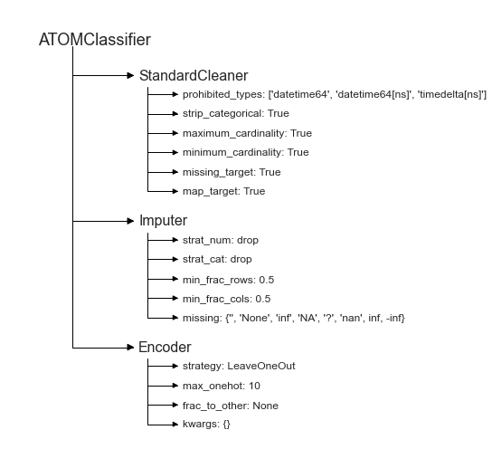

# Utilities
---------------------------------

This example shows various useful utilities that can be used to improve your pipelines.

The data used is a variation on the Australian weather dataset from [https://www.kaggle.com/jsphyg/weather-dataset-rattle-package](https://www.kaggle.com/jsphyg/weather-dataset-rattle-package). The goal of this dataset is to predict whether or not it will rain tomorrow training a binay classifier on target `RainTomorrow`.

## Load the data


```python
# Import packages
import pandas as pd
from sklearn.metrics import fbeta_score
from atom import ATOMClassifier
```


```python
# Load data
X = pd.read_csv('./datasets/weatherAUS.csv')

# Let's have a look at a subset of the data
X.sample(frac=1).iloc[:5, :8]
```


<div>
<style scoped>
    .dataframe tbody tr th:only-of-type {
        vertical-align: middle;
    }

    .dataframe tbody tr th {
        vertical-align: top;
    }

    .dataframe thead th {
        text-align: right;
    }
</style>
<table border="1" class="dataframe">
  <thead>
    <tr style="text-align: right;">
      <th></th>
      <th>Location</th>
      <th>MinTemp</th>
      <th>MaxTemp</th>
      <th>Rainfall</th>
      <th>Evaporation</th>
      <th>Sunshine</th>
      <th>WindGustDir</th>
      <th>WindGustSpeed</th>
    </tr>
  </thead>
  <tbody>
    <tr>
      <th>114293</th>
      <td>PearceRAAF</td>
      <td>3.1</td>
      <td>20.3</td>
      <td>0.2</td>
      <td>NaN</td>
      <td>8.9</td>
      <td>S</td>
      <td>28.0</td>
    </tr>
    <tr>
      <th>94808</th>
      <td>Adelaide</td>
      <td>21.4</td>
      <td>23.2</td>
      <td>30.2</td>
      <td>5.4</td>
      <td>0.0</td>
      <td>N</td>
      <td>22.0</td>
    </tr>
    <tr>
      <th>130362</th>
      <td>Launceston</td>
      <td>6.9</td>
      <td>22.5</td>
      <td>0.0</td>
      <td>NaN</td>
      <td>NaN</td>
      <td>N</td>
      <td>20.0</td>
    </tr>
    <tr>
      <th>28536</th>
      <td>Richmond</td>
      <td>13.7</td>
      <td>30.3</td>
      <td>0.0</td>
      <td>NaN</td>
      <td>NaN</td>
      <td>SSW</td>
      <td>76.0</td>
    </tr>
    <tr>
      <th>58618</th>
      <td>Bendigo</td>
      <td>4.0</td>
      <td>16.6</td>
      <td>0.0</td>
      <td>NaN</td>
      <td>NaN</td>
      <td>SE</td>
      <td>20.0</td>
    </tr>
  </tbody>
</table>
</div>


## Use the utility attributes


```python
atom = ATOMClassifier(X, warnings=False, random_state=1)

# We can quickly check what columns have missing values
print("Columns with missing values:\n", atom.missing)

# Or what columns are categorical
print("\nCategorical columns:", atom.categorical)

# Or if the dataset is scaled
print("\nIs the dataset scaled?", atom.scaled)
```

    Columns with missing values:
     MinTemp            637
    MaxTemp            322
    Rainfall          1406
    Evaporation      60843
    Sunshine         67816
    WindGustDir       9330
    WindGustSpeed     9270
    WindDir9am       10013
    WindDir3pm        3778
    WindSpeed9am      1348
    WindSpeed3pm      2630
    Humidity9am       1774
    Humidity3pm       3610
    Pressure9am      14014
    Pressure3pm      13981
    Cloud9am         53657
    Cloud3pm         57094
    Temp9am            904
    Temp3pm           2726
    RainToday         1406
    dtype: int64
    
    Categorical columns: ['Location', 'WindGustDir', 'WindDir9am', 'WindDir3pm', 'RainToday']
    
    Is the dataset scaled? False
    

## Use the stats method to check changes in the dataset


```python
# Note the number of missing values and categorical columns
atom.stats()

# Now, let's impute and encode the dataset...
atom.impute()
atom.encode()

# ... and the values are gone
atom.stats()
```

    
    Dataset stats ================= >>
    Shape: (142193, 22)
    Missing values: 316559
    Categorical columns: 5
    Scaled: False
    ----------------------------------
    Train set size: 113755
    Test set size: 28438
    ----------------------------------
    Dataset balance: No:Yes <==> 3.5:1.0
    ----------------------------------
    Instances in RainTomorrow per class:
    |        |    total |    train_set |    test_set |
    |:-------|---------:|-------------:|------------:|
    | 0: No  |   110316 |        88263 |       22053 |
    | 1: Yes |    31877 |        25492 |        6385 |
    
    
    Dataset stats ================= >>
    Shape: (56420, 22)
    Scaled: False
    ----------------------------------
    Train set size: 45136
    Test set size: 11284
    ----------------------------------
    Dataset balance: No:Yes <==> 3.5:1.0
    ----------------------------------
    Instances in RainTomorrow per class:
    |        |    total |    train_set |    test_set |
    |:-------|---------:|-------------:|------------:|
    | 0: No  |    43993 |        35199 |        8794 |
    | 1: Yes |    12427 |         9937 |        2490 |
    
    

## Change the data mid-pipeline


```python
# We can change atom's data mid-pipeline
# Note that we can only replace a dataframe with a new dataframe!
atom.X = atom.X.assign(AvgTemp=(atom.X['MaxTemp'] + atom.X['MinTemp'])/2)

# This will automatically update all other data attributes
assert 'AvgTemp' in atom.dataset
```

## Visualize the pipeline


```python
# We can easily visualize the pipeline in two ways
print(atom)  # Directly in the notebook
atom.plot_pipeline()  # Using a plot
```

    ATOMClassifier
     --> StandardCleaner
       >>> prohibited_types: ['datetime64', 'datetime64[ns]', 'timedelta[ns]']
       >>> strip_categorical: True
       >>> maximum_cardinality: True
       >>> minimum_cardinality: True
       >>> missing_target: True
       >>> map_target: True
     --> Imputer
       >>> strat_num: drop
       >>> strat_cat: drop
       >>> min_frac_rows: 0.5
       >>> min_frac_cols: 0.5
       >>> missing: {'', 'None', 'inf', 'NA', '?', 'nan', inf, -inf}
     --> Encoder
       >>> strategy: LeaveOneOut
       >>> max_onehot: 10
       >>> frac_to_other: None
       >>> kwargs: {}
    





## Use a custom metric


```python
atom.verbose = 1

# Define a custom metric
def f2_score(y_true, y_pred):
    return fbeta_score(y_true, y_pred, beta=2)

# Remember to use the greater_is_better, needs_proba and needs_threshold parameters if necessary!
atom.run(models='lr', metric=f2_score)
```

    
    Training ===================================== >>
    Models: LR
    Metric: f2_score
    
    
    Results for Logistic Regression:         
    Fit ---------------------------------------------
    Score on the train set --> f2_score: 0.5678
    Score on the test set  --> f2_score: 0.5682
    Time elapsed: 0.201s
    -------------------------------------------------
    Total time: 0.226s
    
    
    Final results ========================= >>
    Duration: 0.228s
    ------------------------------------------
    Logistic Regression --> f2_score: 0.568
    

## Customize the estimator's parameters


```python
# You can use the est_params parameter to customize the estimator
# Let's run AdaBoost using LR instead of a decision tree as base estimator
atom.run('AdaB', est_params={'base_estimator': atom.lr.estimator})
```

    
    Training ===================================== >>
    Models: AdaB
    Metric: f2_score
    
    
    Results for AdaBoost:         
    Fit ---------------------------------------------
    Score on the train set --> f2_score: 0.5565
    Score on the test set  --> f2_score: 0.5482
    Time elapsed: 2.024s
    -------------------------------------------------
    Total time: 2.027s
    
    
    Final results ========================= >>
    Duration: 2.029s
    ------------------------------------------
    AdaBoost --> f2_score: 0.548
    


```python
atom.adab.estimator
```


    AdaBoostClassifier(base_estimator=LogisticRegression(n_jobs=1, random_state=1),
                       random_state=1)


```python
# Note that parameters specified by est_params are not optimized in the BO
# (also, we can change the verbosity per method)
atom.run('tree', n_calls=3, n_initial_points=1, est_params={'max_depth': 2}, verbose=2)
```

    
    Training ===================================== >>
    Models: Tree
    Metric: f2_score
    
    
    Running BO for Decision Tree...
    Initial point 1 ---------------------------------
    Parameters --> {'criterion': 'gini', 'splitter': 'best', 'min_samples_split': 2, 'min_samples_leaf': 1, 'max_features': None, 'ccp_alpha': 0}
    Evaluation --> f2_score: 0.4936  Best f2_score: 0.4936
    Time iteration: 0.383s   Total time: 0.397s
    Iteration 2 -------------------------------------
    Parameters --> {'criterion': 'gini', 'splitter': 'random', 'min_samples_split': 4, 'min_samples_leaf': 20, 'max_features': 0.7, 'ccp_alpha': 0.014}
    Evaluation --> f2_score: 0.0000  Best f2_score: 0.4936
    Time iteration: 0.146s   Total time: 0.547s
    Iteration 3 -------------------------------------
    Parameters --> {'criterion': 'gini', 'splitter': 'random', 'min_samples_split': 3, 'min_samples_leaf': 6, 'max_features': None, 'ccp_alpha': 0.03}
    Evaluation --> f2_score: 0.0000  Best f2_score: 0.4936
    Time iteration: 0.159s   Total time: 0.942s
    
    Results for Decision Tree:         
    Bayesian Optimization ---------------------------
    Best parameters --> {'criterion': 'gini', 'splitter': 'best', 'min_samples_split': 2, 'min_samples_leaf': 1, 'max_features': None, 'ccp_alpha': 0}
    Best evaluation --> f2_score: 0.4936
    Time elapsed: 1.222s
    Fit ---------------------------------------------
    Score on the train set --> f2_score: 0.4937
    Score on the test set  --> f2_score: 0.4878
    Time elapsed: 0.106s
    -------------------------------------------------
    Total time: 1.339s
    
    
    Final results ========================= >>
    Duration: 1.341s
    ------------------------------------------
    Decision Tree --> f2_score: 0.488
    

## Customize the plot aesthetics


```python
# Use the plotting attributes to further customize your plots!
atom.palette= 'Blues'
atom.style = 'white'

atom.plot_roc()
```


