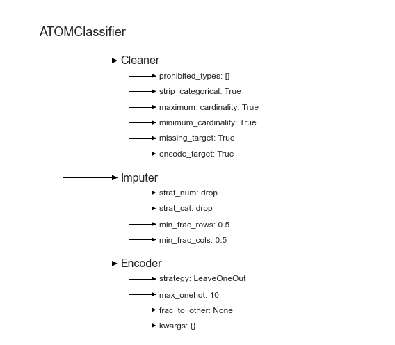

# Utilities
---------------------------------

This example shows various useful utilities that can be used to improve your pipelines.

The data used is a variation on the Australian weather dataset from [https://www.kaggle.com/jsphyg/weather-dataset-rattle-package](https://www.kaggle.com/jsphyg/weather-dataset-rattle-package). The goal of this dataset is to predict whether or not it will rain tomorrow training a binay classifier on target `RainTomorrow`.

## Load the data


```python
# Import packages
import pandas as pd
from sklearn.metrics import fbeta_score
from atom import ATOMClassifier, ATOMLoader
```


```python
# Load data
X = pd.read_csv('./datasets/weatherAUS.csv')

# Let's have a look at a subset of the data
X.sample(frac=1).iloc[:5, :8]
```


<div>
<style scoped>
    .dataframe tbody tr th:only-of-type {
        vertical-align: middle;
    }

    .dataframe tbody tr th {
        vertical-align: top;
    }

    .dataframe thead th {
        text-align: right;
    }
</style>
<table border="1" class="dataframe">
  <thead>
    <tr style="text-align: right;">
      <th></th>
      <th>Location</th>
      <th>MinTemp</th>
      <th>MaxTemp</th>
      <th>Rainfall</th>
      <th>Evaporation</th>
      <th>Sunshine</th>
      <th>WindGustDir</th>
      <th>WindGustSpeed</th>
    </tr>
  </thead>
  <tbody>
    <tr>
      <th>88027</th>
      <td>GoldCoast</td>
      <td>15.7</td>
      <td>21.3</td>
      <td>3.4</td>
      <td>NaN</td>
      <td>NaN</td>
      <td>SSE</td>
      <td>31.0</td>
    </tr>
    <tr>
      <th>130010</th>
      <td>Launceston</td>
      <td>-0.3</td>
      <td>13.0</td>
      <td>0.0</td>
      <td>2.2</td>
      <td>NaN</td>
      <td>SSE</td>
      <td>33.0</td>
    </tr>
    <tr>
      <th>118018</th>
      <td>Perth</td>
      <td>7.6</td>
      <td>25.6</td>
      <td>0.0</td>
      <td>4.2</td>
      <td>9.8</td>
      <td>ENE</td>
      <td>26.0</td>
    </tr>
    <tr>
      <th>106188</th>
      <td>Albany</td>
      <td>12.4</td>
      <td>18.5</td>
      <td>3.0</td>
      <td>3.0</td>
      <td>5.5</td>
      <td>NaN</td>
      <td>NaN</td>
    </tr>
    <tr>
      <th>21882</th>
      <td>NorfolkIsland</td>
      <td>13.9</td>
      <td>18.1</td>
      <td>13.4</td>
      <td>1.6</td>
      <td>1.7</td>
      <td>ENE</td>
      <td>54.0</td>
    </tr>
  </tbody>
</table>
</div>


## Use the utility attributes


```python
atom = ATOMClassifier(X, warnings=False, random_state=1)
atom.clean()

# We can quickly check what columns have missing values
print("Columns with missing values:\n", atom.nans)

# Or what columns are categorical
print("\nCategorical columns:", atom.categorical)

# Or if the dataset is scaled
print("\nIs the dataset scaled?", atom.scaled)
```

    
    
    Columns with missing values:
     MinTemp            637
    MaxTemp            322
    Rainfall          1406
    Evaporation      60843
    Sunshine         67816
    WindGustDir       9330
    WindGustSpeed     9270
    WindDir9am       10013
    WindDir3pm        3778
    WindSpeed9am      1348
    WindSpeed3pm      2630
    Humidity9am       1774
    Humidity3pm       3610
    Pressure9am      14014
    Pressure3pm      13981
    Cloud9am         53657
    Cloud3pm         57094
    Temp9am            904
    Temp3pm           2726
    RainToday         1406
    dtype: int64
    
    Categorical columns: ['Location', 'WindGustDir', 'WindDir9am', 'WindDir3pm', 'RainToday']
    
    Is the dataset scaled? False
    

## Use the stats method to check changes in the dataset


```python
# Note the number of missing values and categorical columns
atom.stats()
```

    Dataset stats ================== >>
    Shape: (142193, 22)
    Missing values: 316559
    Categorical columns: 5
    Scaled: False
    -----------------------------------
    Train set size: 113755
    Test set size: 28438
    -----------------------------------
    Dataset balance: No:Yes <==> 3.5:1.0
    -----------------------------------
    Distribution of classes:
    |    |   dataset |   train |   test |
    |---:|----------:|--------:|-------:|
    |  0 |    110316 |   88263 |  22053 |
    |  1 |     31877 |   25492 |   6385 |
    


```python
# Now, let's impute and encode the dataset...
atom.impute()
atom.encode()

# ... and the values are gone
atom.stats()
```

    Dataset stats ================== >>
    Shape: (56420, 22)
    Scaled: False
    -----------------------------------
    Train set size: 45021
    Test set size: 11399
    -----------------------------------
    Dataset balance: No:Yes <==> 3.5:1.0
    -----------------------------------
    Distribution of classes:
    |    |   dataset |   train |   test |
    |---:|----------:|--------:|-------:|
    |  0 |     43993 |   35107 |   8886 |
    |  1 |     12427 |    9914 |   2513 |
    

## Change the data mid-pipeline


```python
# We can change atom's data mid-pipeline, adding a column for example
# Note that we can only replace a dataframe with a new dataframe!
atom.X = atom.X.assign(AvgTemp=(atom.X['MaxTemp'] + atom.X['MinTemp'])/2)

# This will automatically update all other data attributes
assert 'AvgTemp' in atom.dataset
```

## Visualize the pipeline


```python
# We can easily visualize the pipeline through the branch
atom.branch.status()
```

    Branch: main
     --> Cleaner
       >>> prohibited_types: []
       >>> strip_categorical: True
       >>> maximum_cardinality: True
       >>> minimum_cardinality: True
       >>> missing_target: True
       >>> encode_target: True
     --> Imputer
       >>> strat_num: drop
       >>> strat_cat: drop
       >>> min_frac_rows: 0.5
       >>> min_frac_cols: 0.5
     --> Encoder
       >>> strategy: LeaveOneOut
       >>> max_onehot: 10
       >>> frac_to_other: None
       >>> kwargs: {}
    


```python
atom.plot_pipeline()  # Or using a plot
```





## Use a custom metric


```python
atom.verbose = 1

# Define a custom metric
def f2_score(y_true, y_pred):
    return fbeta_score(y_true, y_pred, beta=2)

# Remember to use the greater_is_better, needs_proba and needs_threshold parameters if necessary!
atom.run(models='lr', metric=f2_score)
```

    
    Training ===================================== >>
    Models: LR
    Metric: f2_score
    
    
    Results for Logistic Regression:         
    Fit ---------------------------------------------
    Train evaluation --> f2_score: 0.5677
    Test evaluation --> f2_score: 0.5691
    Time elapsed: 0.237s
    -------------------------------------------------
    Total time: 0.265s
    
    
    Final results ========================= >>
    Duration: 0.266s
    ------------------------------------------
    Logistic Regression --> f2_score: 0.569
    

## Customize the estimator's parameters


```python
# You can use the est_params parameter to customize the estimator
# Let's run AdaBoost using LR instead of a decision tree as base estimator
atom.run('AdaB', est_params={'base_estimator': atom.lr.estimator})
```

    
    Training ===================================== >>
    Models: AdaB
    Metric: f2_score
    
    
    Results for AdaBoost:         
    Fit ---------------------------------------------
    Train evaluation --> f2_score: 0.5567
    Test evaluation --> f2_score: 0.5488
    Time elapsed: 2.123s
    -------------------------------------------------
    Total time: 2.123s
    
    
    Final results ========================= >>
    Duration: 2.125s
    ------------------------------------------
    AdaBoost --> f2_score: 0.549
    


```python
atom.adab.estimator
```


    AdaBoostClassifier(base_estimator=LogisticRegression(n_jobs=1, random_state=1),
                       random_state=1)


```python
# Note that parameters specified by est_params are not optimized in the BO
# (also, we can change the verbosity per method)
atom.run('tree', n_calls=3, n_initial_points=1, est_params={'max_depth': 2}, verbose=2)
```

    
    Training ===================================== >>
    Models: Tree
    Metric: f2_score
    
    
    Running BO for Decision Tree...
    Initial point 1 ---------------------------------
    Parameters --> {'criterion': 'gini', 'splitter': 'best', 'min_samples_split': 2, 'min_samples_leaf': 1, 'max_features': None, 'ccp_alpha': 0}
    Evaluation --> f2_score: 0.4938  Best f2_score: 0.4938
    Time iteration: 0.396s   Total time: 0.410s
    Iteration 2 -------------------------------------
    Parameters --> {'criterion': 'gini', 'splitter': 'random', 'min_samples_split': 4, 'min_samples_leaf': 20, 'max_features': 0.5, 'ccp_alpha': 0.014}
    Evaluation --> f2_score: 0.4444  Best f2_score: 0.4938
    Time iteration: 0.136s   Total time: 0.550s
    Iteration 3 -------------------------------------
    Parameters --> {'criterion': 'entropy', 'splitter': 'random', 'min_samples_split': 2, 'min_samples_leaf': 6, 'max_features': 0.5, 'ccp_alpha': 0.0}
    Evaluation --> f2_score: 0.3052  Best f2_score: 0.4938
    Time iteration: 0.140s   Total time: 0.932s
    
    Results for Decision Tree:         
    Bayesian Optimization ---------------------------
    Best parameters --> {'criterion': 'gini', 'splitter': 'best', 'min_samples_split': 2, 'min_samples_leaf': 1, 'max_features': None, 'ccp_alpha': 0}
    Best evaluation --> f2_score: 0.4938
    Time elapsed: 1.231s
    Fit ---------------------------------------------
    Train evaluation --> f2_score: 0.4939
    Test evaluation --> f2_score: 0.4871
    Time elapsed: 0.090s
    -------------------------------------------------
    Total time: 1.328s
    
    
    Final results ========================= >>
    Duration: 1.338s
    ------------------------------------------
    Decision Tree --> f2_score: 0.487
    

## Save & load


```python
# Save the atom instance as a pickle with the save method
# Remember that the instance contains the data, use save_datad to save the instance without the data
atom.save('atom', save_data=False)
```

    ATOMClassifier saved successfully!
    


```python
# Load the instance again with ATOMLoader
# No need to store the transformed data, providing the original dataset to the loader
# will automatically transform it throigh all the steps in atom's pipeline
atom_2 = ATOMLoader('atom', data=(X,), verbose=2)

# Remember to also add the extra column!
atom_2.X = atom_2.X.assign(AvgTemp=(atom_2.X['MaxTemp'] + atom_2.X['MinTemp'])/2)
```

    Loading data for branch 'main'...
    Applying data cleaning...
     --> Label-encoding the target column.
    Imputing missing values...
     --> Dropping 1116 rows for containing less than 50% non-missing values.
     --> Dropping 295 rows due to missing values in feature MinTemp.
     --> Dropping 176 rows due to missing values in feature MaxTemp.
     --> Dropping 1161 rows due to missing values in feature Rainfall.
     --> Dropping 58505 rows due to missing values in feature Evaporation.
     --> Dropping 10826 rows due to missing values in feature Sunshine.
     --> Dropping 4153 rows due to missing values in feature WindGustDir.
     --> Dropping 2199 rows due to missing values in feature WindDir9am.
     --> Dropping 208 rows due to missing values in feature WindDir3pm.
     --> Dropping 258 rows due to missing values in feature Humidity9am.
     --> Dropping 56 rows due to missing values in feature Humidity3pm.
     --> Dropping 53 rows due to missing values in feature Pressure9am.
     --> Dropping 20 rows due to missing values in feature Pressure3pm.
     --> Dropping 5361 rows due to missing values in feature Cloud9am.
     --> Dropping 1386 rows due to missing values in feature Cloud3pm.
    Encoding categorical columns...
     --> LeaveOneOut-encoding feature Location. Contains 26 unique classes.
     --> LeaveOneOut-encoding feature WindGustDir. Contains 16 unique classes.
     --> LeaveOneOut-encoding feature WindDir9am. Contains 16 unique classes.
     --> LeaveOneOut-encoding feature WindDir3pm. Contains 16 unique classes.
     --> Label-encoding feature RainToday. Contains 2 unique classes.
    ATOMClassifier loaded successfully!
    

## Customize the plot aesthetics


```python
# Use the plotting attributes to further customize your plots!
atom_2.palette= 'Blues'
atom_2.style = 'white'

atom_2.plot_roc()
```


